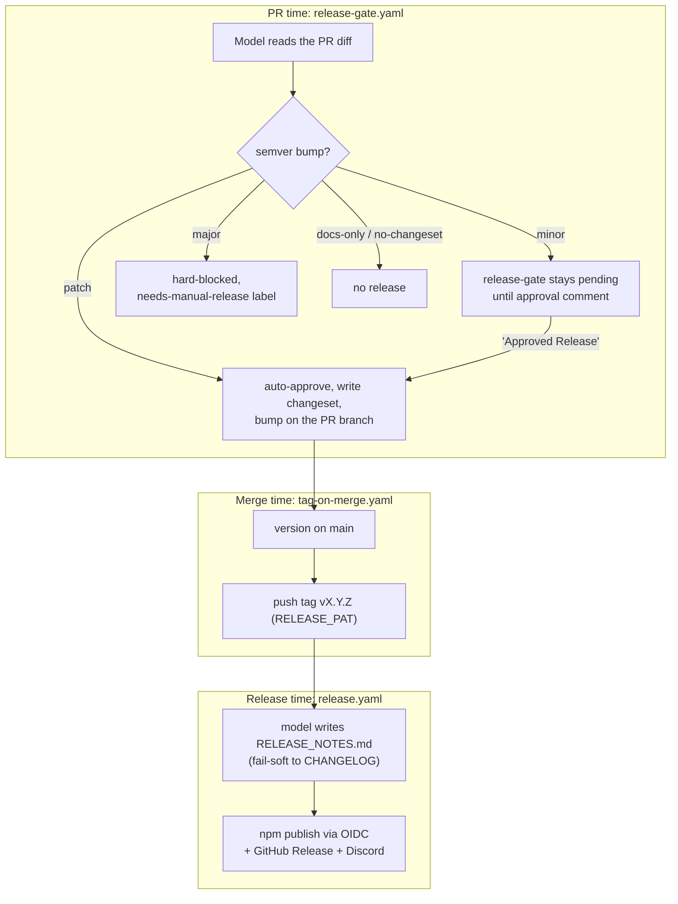

# Release Automation (AI-authored changesets, gated publish)

> Category: Infrastructure | Version: 1.1 | Date: July 2026 | Status: Active

How Honeycomb turns a merged code change into a published npm release with no human writing a version number or release note. Humans write code; a model picks the semver bump, writes the changeset, writes the release notes, and the pipeline tags, publishes, and announces. A single human gate stands on `minor` releases and a hard block stands on `major`. This is the layer that sits on top of the [npm Publishing Pipeline](npm-publishing.md): publishing still fails closed and is still triggered by a pushed `vX.Y.Z` tag, but the tag itself is now produced by automation rather than by hand.

**Related:**
- [`npm-publishing.md`](npm-publishing.md), the publish core this drives (OIDC, `files` allowlist, `pack-check.mjs`, post-publish smoke)
- [`monorepo-build-release.md`](monorepo-build-release.md), the build the publish consumes
- [`../security/secrets.md`](../security/secrets.md), the org secrets the workflows read
- [`../operations/install-and-onboarding.md`](../operations/install-and-onboarding.md), where a published release reaches users

---

## Why this exists

Before this pipeline, a release was a manual sequence: decide the bump, edit `package.json` and the synced manifests, write a CHANGELOG entry, push a tag, and hope the version and the tag agreed. Every step was a place to forget the bump, mis-size it, or push a tag that did not match the version in the tree. The result was that real work sat unreleased on `main` because the mechanical release step was skipped or done wrong.

The automation shifts that work to a model and a set of GitHub Actions workflows, keeping exactly two human decisions: approving a `minor` and unblocking a `major`. Everything smaller is hands-off, and the pipeline was piloted on honeycomb first with the intent to replicate to `doctor`, `nectar`, and `hive` once proven (see [PR #263](https://github.com/legioncodeinc/honeycomb/pull/263)).

## The three-workflow flow

The pipeline is three workflows that hand off through the branch, the merge, and the tag.

### PR time: `release-gate.yaml`

On each pull request, Claude **Sonnet 5 on Amazon Bedrock** reads the diff and picks a semver bump, writing a changeset file under `.changeset/`. Auth is an **Amazon Bedrock API key** (a bearer token passed as `AWS_BEARER_TOKEN_BEDROCK`) driving `@aws-sdk/client-bedrock-runtime` through `scripts/release/bedrock.mjs`. The gate then routes on the size the model chose:

| Bump | Behavior |
|---|---|
| `patch` | Auto-approved; the version is bumped on the PR branch immediately. |
| `minor` | The `release-gate` check stays **pending** until **@thenotoriousllama** comments `Approved Release` (case-insensitive), then the branch is bumped and the check goes green. |
| `major` | **Hard-blocked**, never auto-bumped; the PR gets the `needs-manual-release` label. |

Two escape hatches keep the gate from firing when it should not: a **docs-only** PR (every changed file is markdown) never releases, and a `no-changeset` label opts a PR out entirely. A **double-bump guard** ensures that once a PR carries a bump, later pushes to the same branch do not re-bump it.

`release-gate` is registered as a **required status check** in `.github/rulesets/main-protection.json`. The ruleset must be synced after the pipeline lands so the check is actually enforced on `main`.

### Merge time: `tag-on-merge.yaml`

When the bumped PR merges, the version now on `main` is tagged `vX.Y.Z`. The tag is pushed with a fine-grained **`RELEASE_PAT`** (Contents: write) rather than the default `GITHUB_TOKEN`, specifically so the pushed tag **triggers** the downstream `release.yaml` (a tag pushed by `GITHUB_TOKEN` would not fire another workflow).

### Release time: `release.yaml`

The publish core is unchanged from the [npm Publishing Pipeline](npm-publishing.md): the same OIDC Trusted Publishing, `files` allowlist, `pack-check.mjs`, and post-publish global-install smoke. The automation adds two fail-soft steps around it: Sonnet 5 writes `RELEASE_NOTES.md` (falling back to the matching CHANGELOG entry if the model call fails) which becomes the GitHub Release body, and a Discord announcement fires via webhook (also fail-soft, so a webhook outage never fails the release).

## Required setup

The pipeline reads a small set of org/repo secrets and variables (documented in `RELEASE-AUTOMATION.md`):

| Kind | Name | Purpose |
|---|---|---|
| Secret | `AWS_BEDROCK_API_KEY` | Long-term Bedrock key for the changeset + release-note model calls |
| Secret | `DISCORD_WEBHOOK_URL` | Release announcement channel |
| Secret | `RELEASE_PAT` | Fine-grained PAT (Contents: write) so the merge-time tag triggers the publish |
| Variable | `AWS_REGION` | Bedrock region |
| Variable | `BEDROCK_MODEL_ID` | Sonnet 5 inference-profile id |

The scripts live under `scripts/release/`: `ai-changeset.mjs` (pick the bump), `ai-release-notes.mjs` (write the notes), `apply-bump.mjs` (do the version write), `bedrock.mjs` (the model client), and `discord-notify.mjs` (the announcement).

## Failure mode: the orphaned changeset

The most important operational lesson from this pipeline is a timing race between the gate's bump commit and a squash-merge, which stranded a real release. It is worth understanding because the symptom (npm silently stuck a version behind, with the code present on `main`) is confusing.

**What happened.** PRD-006 merged in [#274](https://github.com/legioncodeinc/honeycomb/pull/274). The `release-gate` minor-bump bot commit (`chore(release): minor bump [approved]`) landed on the feature branch roughly **5 seconds after** #274 was squash-merged. Because it was a squash-merge, that late bump commit never reached `main`; instead `main` carried the changeset `ai-4f2ab1e.md` **un-consumed**, with the version still at `0.7.0`. `tag-on-merge` then read `0.7.0`, saw that the `v0.7.0` tag already existed, and did nothing. The net effect: `main` held the entire PRD-006 implementation, but npm's `@latest` stayed at `0.7.0`, a build that predated all of PRD-006 (no `.mcp.json`, no `skills/`, no `commands/`, no auto-wiring). Users who ran `npm i -g @legioncodeinc/honeycomb@latest` got the old build.

**The manual recovery.** [#276](https://github.com/legioncodeinc/honeycomb/pull/276) consumed the pending changeset and bumped `0.7.0 -> 0.8.0` with no source changes (a version-bump-only PR: `package.json`, `package-lock.json`, the synced manifests, `CHANGELOG.md`, and deletion of the orphaned `.changeset/ai-4f2ab1e.md`). On merge, `tag-on-merge` pushed `v0.8.0` and the publish ran normally.

**The systemic fix.** `tag-on-merge` was hardened to **consume orphaned changesets** on `main`: when it finds an un-consumed changeset with the version un-bumped, it applies the bump itself rather than no-op'ing on a stale version (commit `5bb1bb9`, "tag-on-merge consumes orphaned changesets (release safety net)"). This closes the window where a bump commit that loses the race to a squash-merge leaves a real release stranded.

**The takeaway for operators.** If code is on `main` but npm `@latest` is a version behind, suspect an orphaned changeset first: look for an un-consumed file in `.changeset/` and a `package.json` version that matches the last published tag. The safety net should now catch this automatically, but the manual recovery (a version-bump-only PR that deletes the changeset) remains the fallback.

## Design posture

- **Fail closed, but fail soft on the extras.** The publish core keeps every guard from the npm pipeline. The model-authored pieces (changeset selection, release notes, Discord) are additive and fail soft: a model or webhook outage degrades to a CHANGELOG-derived note or a skipped announcement, never a broken or half-published release.
- **Human gates are scoped to blast radius.** `patch` is hands-off, `minor` needs one approval comment, `major` is hard-blocked. The gate size tracks the risk of the change, not a blanket "approve every release" tax.
- **The tag is the seam.** Every path converges on a pushed `vX.Y.Z` tag as the single publish trigger, which is why `RELEASE_PAT` (not `GITHUB_TOKEN`) pushes it and why an un-tagged-but-bumped `main` is the failure mode to watch.
