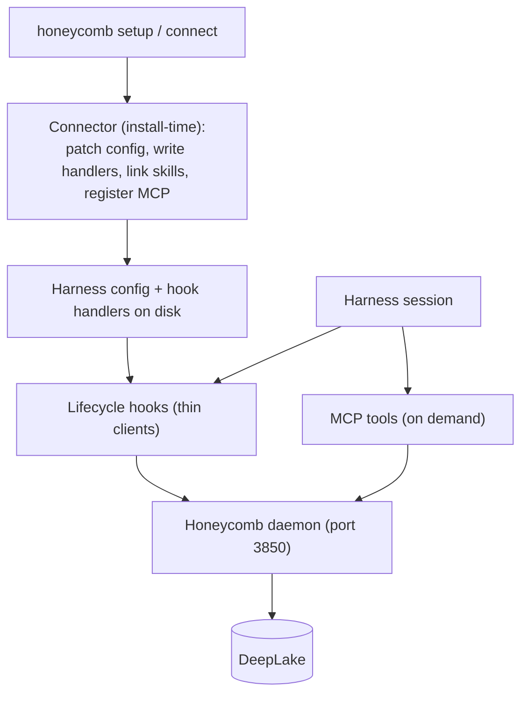

# Harness Integration

> Category: Integrations | Version: 1.0 | Date: June 2026 | Status: Active

How Honeycomb plugs underneath coding harnesses: the install-time connector base, the per-harness shims, MCP-server-via-install, and the capability detection plus idempotent install/uninstall contract that wires all six supported harnesses.

**Related:**
- [`hook-lifecycle.md`](hook-lifecycle.md)
- [`mcp-and-sdk.md`](mcp-and-sdk.md)
- [`../architecture/daemon-surface.md`](../architecture/daemon-surface.md)
- [`../architecture/request-lifecycle.md`](../architecture/request-lifecycle.md)
- [`../frontend/cursor-extension-architecture.md`](../frontend/cursor-extension-architecture.md)

---

## The positioning

Honeycomb does not try to be another agent shell. It runs underneath the harnesses people already use and gives them one shared memory layer. The challenge is that every harness exposes a different extension surface, and they share almost nothing at the integration layer. The answer is to write the memory logic once in the daemon and wrap it per harness with a thin shim. Adding a harness means writing a shim and a connector subclass, not a memory engine.

Honeycomb wires six harnesses: **Claude Code, Codex, Cursor, Hermes, pi, and OpenClaw**. Each reaches the daemon through the same three surfaces, and the daemon, which is the only process that touches DeepLake, does the real work behind every one of them.

## Three surfaces, one daemon

A harness reaches Honeycomb through three kinds of surface, and the important thing is that all of them are thin clients of the daemon. None touch DeepLake directly.

A **connector** is install-time. It runs once during `honeycomb setup` or `honeycomb connect <harness>`, patches the harness config, writes the compiled hook handlers, and symlinks org/team skills into the harness's locations. Connectors are subclasses of a shared base and never run at session time.

A **hook** is a lifecycle event the harness fires that calls the daemon. Hooks are how capture and automatic recall happen; the per-harness event matrix is documented in [`hook-lifecycle.md`](hook-lifecycle.md).

An **MCP server** is the on-demand tool surface, a registered server a harness invokes to ask for memory operations explicitly. Where a harness speaks MCP, the connector registers the Honeycomb server during install (MCP-server-via-install); the tool surface is documented in [`mcp-and-sdk.md`](mcp-and-sdk.md).



The connector touches the local filesystem only, it opens no DeepLake, holds no daemon handle, and stamps no runtime path (runtime calls are the hooks' job). The `src/connectors/` root is a non-daemon root by invariant, so this holds by construction. The `x-honeycomb-runtime-path: plugin|legacy` header on the *runtime* path tells the daemon which surface a call came from; the daemon enforces one active path per session.

## The connector base

Every per-harness connector is a subclass of the abstract `HarnessConnector` (`src/connectors/contracts.ts`). The base owns `install()` and `uninstall()` and all the shared mechanics; a subclass overrides only four seams:

1. **`configPath()`**, where the harness keeps its hook config.
2. **`hookHandlers()`**, which compiled handlers to write and register.
3. **`skillLinkTargets()`**, where org/team skills are symlinked.
4. **`eventNameMap()`**, the native event names the handlers register under.

The base supplies everything else: the foreign-preserving config patch, the idempotent `writeJsonIfChanged`, the Honeycomb-entry predicate, skill symlinking, platform detection, and the reversible uninstall. All filesystem access goes through an injectable `ConnectorFs` seam, so the whole connector is testable against an in-memory `FakeFs`, a real `~/.cursor` or `~/.codex` is never touched in a test.

The `ClaudeCodeConnector` is the reference; `CodexConnector` and `CursorConnector` prove the base is subclass-only, each is a small class that fills the four seams and inherits install/uninstall verbatim. Codex uses the same nested matcher-block config shape as Claude Code (`~/.codex/hooks.json`). Cursor overrides the config-shape seams because real Cursor stores each event's handlers as a *flat* array directly under the event key in `~/.cursor/hooks.json`, not the nested `{ matcher, hooks: [...] }` block, but it still inherits the base's foreign-preserve and idempotency guarantees on that flat shape.

### Idempotent install, foreign-safe uninstall

Two invariants make the connector safe to run repeatedly:

- **Idempotent.** Every Honeycomb config entry is stamped with a sentinel field (`_honeycomb: true`). On re-install, the connector filters its own prior entries out by that sentinel, appends fresh ones, and writes the config *only if the serialized bytes changed* (`writeJsonIfChanged`). A no-change re-run writes nothing, so the harness's hook-trust fingerprint is unchanged and no re-trust dialog appears. `honeycomb setup` is therefore safe to run on every upgrade.
- **Foreign-safe.** A third-party hook never carries the sentinel, so the predicate (`isHoneycombEntry`) never reclaims it. Install preserves foreign matcher blocks and foreign top-level keys verbatim; uninstall removes *only* Honeycomb's entries and *only* Honeycomb's skill symlinks. An emptied config is cleanly unlinked rather than left as `{}`; a still-populated config is preserved. Skill links are likewise no-clobber: a real dir or a foreign symlink at a target path is left untouched.

## Capability detection and `honeycomb setup`

Each connector reports whether its harness is installed via `detectPlatforms()`, which checks that the harness's config root exists on disk (e.g. Cursor is "installed" when `~/.cursor` exists). The CLI verbs (`src/connectors/cli.ts`) drive the registry off that probe:

- **`honeycomb setup`**, ask every connector whether it is detected and wire all the detected ones. On a box with three harnesses present, all three are wired; each `install()` is foreign-preserving and idempotent, so re-running `setup` writes nothing where nothing changed.
- **`honeycomb connect <harness>`**, wire exactly one named harness.
- **`honeycomb uninstall [<harness>]`**, reverse only Honeycomb's footprint for one harness, or for every detected harness when no target is given.

The connector registry (`src/cli/connector-runner.ts`, `createConnectorRegistry`) builds each connector over the real `node:fs`-backed `ConnectorFs` and the user's home. Claude Code is wired by registering its marketplace plugin via the real `claude plugin` CLI (rather than writing top-level `settings.json` hooks); Codex and Cursor are wired by the config-patch path. A new harness is a subclass added to the registry, never a fork of install logic.

## The support matrix

Each harness wires the same logical lifecycle events through its own mechanism; the shim normalizes the harness's native event names and payloads into the daemon's shared shape. The per-event detail is in [`hook-lifecycle.md`](hook-lifecycle.md); the integration surfaces by harness:

| Harness | Surfaces | Notes |
|---|---|---|
| Claude Code | Marketplace plugin + hooks + MCP | Reference connector and reference hook set; model-only context, `legacy` runtime path |
| Codex | `~/.codex/hooks.json` + hooks + MCP | Nested matcher-block config shape; user-visible context; Bash-only VFS intercept |
| Cursor | `~/.cursor/hooks.json` + extension + MCP | Flat per-event config shape; first-party editor extension; `Shell`-tool VFS intercept; see [`../frontend/cursor-extension-architecture.md`](../frontend/cursor-extension-architecture.md) |
| Hermes | Skill + shell hooks + MCP | Terminal-only tool capture; user-visible `{ context }` output with an MCP-tools mention; `legacy` runtime path |
| pi | Managed extension + `AGENTS.md` block | On-demand recall; context from the static `AGENTS.md` block; summary worker shells `pi --print` |
| OpenClaw | Native extension (flagship) + connector + MCP | Batches capture at `agent_end`; auto-routes the agent from the session key; `plugin` runtime path |

The differences are real but shallow: native event names and payload fields vary, and the context channel is model-only on some harnesses (Claude Code, Cursor, OpenClaw) and user-visible on others (Codex, Hermes, pi), so each shim normalizes before handing off and renders the context block through its harness's channel.

## MCP-server-via-install

For harnesses that speak the Model Context Protocol, the Honeycomb MCP server is registered during install so its `honeycomb_*` tools appear in the harness's native tool list. The server bundle is built by esbuild to `mcp/bundle/server.js` and ships with the package. Hermes, for example, registers it through its `.mcp.json`:

```json
{ "mcpServers": { "honeycomb": { "command": "node", "args": ["mcp/bundle/server.js"] } } }
```

and the Hermes shim appends a user-visible mention so the agent knows the tools exist: `(Honeycomb MCP tools available: honeycomb_search, honeycomb_read, honeycomb_index.)`. The same `node mcp/bundle/server.js` stdio entry registers into the other MCP-speaking harnesses during their connect step. The tool surface, the read/resolve and search/mine clusters, and the registration mechanics are documented in [`mcp-and-sdk.md`](mcp-and-sdk.md).

## Identity sync

`AGENTS.md` in the workspace is the source of truth for operating instructions, and the daemon's file watcher syncs it into each harness's identity file (`~/.claude/CLAUDE.md`, the pi `AGENTS.md` block, and so on), each copy stamped do-not-edit. A manual re-sync is `POST /api/harnesses/regenerate`. The watcher behavior is documented in [`../architecture/daemon-surface.md`](../architecture/daemon-surface.md).

## Capture and recall, directly

Beyond the hook lifecycle, a harness can call recall and remember directly through the CLI skills (`/recall`, `/remember`), the MCP tools, the SDK, or the virtual filesystem browse surface. These explicit calls bypass the inject-on-confidence rule, because the agent is asking rather than the daemon volunteering. The tool and SDK surfaces are documented in [`mcp-and-sdk.md`](mcp-and-sdk.md).

## The references gate

Integration work carries a hard rule: before changing anything under a harness integration, the acting engineer inspects the sibling harness repo under `references/` (for example `references/openclaw/`, `references/cursor/`, `references/codex/`) for the exact protocol and runtime behavior. No direct sibling-harness check means no verdict on that integration. This is what keeps each connector and shim honest against the real harness, the Cursor connector's flat `hooks.json` shape, for instance, is implemented against `references/cursor/hooks-schema.ts`, not against an assumption.
