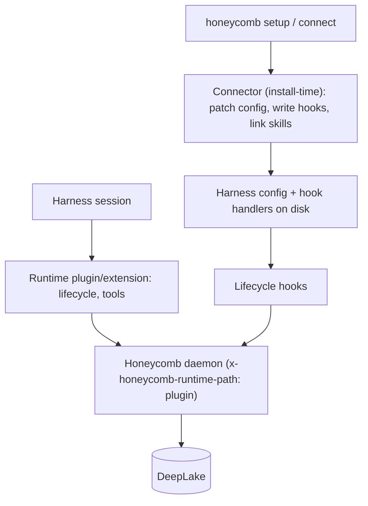

# Harness Integration

> Category: Integrations | Version: 1.0 | Date: June 2026 | Status: Active

How Honeycomb plugs underneath coding harnesses: the connector, plugin, and hook surfaces, the runtime-path contract, and the support matrix across every harness Honeycomb targets.

**Related:**
- [`hook-lifecycle.md`](hook-lifecycle.md)
- [`mcp-and-sdk.md`](mcp-and-sdk.md)
- [`../architecture/daemon-surface.md`](../architecture/daemon-surface.md)
- [`../architecture/request-lifecycle.md`](../architecture/request-lifecycle.md)
- [`../frontend/cursor-extension-architecture.md`](../frontend/cursor-extension-architecture.md)

---

## The positioning

Honeycomb does not try to be another agent shell. It runs underneath the harnesses people already use and gives them one shared memory layer. The challenge is that every harness exposes a different extension surface, and they share almost nothing at the integration layer. The answer, inherited from both source systems, is to write the memory logic once in the daemon and wrap it per harness with a thin shim. Adding a harness means writing a shim, not a memory engine.

## Three surfaces, one daemon

A harness reaches Honeycomb through three kinds of surface, and the important thing in the merged design is that all of them are thin clients of the daemon. None of them touch DeepLake directly; the daemon does.

A **connector** is install-time. It runs once during `honeycomb setup` or `honeycomb connect <harness>`, patches the harness config, writes lifecycle hook handlers, and links skills into the harness's locations. Connectors extend a shared connector base.

A **runtime plugin or extension** runs inside the harness process during a session, handling lifecycle and exposing tools. The OpenCode plugin and OpenClaw extension are runtime surfaces, distinct from their install-time connectors.

A **hook** is a lifecycle event the harness fires that calls the daemon's `/api/hooks/*` endpoints. Hooks are how capture and automatic recall happen; the matrix is documented in [`hook-lifecycle.md`](hook-lifecycle.md).

Connector install-time code and daemon runtime code are different surfaces and must not be conflated. The `x-honeycomb-runtime-path: plugin|legacy` header tells the daemon which surface a call came from, and the daemon enforces one active path per session with a `409` on conflict, as described in [`../architecture/daemon-surface.md`](../architecture/daemon-surface.md).

## The support matrix

Honeycomb targets the union of both source systems' harnesses. Each wires the same logical events through its own mechanism; the shim normalizes the harness's event names and payloads into the daemon's shared shape.

| Harness | Surfaces | Notes |
|---|---|---|
| Claude Code | Marketplace plugin + hooks + MCP | Reference hook set; native bridge indexes per-project memory |
| Cursor | `~/.cursor/hooks.json` + extension | 1.7+ hooks; dashboard surface; see [`../frontend/cursor-extension-architecture.md`](../frontend/cursor-extension-architecture.md) |
| OpenClaw | Native extension (flagship) + connector | Auto-routes agent from session key (`agent:alice:...`) |
| Codex | `~/.codex/hooks.json` + MCP | MCP-first; plugin marketplace when supported |
| Hermes | Skill + shell hooks + MCP | Memory provider tools; delegation capture |
| pi | Extension + `AGENTS.md` block | Managed extension; on-demand recall |
| OpenCode | Runtime plugin + hooks | Bundled plugin; syncs `AGENTS.md` |
| Gemini CLI | MCP + `GEMINI.md` sync | On-demand tools plus identity sync |
| Oh My Pi | Managed extension | Fail-open on daemon errors; context injected outside the transcript |

The differences are real but shallow: event names and payload fields vary, and the `additionalContext` channel is model-only on some harnesses and user-visible on others, so each shim normalizes before handing off. Where a harness cannot intercept a write, goal and KPI routing falls back to a CLI call.

## Identity sync

`AGENTS.md` in the workspace is the source of truth for operating instructions, and the daemon's file watcher syncs it into each harness's identity file (`~/.claude/CLAUDE.md`, `~/.config/opencode/AGENTS.md`, `~/.gemini/GEMINI.md`, and so on), each copy stamped do-not-edit. A manual re-sync is `POST /api/harnesses/regenerate`. The watcher behavior is documented in [`../architecture/daemon-surface.md`](../architecture/daemon-surface.md).

## Capture and recall, directly

Beyond the hook lifecycle, a harness can call recall and remember directly through the CLI skills (`/recall`, `/remember`), the MCP tools, the SDK, or the virtual filesystem browse surface. These explicit calls bypass the inject-on-confidence rule, because the agent is asking rather than the daemon volunteering. The tool and SDK surfaces are documented in [`mcp-and-sdk.md`](mcp-and-sdk.md).

## The references gate

Integration work carries a hard rule from the engine's contribution policy: before changing anything under a harness integration, the acting engineer inspects the sibling harness repo under `references/` (for example `references/openclaw/`, `references/cursor/`, `references/claude-code/`) for the exact protocol and runtime behavior. No direct sibling-harness check means no verdict on that integration. This is what keeps shims honest against the real harness rather than against assumptions.
