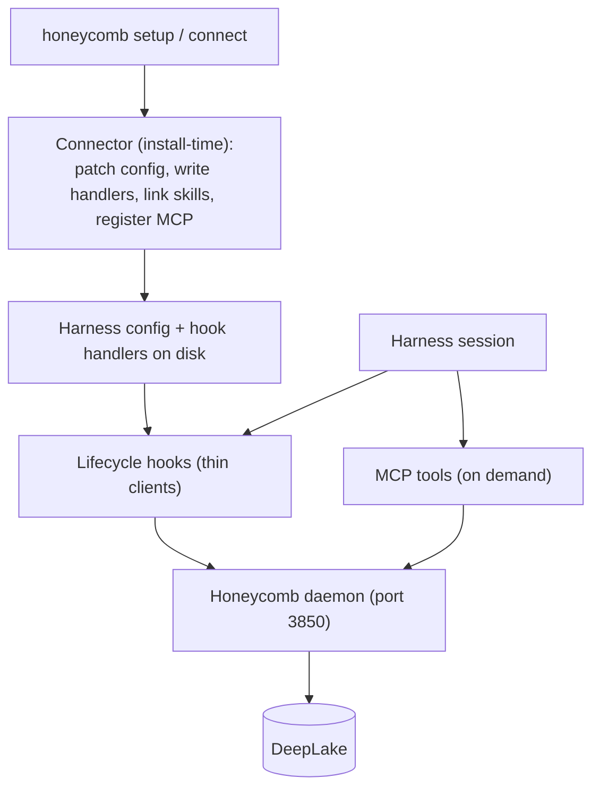

# Harness Integration

> Category: Integrations | Version: 1.1 | Date: July 2026 | Status: Active

How Honeycomb plugs underneath coding harnesses: the install-time connector base, the per-harness shims, MCP-server-via-install, and the capability detection plus idempotent install/uninstall contract that wires 4 supported harnesses today (Claude Code, Codex, Cursor, Hermes) while tracking pi and OpenClaw as in progress.

**Related:**
- [`hook-lifecycle.md`](hook-lifecycle.md)
- [`mcp-and-sdk.md`](mcp-and-sdk.md)
- [`../architecture/daemon-surface.md`](../architecture/daemon-surface.md)
- [`../architecture/request-lifecycle.md`](../architecture/request-lifecycle.md)
- [`../frontend/cursor-extension-architecture.md`](../frontend/cursor-extension-architecture.md)

---

## The positioning

Honeycomb does not try to be another agent shell. It runs underneath the harnesses people already use and gives them one shared memory layer. The challenge is that every harness exposes a different extension surface, and they share almost nothing at the integration layer. The answer is to write the memory logic once in the daemon and wrap it per harness with a thin shim. Adding a harness means writing a shim and a connector subclass, not a memory engine.

Honeycomb currently supports 4 harnesses in production: **Claude Code, Codex, Cursor, and Hermes**. pi and OpenClaw remain in progress. The daemon remains the only process that touches DeepLake, and supported harnesses reach it through the same three surfaces.

## Three surfaces, one daemon

A harness reaches Honeycomb through three kinds of surface, and the important thing is that all of them are thin clients of the daemon. None touch DeepLake directly.

A **connector** is install-time. It runs once during `honeycomb setup` or `honeycomb connect <harness>`, patches the harness config, writes the compiled hook handlers, and symlinks org/team skills into the harness's locations. Connectors are subclasses of a shared base and never run at session time.

A **hook** is a lifecycle event the harness fires that calls the daemon. Hooks are how capture and automatic recall happen; the per-harness event matrix is documented in [`hook-lifecycle.md`](hook-lifecycle.md).

An **MCP server** is the on-demand tool surface, a registered server a harness invokes to ask for memory operations explicitly. Where a harness speaks MCP, the connector registers the Honeycomb server during install (MCP-server-via-install); the tool surface is documented in [`mcp-and-sdk.md`](mcp-and-sdk.md).

The connector touches the local filesystem only, it opens no DeepLake, holds no daemon handle, and stamps no runtime path (runtime calls are the hooks' job). The `src/connectors/` root is a non-daemon root by invariant, so this holds by construction. The `x-honeycomb-runtime-path: plugin|legacy` header on the *runtime* path tells the daemon which surface a call came from; the daemon enforces one active path per session.

## The connector base

Every per-harness connector is a subclass of the abstract `HarnessConnector` (`src/connectors/contracts.ts`). The base owns `install()` and `uninstall()` and all the shared mechanics; a subclass overrides four required seams and may add owned install-time artifacts:

1. **`configPath()`**, where the harness keeps its hook config.
2. **`hookHandlers()`**, which compiled handlers to write and register.
3. **`skillLinkTargets()`**, where org/team skills are symlinked.
4. **`eventNameMap()`**, the native event names the handlers register under.
5. **`additionalFiles()`** (optional), non-hook artifacts such as Hermes' stable MCP bundle copy.

The base supplies everything else: the foreign-preserving config patch, the idempotent `writeJsonIfChanged`, the Honeycomb-entry predicate, skill symlinking, platform detection, and the reversible uninstall. All filesystem access goes through an injectable `ConnectorFs` seam, so the whole connector is testable against an in-memory `FakeFs`, a real `~/.cursor` or `~/.codex` is never touched in a test.

The `ClaudeCodeConnector` is the reference. Codex and Cursor adapt their JSON shapes; Hermes overrides the config-text seams for comment-preserving YAML while retaining the base's handler, owned-artifact, idempotency, detection, and skill-link mechanics. Hermes resolves the active profile from `$HERMES_HOME` (default `~/.hermes`).

### Idempotent install, foreign-safe uninstall

Two invariants make the connector safe to run repeatedly:

- **Idempotent.** Every Honeycomb config entry is stamped with a sentinel field (`_honeycomb: true`). On re-install, the connector filters its own prior entries out by that sentinel, appends fresh ones, and writes the config *only if the serialized bytes changed* (`writeJsonIfChanged`). A no-change re-run writes nothing, so the harness's hook-trust fingerprint is unchanged and no re-trust dialog appears. `honeycomb setup` is therefore safe to run on every upgrade.
- **Foreign-safe.** A third-party hook never carries the sentinel, so the predicate (`isHoneycombEntry`) never reclaims it. Install preserves foreign matcher blocks and foreign top-level keys verbatim; uninstall removes *only* Honeycomb's entries and *only* Honeycomb's skill symlinks. An emptied config is cleanly unlinked rather than left as `{}`; a still-populated config is preserved. Skill links are likewise no-clobber: a real dir or a foreign symlink at a target path is left untouched.

## Capability detection and `honeycomb setup`

Each connector reports whether its harness is installed via `detectPlatforms()`, which checks that the harness's config root exists on disk (e.g. Cursor is "installed" when `~/.cursor` exists). The CLI verbs (`src/connectors/cli.ts`) drive the supported-harness registry off that probe:

- **`honeycomb setup`**, ask every connector whether it is detected and wire all the detected ones. On a box with three harnesses present, all three are wired; each `install()` is foreign-preserving and idempotent, so re-running `setup` writes nothing where nothing changed.
- **`honeycomb connect <harness>`**, wire exactly one named harness.
- **`honeycomb uninstall [<harness>]`**, reverse only Honeycomb's footprint for one harness, or for every detected harness when no target is given.

The connector registry (`src/cli/connector-runner.ts`, `createConnectorRegistry`) builds each connector over the real `node:fs`-backed `ConnectorFs` and the user's home. Claude Code is wired by registering its marketplace plugin via the real `claude plugin` CLI (rather than writing top-level `settings.json` hooks); Codex, Cursor, and Hermes are wired by their native config-patch paths. A new harness is a subclass added to the registry, never a fork of install logic.

## The support matrix

Each harness wires the same logical lifecycle events through its own mechanism; the shim normalizes the harness's native event names and payloads into the daemon's shared shape. The per-event detail is in [`hook-lifecycle.md`](hook-lifecycle.md); the integration surfaces by harness:

| Harness | Status | Surfaces | Notes |
|---|---|---|---|
| Claude Code | Supported | Marketplace plugin + hooks + MCP | Reference connector and reference hook set; model-only context, `legacy` runtime path |
| Codex | Supported | `~/.codex/hooks.json` + hooks + MCP | Nested matcher-block config shape; user-visible context; Bash-only VFS intercept |
| Cursor | Supported | `~/.cursor/hooks.json` + extension + MCP | Flat per-event config shape; first-party editor extension; `Shell`-tool VFS intercept; see [`../frontend/cursor-extension-architecture.md`](../frontend/cursor-extension-architecture.md) |
| Hermes | Supported | `$HERMES_HOME/config.yaml` shell hooks + MCP | Native 0.19 lifecycle; model-only `pre_llm_call` recall; explicit first-use hook consent |
| pi | In progress | Planned extension + `AGENTS.md` path | Not wired as a production connector path yet |
| OpenClaw | In progress | Planned native-extension path | Not wired as a production connector path yet |

The differences are real but shallow: native event names and payload fields vary, and the context channel is model-only on some harnesses (Claude Code, Cursor, Hermes, OpenClaw) and user-visible on others (Codex, pi), so each shim normalizes before handing off and renders the context block through its harness's channel.

## MCP-server-via-install

For harnesses that speak the Model Context Protocol, the Honeycomb MCP server is registered during install so its `honeycomb_*` tools appear in the harness's native tool list. The server bundle is built by esbuild to `mcp/bundle/server.js` and ships with the package. The Hermes connector copies it to `$HERMES_HOME/honeycomb/mcp/server.js` and writes a foreign-safe `mcp_servers.honeycomb` stdio entry in `config.yaml`; no repository-local `.mcp.json` is involved. The tool surface, the read/resolve and search/mine clusters, and the registration mechanics are documented in [`mcp-and-sdk.md`](mcp-and-sdk.md).

## The Claude Code plugin: packaging and delivery

Claude Code is wired as a **marketplace plugin**, not raw `settings.json` hooks. A plugin is a self-contained tree, and everything the plugin declares has to actually ship in the npm tarball or the installed plugin is inert. Two PRDs closed the gap where declared components never reached users.

**What the plugin declares (PRD-076b/c, [PR #271](https://github.com/legioncodeinc/honeycomb/pull/271)).** The Honeycomb MCP server is registered *inside the plugin tree* via a bundled `harnesses/claude-code/.mcp.json`, and the plugin also ships a `honeycomb-memory` **skill** (`harnesses/claude-code/skills/honeycomb-memory/SKILL.md`) plus three slash **commands**, `/recall`, `/remember`, and `/forget` (`harnesses/claude-code/commands/*.md`). These make recall and memory management first-class, discoverable surfaces in a Claude Code session rather than only CLI verbs.

**The packaging bug and its guard (PRD-006a, [PR #274](https://github.com/legioncodeinc/honeycomb/pull/274)).** The declared components existed in the repo but were **not in the npm `files` allowlist**, so `npm i -g` shipped a plugin with no `.mcp.json`, no `skills/`, and no `commands/`, an installed-but-inert plugin. The fix adds `harnesses/claude-code/{.mcp.json,skills,commands}` (and the plugin-internal `harnesses/claude-code/mcp/bundle/server.js`, F-1 in #271) to the allowlist, and hardens `scripts/pack-check.mjs` into a **declaration-derived guard**: it reads the plugin's `.mcp.json` args and `hooks.json` handlers plus the conventional `skills/`/`commands/` dirs, and **fails the build** if any declared component is missing from the pack. The guard is proven to bite (removing a component fails `pack:check`), so a future declaration can never silently ship without its files. This is the packaging analogue of the `files`-allowlist discipline in [`../infrastructure/npm-publishing.md`](../infrastructure/npm-publishing.md).

## Self-healing: reconcile and the `honeycomb harness` verbs

An installed agent whose plugin is present but **not enabled** is a silent failure: capture and recall simply do not happen, and nothing tells the user. PRD-006 (PR #274) adds a self-healing path and an inspection surface.

**Self-healing reconcile (006b).** `src/cli/harness-reconcile.ts`, fired via a new `onDaemonUp` seam, wires any harness whose agent is detected but whose plugin is not enabled. It reuses the existing `detectInstalledHarnesses` + `isPluginEnabled` + `createAutoWiring` over the real connector, so it is not a second install path, just the same wiring applied on a schedule. The gate order keeps steady state a cheap no-op (a fully-wired box reconciles to nothing), and every step is fail-soft.

**Inspection and repair verbs (006c/d).** Three new verbs expose the wiring state and let a user fix it: `honeycomb harness status | connect | repair [--json]`. The Hive onboarding step and the dashboard harness card consume `harness status --json`, and `GET /api/diagnostics/harnesses` gained a `pluginEnabled` field (separate from "agent installed") fed by an injected seam.

**The load-bearing tier constraint.** The daemon (Tier 2) may **not** import the connector composition (Tier 4). Both the reconcile and the status/repair surface therefore live at the **CLI tier** and are exposed to the daemon only through injected seams, never a direct Tier-2-to-Tier-4 import. Two documented consequences follow:

- **W-1:** the recurring reconcile cadence is hosted in the short-lived CLI process (via `onDaemonUp` and each daemon-ensuring CLI verb), not a durable in-daemon idle loop; a persistent in-daemon loop is deferred because it needs a currently-forbidden contention-seam edit.
- **W-2:** `GET /api/diagnostics/harnesses` `pluginEnabled` returns `false` in production because the resolver is not injected at the composition root. The **authoritative** value is `honeycomb harness status --json`; the dashboard/hive card must read the verb, not the endpoint field.

## Identity sync

`AGENTS.md` in the workspace is the source of truth for operating instructions, and the daemon's file watcher syncs it into each harness's identity file (`~/.claude/CLAUDE.md`, the pi `AGENTS.md` block, and so on), each copy stamped do-not-edit. A manual re-sync is `POST /api/harnesses/regenerate`. The watcher behavior is documented in [`../architecture/daemon-surface.md`](../architecture/daemon-surface.md).

## Capture and recall, directly

Beyond the hook lifecycle, a harness can call recall and remember directly through the plugin slash commands (`/recall`, `/remember`, `/forget`) and the `honeycomb-memory` skill, the MCP tools, the SDK, or the virtual filesystem browse surface. These explicit calls bypass the inject-on-confidence rule, because the agent is asking rather than the daemon volunteering. The tool and SDK surfaces are documented in [`mcp-and-sdk.md`](mcp-and-sdk.md).

## The references gate

Integration work carries a hard rule: before changing anything under a harness integration, the acting engineer inspects the sibling harness repo under `references/` (for example `references/openclaw/`, `references/cursor/`, `references/codex/`) for the exact protocol and runtime behavior. No direct sibling-harness check means no verdict on that integration. This is what keeps each connector and shim honest against the real harness, the Cursor connector's flat `hooks.json` shape, for instance, is implemented against `references/cursor/hooks-schema.ts`, not against an assumption.
