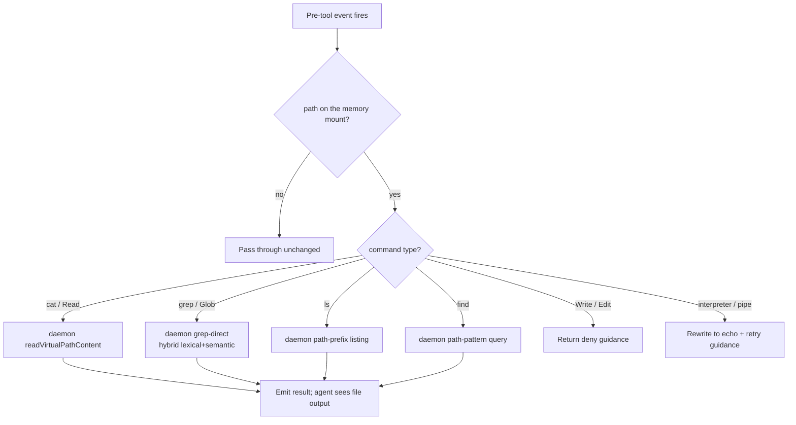

# Hook Lifecycle

> Category: Integrations | Version: 1.0 | Date: June 2026 | Status: Active

Which hook events fire on each of the seven harnesses, what each hook does, and how the shared session-start seam now auto-pulls both team skills and portable assets, every hook a thin client that hands capture, recall, and pipeline work to the Honeycomb daemon.

**Related:**
- [`harness-integration.md`](harness-integration.md)
- [`mcp-and-sdk.md`](mcp-and-sdk.md)
- [`../ai/session-capture.md`](../ai/session-capture.md)
- [`../architecture/request-lifecycle.md`](../architecture/request-lifecycle.md)
- [`../architecture/daemon-surface.md`](../architecture/daemon-surface.md)
- [`../collaboration/team-skills-sharing.md`](../collaboration/team-skills-sharing.md)
- [`../collaboration/asset-sync-substrate.md`](../collaboration/asset-sync-substrate.md)

---

## Hooks are thin clients

Every Honeycomb hook is a thin client. When a lifecycle event fires, the hook reads the credential, normalizes the harness's payload into the shape the daemon expects, and makes a local request to the daemon on port 3850. The daemon runs all of the actual work: capture writes, recall queries, the memory pipeline, skillify mining, and summary generation. The daemon is the only component that talks to DeepLake.

This keeps the per-harness code small and uniform. The hook does not build SQL, does not hold a DeepLake handle, and does not decide scope; it states what happened and lets the daemon decide what to persist and what to return. The end-to-end path a single request takes is covered in [`../architecture/request-lifecycle.md`](../architecture/request-lifecycle.md).

---

## Hook event coverage by harness

Each harness has its own event vocabulary. The table maps the logical Honeycomb events to the native names each harness actually emits (the maps live in each `src/hooks/<harness>/shim.ts`).

| Logical event | Claude Code | Codex | Cursor | Hermes | pi | OpenClaw |
|---|---|---|---|---|---|---|
| Session start / recall inject | `SessionStart` | `SessionStart` | `sessionStart` | `on_session_start` | AGENTS.md static block | `before_agent_start` + `before_prompt_build` |
| Prompt capture | `UserPromptSubmit` | `UserPromptSubmit` | `beforeSubmitPrompt` | `on_user_message` | (batched) | `agent_end` (batch) |
| Pre-tool intercept (VFS recall) | `PreToolUse` | `PreToolUse` (Bash) | `beforeShellExecution` (Shell) | `on_tool_use` (terminal only) | N/A | N/A |
| Tool-call capture | `PostToolUse` | `PostToolUse` | `postToolUse` | `on_tool_use` (terminal only) | N/A | `agent_end` (batch) |
| Assistant response capture | `Stop` / `SubagentStop` | `Stop` | `afterAgentResponse` / `stop` | N/A | N/A | `agent_end` (batch) |
| Session end / summary spawn | `SessionEnd` | N/A (periodic only) | `sessionEnd` | `on_session_end` | `agent_end` / `session_shutdown` | `agent_end` (with summary slice) |

A blank cell means that native event is not available on that harness. The lifecycle is still functionally complete: OpenClaw batches capture across the full conversation in `agent_end` rather than per-event, producing the same rows the daemon would have written incrementally, just grouped into one flush; pi reads its session-start context from the static `AGENTS.md` block rather than a live event.

Each harness also carries a context channel and a host CLI, both single-sourced in its shim:

| Harness | Context channel | Runtime path | Summary host CLI |
|---|---|---|---|
| Claude Code | model-only (`additionalContext`) | `legacy` | `claude -p` |
| Codex | user-visible | `legacy` | `codex exec --dangerously-bypass-approvals-and-sandbox` |
| Cursor | model-only (`additional_context`) | `plugin` | `cursor-agent` → `claude` fallback |
| Hermes | user-visible (`{ context }` + MCP mention) | `legacy` | `hermes --non-interactive` |
| pi | user-visible | `plugin` | `pi --print --provider 
 --model <m>` |
| OpenClaw | model-only | `plugin` | native extension slice (no host CLI) |

---

## The shim and the shared core

Each harness gets a single `src/hooks/<harness>/shim.ts`. The shim is a thin override: it declares the harness's event map, context channel, runtime path, and host CLI, and it lowers the harness's native payload into the canonical normalized data. The shim shares one `createShim` engine and contains no SQL and no DeepLake access.

The cross-harness logic lives in `src/hooks/shared/`. Every shim routes through these agent-agnostic modules:

| File | Role |
|---|---|
| `src/hooks/shared/session-start.ts` | The session-start lifecycle: credentials → heal → autoUpdate → ensure tables → placeholder → render context → prime → **autoPullSkills** + **assets** → spawn graph-pull → return context. |
| `src/hooks/shared/session-start-seams.ts` | The production `SessionStartSeams`, the real, fail-soft, time-budgeted loopback auto-pull wiring for skills and assets. |
| `src/hooks/shared/capture.ts` | Capture core: one normalized capture request per event to the daemon, which writes one `sessions` row. |
| `src/hooks/shared/pre-tool-use.ts` | The VFS intercept core: routes memory-path tool calls to daemon-backed reads/searches. |
| `src/hooks/shared/session-end.ts` | Session-end core: mark ended, record usage, fire skillify, spawn the summary worker. |
| `src/hooks/shared/context-renderer.ts` | Renders the rules/goals block injected at session start. Read-only; absorbs its own errors. |
| `src/hooks/shared/prime-renderer.ts` | Renders the session-start memory-prime digest appended to the context block. |
| `src/hooks/shared/credential-reader.ts` | Reads the shared `~/.deeplake/credentials.json` (PRD-023), falling back to the legacy `~/.honeycomb/credentials.json`. See [`../security/credential-storage.md`](../security/credential-storage.md). |
| `src/hooks/shared/daemon-client.ts` | The loopback transport every shared step calls the daemon through. |
| `src/hooks/shared/project-resolver.ts` | Resolves the project key for scope. |

The normalization layer (`src/hooks/normalize.ts`, `src/hooks/contracts.ts`) supplies the canonical `*Data` builders every shim reuses, so a Cursor `Shell` tool and a Claude Code `Bash` tool produce the same normalized shape and reach the same shared VFS intercept.

---

## What each hook event does

### Session start

The session-start core (`src/hooks/shared/session-start.ts`) runs once when the harness opens a new session. Its steps, in order, each fail-soft:

1. Load credentials. A session with no token continues read-only (recall is never disabled).
2. Heal token/org drift with `healDriftedOrgToken`.
3. `autoUpdate`, self-update if a newer plugin exists.
4. Ensure the `memory` and `sessions` tables exist. **Gated** on `HONEYCOMB_CAPTURE !== "false"`.
5. Write a placeholder summary row so the session is visible while in progress. **Gated** on capture.
6. Render the rules/goals context block (read-only, runs regardless of the gate), then append the session-start memory-prime digest.
7. **Auto-pull team skills** *and* **portable assets** (see below).
8. Spawn the detached graph-pull worker for the next session's codebase context.
9. Return the assembled context to the harness, routed through its channel.

The two gated steps (table-ensure + placeholder) reuse the pure `shouldCapture` gate; when capture is off, neither runs, but the context block still renders and is returned.

### The shared auto-pull seam

Steps 7's auto-pulls are the seam that makes team collaboration live. Both ride the same injectable `SessionStartSeams` object so they share one wiring discipline (`src/hooks/shared/session-start-seams.ts`):

- **Skills** POST to `POST /api/skills/pull`; **assets** POST to `POST /api/assets/pull`. The hook states "pull now"; the daemon runs the idempotent team pull plus the cross-harness symlink fan-out and the install/retract daemon-side. The hook opens no DeepLake.
- Both are **idempotent** (a re-pull of a version already on disk writes nothing), **fail-soft** (any error, daemon down, non-200, refused socket, timeout, is swallowed, so session start is never blocked), and **time-budgeted** (a 5-second abort timer; a hung daemon never delays the first turn).
- Both honor a kill switch: `HONEYCOMB_AUTOPULL_DISABLED=1` for skills, `HONEYCOMB_ASSET_AUTOPULL_DISABLED=1` for assets.
- Both stamp tenancy headers (`x-honeycomb-org` / `x-honeycomb-workspace` / `x-honeycomb-actor`) from the credential. A signed-out session POSTs unscoped and the daemon fail-closes it to a no-op.

This is why a teammate's freshly-mined skill or promoted asset becomes visible within seconds of publication. The skills loop is detailed in [`../collaboration/team-skills-sharing.md`](../collaboration/team-skills-sharing.md); the asset substrate it generalizes is in [`../collaboration/asset-sync-substrate.md`](../collaboration/asset-sync-substrate.md).

### Per-turn capture

The capture core handles three event types and sends one capture request per event, which the daemon writes as one row in the `sessions` table:

- **prompt events** (`user_message` row): the user's prompt text.
- **tool-call events** (`tool_call` row): the tool name, input, and response.
- **assistant-response events** (`assistant_message` row): the assistant's last message.

Each request carries session metadata (session id, cwd, permission mode, native event name, agent id) and an optional message embedding. If the daemon reports the table does not exist (a missed session-start ensure), it creates the table and retries once. On an assistant-response event, capture additionally asks the daemon to evaluate the stop-counter trigger, which may fire the skillify miner independently of the summary worker. OpenClaw batches capture differently: `agent_end` delivers the full conversation and the hook sends only the slice of new messages since the previous flush. The capture mechanics on the engine side are covered in [`../ai/session-capture.md`](../ai/session-capture.md).

### Pre-tool-use (VFS recall)

The pre-tool-use core is the VFS intercept. It runs before tool execution and looks for memory-path tool calls. When it sees one, it asks the daemon to resolve the call and rewrites the tool result from the daemon's response:

- `cat` / `Read` on a path becomes a direct row read via the daemon's `readVirtualPathContent`.
- `grep` / `Glob` becomes a hybrid lexical-plus-semantic search through the daemon's grep-direct path.
- `ls` becomes a path-prefix listing; `find` becomes a path-pattern query.

Write and Edit on a memory path are denied with guidance to use the CLI instead. Commands the VFS cannot model (interpreters, pipes, command substitution) are rewritten to a harmless `echo`. The harnesses differ on coverage: Claude Code and Codex intercept Bash; Cursor normalizes its `Shell` tool to the canonical `Bash` shape so the same intercept applies; Hermes intercepts terminal tools only; pi and OpenClaw have no pre-tool intercept.

### Session end

The session-end core exits fast and pushes work to detached processes and the daemon:

1. Mark the session ended so other sessions stop treating it as live.
2. Record usage by parsing the transcript for memory-search activity.
3. Fire skillify mining (its own per-project lock, independent of the summary lock).
4. Acquire the per-session summary lock and spawn the summary worker.

The detached worker reads the session's events from the daemon, shells the harness's host CLI (the per-harness binary in the table above), and sends the finished summary back to the daemon for the `memory` table. If the spawn throws before the worker takes ownership, the lock is released so a resume can retrigger summaries. The detail is in [`../architecture/request-lifecycle.md`](../architecture/request-lifecycle.md).

---

## Shared vs harness-specific behavior

```mermaid
flowchart LR
    subgraph shared["Shared core (always the same)"]
        capGate["Capture gate check"]
        daemonCall["Request to Honeycomb daemon"]
        vfsRoute["VFS path routing"]
        autopull["Skills + assets auto-pull seam"]
        summaryWorker["Summary worker spawn"]
        skillify["Skillify trigger"]
        contextRender["Rules/goals + prime render"]
    end

    subgraph harnessSpecific["Per-harness shims"]
        eventNames["Native event name map"]
        payloadShape["Payload normalization"]
        contextChannel["Context channel\nmodel-only vs user-visible"]
        toolSurface["Tool surface\nhook intercept vs registered tool"]
        hostCli["Host CLI for summary"]
    end

    harnessSpecific --> shared
```

The shims are intentionally thin. Their only job is to normalize the incoming payload into the shape the shared core expects and to route the daemon's response back through the harness's response format. All memory decisions, all SQL, all embedding calls, all locking, and both auto-pulls happen behind the shared core, in the daemon.
