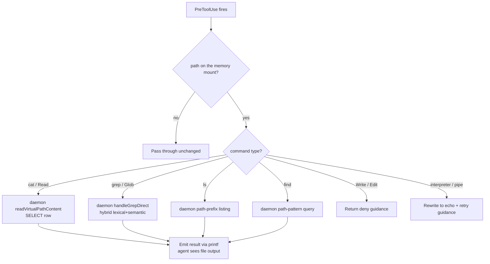

# Hook Lifecycle

> Category: Integrations | Version: 1.0 | Date: June 2026 | Status: Active

Which hook events fire on each agent, what each hook does, and how every hook is a thin client that hands capture, recall, and pipeline work to the Honeycomb daemon.

**Related:**
- [`harness-integration.md`](harness-integration.md)
- [`mcp-and-sdk.md`](mcp-and-sdk.md)
- [`../ai/session-capture.md`](../ai/session-capture.md)
- [`../architecture/request-lifecycle.md`](../architecture/request-lifecycle.md)
- [`../architecture/daemon-surface.md`](../architecture/daemon-surface.md)
- [`../security/trust-boundaries.md`](../security/trust-boundaries.md)

---

## Hooks are thin clients

Every Honeycomb hook is a thin client. When a lifecycle event fires, the hook reads the device-flow credential, normalizes the agent's payload into the shape the daemon expects, and makes a local request to the Honeycomb daemon on port 3850. The daemon runs all of the actual work: capture writes, recall queries, the memory pipeline, skillify mining, and summary generation. The daemon is the only component that talks to DeepLake.

This keeps the per-agent code small and uniform. The hook does not build SQL, does not hold a DeepLake handle, and does not decide scope; it states what happened and lets the daemon decide what to persist and what to return. The end-to-end path a single request takes through the daemon is covered in [`../architecture/request-lifecycle.md`](../architecture/request-lifecycle.md).

---

## Hook event coverage by agent

Each assistant has its own event vocabulary. The table below maps the logical Honeycomb events to the names each agent actually emits.

| Logical event | Claude Code | Codex | Cursor (1.7+) | OpenClaw | Hermes | pi |
|---|---|---|---|---|---|---|
| Session start / recall inject | `SessionStart` | `SessionStart` | `sessionStart` | `before_agent_start` + `before_prompt_build` | `on_session_start` | AGENTS.md static block |
| Prompt capture | `UserPromptSubmit` | `UserPromptSubmit` | `beforeSubmitPrompt` | `agent_end` (message batch) | `on_user_message` | `agent_end` |
| Pre-tool intercept (VFS recall) | `PreToolUse` | `PreToolUse(Bash)` | `postToolUse` / `beforeSubmitPrompt` | N/A (tool registration) | `on_tool_use` (terminal only) | N/A |
| Post-tool capture | `PostToolUse` | `PostToolUse` | `postToolUse` | `agent_end` (message batch) | N/A | N/A |
| Assistant response capture | `Stop` / `SubagentStop` | `Stop` | `afterAgentResponse` / `stop` | `agent_end` (message batch) | N/A | N/A |
| Session end / summary spawn | `SessionEnd` | N/A (periodic only) | `sessionEnd` | `agent_end` (with summary worker request) | `on_session_end` | `session_shutdown` |

A blank cell means that event is not available on that assistant. The lifecycle is still functionally complete: OpenClaw, for example, batches capture across the full conversation in `agent_end` rather than per-event, producing the same rows the daemon would have written incrementally, just grouped into one flush.

---

## The shared core files

The code paths that normalize payloads and call the daemon are agent-agnostic. Every per-agent shim calls into these shared modules:

| File | Role |
|---|---|
| `src/hooks/capture.ts` | Reference capture implementation (Claude Code). Sends one capture request per event to the daemon. |
| `src/hooks/session-start.ts` | Reference SessionStart (Claude Code). Authenticates, heals drift, asks the daemon to ensure tables, writes placeholder, renders context block. |
| `src/hooks/pre-tool-use.ts` | Reference VFS intercept (Claude Code). Routes Bash/Read/Grep/Glob on the memory path to daemon-backed queries. |
| `src/hooks/session-end.ts` | Reference SessionEnd (Claude Code). Marks session ended, records usage, fires skillify, requests the summary worker. |
| `src/hooks/wiki-worker.ts` | Background summary worker (Claude Code). Reads session rows via the daemon, shells `claude -p`, sends the result to the daemon for the `memory` table. |
| `src/hooks/spawn-wiki-worker.ts` | Detached spawn helper. Writes a temp config JSON and forks `wiki-worker.js` as an unref'd child. |
| `src/hooks/shared/context-renderer.ts` | Renders the rules and goals block injected at SessionStart. Read-only; absorbs its own errors. |
| `src/hooks/shared/capture-gate.ts` | `HONEYCOMB_CAPTURE !== "false"` gate and only-CLI entrypoint check used by every capture path. |
| `src/hooks/shared/autoupdate.ts` | `autoUpdate(creds, { agent })`: checks npm registry, spawns `honeycomb update` if a newer version is found. |
| `src/hooks/shared/goals-instructions.ts` | `GOALS_INSTRUCTIONS_CLI`: the CLI-variant goal-management instructions injected for Cursor, Hermes, and pi. |
| `src/hooks/shared/skillopt-hook.ts` | Arms the skill-optimization counter when the agent invokes an org skill. |
| `src/hooks/summary-state.ts` | Per-session sidecar: `clearSessionEnded`, `markSessionEnded`, `tryAcquireLock`, `releaseLock`, `finalizeSummary`. |

---

## Per-agent shim directories

Each agent that needs behavior different from the Claude Code reference gets its own subdirectory under `src/hooks/`.

```
src/hooks/
├── capture.ts              ← reference
├── session-start.ts        ← reference
├── pre-tool-use.ts         ← reference
├── session-end.ts          ← reference
├── wiki-worker.ts          ← reference (shells claude -p)
├── spawn-wiki-worker.ts    ← reference
├── harnesses/codex/
│   ├── session-start.ts        # minimal inject; async setup in session-start-setup.ts
│   ├── session-start-setup.ts  # table ensure, placeholder, version check (detached)
│   ├── capture.ts              # same logic, Codex payload shape
│   ├── pre-tool-use.ts         # intercepts Bash only
│   ├── wiki-worker.ts          # shells `codex exec --dangerously-bypass-approvals-and-sandbox`
│   └── spawn-wiki-worker.ts    # same pattern, Codex config keys
├── cursor/
│   ├── session-start.ts        # additional_context key, workspace_roots for cwd
│   ├── capture.ts              # same logic, Cursor payload shape
│   ├── pre-tool-use.ts         # Shell intercept, same VFS logic
│   ├── session-end.ts          # sessionEnd event name
│   ├── wiki-worker.ts          # shells `cursor-agent` or falls back to claude
│   └── spawn-wiki-worker.ts    # Cursor config keys
├── harnesses/hermes/
│   ├── session-start.ts        # { context: "..." } output, MCP tools mention in inject
│   ├── capture.ts              # same logic, Hermes payload shape
│   ├── pre-tool-use.ts         # terminal tool intercept only
│   ├── session-end.ts          # on_session_end event
│   ├── wiki-worker.ts          # shells `hermes` in non-interactive mode
│   └── spawn-wiki-worker.ts    # Hermes config keys
└── harnesses/pi/
    └── wiki-worker.ts          # shells `pi --print --provider <p> --model <m>`
```

The pi extension itself lives at `harnesses/pi/extension-source/honeycomb.ts` (installed as `~/.pi/agent/honeycomb/honeycomb.ts`). It contains the pi-native session hooks and spawns the summary worker. Only the summary worker is in `src/hooks/pi/` because the extension entry point is pi-specific TypeScript that pi compiles directly. The mapping of each agent to its install surface is detailed in [`harness-integration.md`](harness-integration.md).

---

## What each hook event does

### Session start

The SessionStart hook runs once when the assistant opens a new session. Its responsibilities, in order, are:

1. Load credentials from `~/.honeycomb/credentials.json`. On a fresh box with no token, either prompt for login (OpenClaw, pi) or log a notice and continue read-only (all others).
2. Heal token/org drift with `healDriftedOrgToken` if credentials are present.
3. Run `autoUpdate` before any daemon calls so the update notice appears even if the backend is slow. (Not in Codex, which defers this to the detached setup process.)
4. Ask the daemon to ensure the `memory` and `sessions` tables exist. Gated on `HONEYCOMB_CAPTURE !== "false"`.
5. Ask the daemon to write a placeholder summary row so the session is visible in the index while it is in progress. Gated on capture.
6. Render the rules/goals context block via `renderContextBlock`. Read-only; runs regardless of the capture gate.
7. Pull skills from teammates with `autoPullSkills` (a daemon request).
8. Spawn the graph pull worker for the next session's codebase context.
9. Return the assembled `additionalContext` (or equivalent) to the assistant.

Claude Code and Cursor both receive a full context block (memory tier docs, memory commands, skillify commands, rules, goals, graph line) because their `additionalContext` is model-only. Codex receives only a brief login-state line because its `hook context:` is user-visible. Hermes receives the full block despite TUI visibility because the structural index is considered worth the extra lines. pi reads from the static `AGENTS.md` block.

### Per-turn capture

Capture handles three event types and sends one capture request per event to the daemon, which writes one row per event to the `sessions` table:

- **UserPromptSubmit / beforeSubmitPrompt** (`user_message` row): records the user's prompt text.
- **PostToolUse** (`tool_call` row): records the tool name, input, and response.
- **Stop / SubagentStop / afterAgentResponse** (`assistant_message` row): records the assistant's last message.

Each request carries session metadata (session id, cwd, permission mode, hook event name, agent id) and an optional `message_embedding` vector. If the daemon reports the table does not exist yet (the SessionStart ensure failed), it creates the table and retries once. The capture mechanics on the engine side are covered in [`../ai/session-capture.md`](../ai/session-capture.md).

On a Stop event, `capture.ts` additionally asks the daemon to evaluate `tryStopCounterTrigger`, which may fire the skillify miner independently of the summary worker.

OpenClaw batches capture differently: `agent_end` delivers the full conversation as a `messages` array and the hook sends only the slice of new messages since the previous flush.

### Pre-tool-use (VFS recall)

The PreToolUse hook is the VFS intercept. It runs before every tool execution and looks for Bash, Read, Grep, or Glob calls whose paths start with the memory path. When it sees one, it asks the daemon to resolve the call and rewrites the tool result from the daemon's response:

- `cat` / `Read` on a path becomes a direct row read from the `memory` or `sessions` table via the daemon's `readVirtualPathContent`.
- `grep` / `Glob` becomes a hybrid lexical-plus-semantic search through the daemon's `handleGrepDirect`.
- `ls` becomes a path-prefix listing.
- `find` becomes a path-pattern query.

Write and Edit on a memory path are denied with guidance to use Bash instead. Commands that the VFS cannot model (interpreters, pipes, command substitution) are rewritten to a harmless `echo` so nothing escapes to the real filesystem. Codex and Hermes intercept only Bash/terminal, so Read-tool memory access is less available on those assistants. OpenClaw and pi have no PreToolUse hook at all.



### Session end

The SessionEnd hook exits fast and pushes all work to detached processes and the daemon:

1. Call `markSessionEnded` so other sessions stop treating this one as live.
2. Call `recordSessionUsage` to parse the transcript for memory-search activity and append a record to `~/.honeycomb/usage-stats.jsonl`.
3. Call `forceSessionEndTrigger` to run skillify mining (uses its own per-project lock, independent of the summary lock).
4. Acquire the per-session summary lock and spawn the summary worker with reason `SessionEnd`.

If the spawn throws before the worker takes ownership, the hook releases the lock so a `--resume` can retrigger summaries. The detached worker reads the session's events from the daemon, shells the host CLI, and sends the finished summary back to the daemon for the `memory` table. This is covered in detail in [`../architecture/request-lifecycle.md`](../architecture/request-lifecycle.md).

---

## Shared vs agent-specific behavior summary

```mermaid
flowchart LR
    subgraph shared["Shared core (always the same)"]
        capGate["Capture gate check"]
        daemonCall["Request to Honeycomb daemon"]
        vfsRoute["VFS path routing"]
        summaryWorker["Summary worker spawn"]
        skillify["Skillify trigger"]
        contextRender["Rules/goals render"]
    end

    subgraph agentSpecific["Agent-specific shims"]
        eventNames["Event name mapping"]
        payloadShape["Payload field normalization"]
        contextChannel["Context injection channel\nmodel-only vs user-visible"]
        toolSurface["Tool surface\nhook intercept vs registered tool"]
        hostCli["Host CLI for summary\nclaude / codex / cursor-agent / pi"]
        asyncPattern["Async pattern\ninline vs detached setup"]
    end

    agentSpecific --> shared
```



The shims are intentionally thin. Their only job is to normalize the incoming payload into the shape the shared core expects and to route the daemon's response back through the assistant's specific response format. All memory decisions, all SQL, all embedding calls, and all locking happen in the daemon, behind the shared core.
