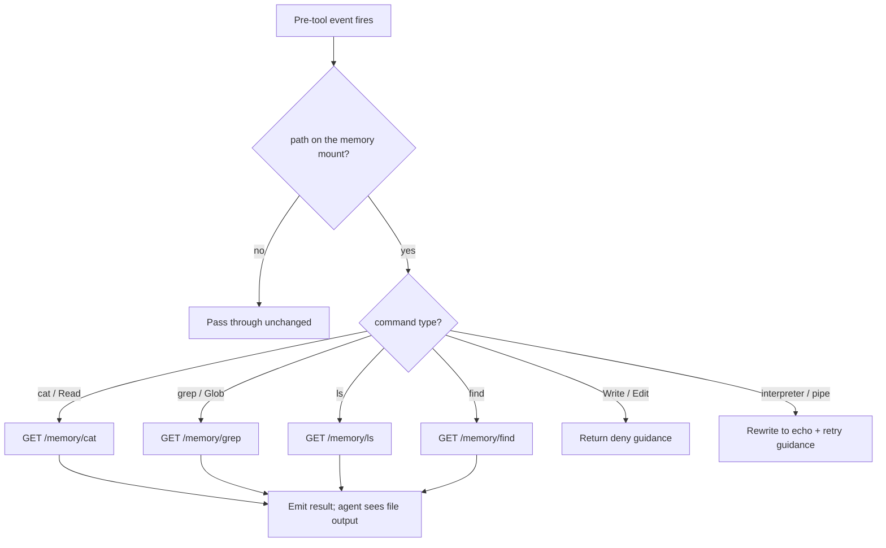

# Hook Lifecycle

> Category: Integrations | Version: 1.3 | Date: October 2026 | Status: Active

Which hook events fire on each of the six harnesses, what each hook does, and how the shared session-start seam returns recall first and then fire-and-forget auto-pulls both team skills and portable assets in the background, every hook a thin client that hands capture, recall, and pipeline work to the Honeycomb daemon.

**Related:**
- [`harness-integration.md`](harness-integration.md)
- [`mcp-and-sdk.md`](mcp-and-sdk.md)
- [`../ai/session-capture.md`](../ai/session-capture.md)
- [`../architecture/request-lifecycle.md`](../architecture/request-lifecycle.md)
- [`../architecture/daemon-surface.md`](../architecture/daemon-surface.md)
- [`../collaboration/team-skills-sharing.md`](../collaboration/team-skills-sharing.md)
- [`../collaboration/asset-sync-substrate.md`](../collaboration/asset-sync-substrate.md)

---

## Hooks are thin clients

Every Honeycomb hook is a thin client. When a lifecycle event fires, the hook reads the credential, normalizes the harness's payload into the shape the daemon expects, and makes a local request to the daemon on port 3850. The daemon runs all of the actual work: capture writes, recall queries, the memory pipeline, skillify mining, and summary generation. The daemon is the only component that talks to DeepLake.

This keeps the per-harness code small and uniform. The hook does not build SQL, does not hold a DeepLake handle, and does not decide scope; it states what happened and lets the daemon decide what to persist and what to return. The end-to-end path a single request takes is covered in [`../architecture/request-lifecycle.md`](../architecture/request-lifecycle.md).

---

## Hook event coverage by harness

Each harness has its own event vocabulary. The table maps logical Honeycomb events to the native names in each `src/hooks/<harness>/shim.ts`, except Cursor's pre-tool cell, which is the connector registration.

| Logical event | Claude Code | Codex | Cursor | Hermes | pi | OpenClaw |
|---|---|---|---|---|---|---|
| Session start / recall inject | `SessionStart` | `SessionStart` | `sessionStart` | `on_session_start` | shim `piAgentsBlock` only | `before_agent_start` + `before_prompt_build` |
| Prompt capture | `UserPromptSubmit` | `UserPromptSubmit` | `beforeSubmitPrompt` | `on_user_message` | N/A | N/A |
| Pre-tool intercept (VFS recall) | `PreToolUse` | `PreToolUse` (Bash) | connector `beforeShellExecution` (shim unmapped) | N/A | N/A | N/A |
| Tool-call capture | `PostToolUse` | `PostToolUse` | `postToolUse` | `on_tool_use` (terminal only) | N/A | N/A |
| Assistant response capture | `Stop` / `SubagentStop` | `Stop` | `afterAgentResponse` / `stop` | N/A | N/A | N/A |
| Session end / summary intent | `SessionEnd` | N/A (periodic only) | `sessionEnd` | `on_session_end` | `agent_end` / `session_shutdown` | `agent_end` |

A blank cell means that native event is absent from the live shim map. Hermes, pi, and OpenClaw remain in progress. OpenClaw's live `agent_end` returns session-end data; `openclawExpandBatch` is called from tests, not from `createOpenClawShim`. pi's harness entry is `bootHarness("pi")`. The extension file the shim names, `harnesses/pi/extension-source/honeycomb.ts`, is absent, so `piAgentsBlock` has no live writer. Cursor's connector still registers `pre-tool-use` as `beforeShellExecution` (matcher `Shell`); `CURSOR_EVENT_MAP` has no that name, so the running shim drops it.

Each harness also carries a context channel and a host CLI, both single-sourced in its shim:

| Harness | Context channel | Runtime path | Shim host CLI |
|---|---|---|---|
| Claude Code | model-only (`additionalContext`) | `legacy` | `claude -p` |
| Codex | user-visible | `legacy` | `codex exec --dangerously-bypass-approvals-and-sandbox` |
| Cursor | model-only (`additional_context`) | `plugin` | `cursor-agent` → `claude` fallback |
| Hermes | user-visible (`{ context }` + MCP mention) | `legacy` | `hermes --non-interactive` |
| pi | user-visible | `plugin` | `pi --print --provider 
 --model <m>` |
| OpenClaw | model-only | `plugin` | native extension slice (no host CLI) |

---

## The shim and the shared core

Each harness gets a single `src/hooks/<harness>/shim.ts`. The shim is a thin override: it declares the harness's event map, context channel, runtime path, and host CLI, and it lowers the harness's native payload into the canonical normalized data. The shim shares one `createShim` engine and contains no SQL and no DeepLake access.

The cross-harness logic lives in `src/hooks/shared/`. Every shim routes through these agent-agnostic modules:

| File | Role |
|---|---|
| `src/hooks/shared/session-start.ts` | Session start: credentials, context request, prime, recall-awareness notice, **return context**, then fire-and-forget **autoPullSkills** + **assets** (PR #257). Production seams for heal, auto-update, table-ensure, placeholder, and graph-pull are empty. |
| `src/hooks/shared/session-start-seams.ts` | The production `SessionStartSeams`, the real, fail-soft, time-budgeted loopback auto-pull wiring for skills and assets. |
| `src/hooks/shared/capture.ts` | Capture core: one normalized capture request per event to the daemon, which writes one `sessions` row. |
| `src/hooks/shared/pre-tool-use.ts` | The VFS intercept core: routes memory-path tool calls to daemon-backed reads/searches. |
| `src/hooks/shared/session-end.ts` | POSTs intents `mark-ended`, `record-usage`, and `skillify`, then calls spawn. Production spawn is a no-op. The daemon acks those intents and enqueues a `summary` job. |
| `src/hooks/shared/context-renderer.ts` | POSTs `/api/hooks/context`. Production `contextHandler` returns `{ additionalContext: "" }`. The renderer absorbs its own errors. |
| `src/hooks/shared/prime-renderer.ts` | Renders the session-start memory-prime digest appended to the context block. |
| `src/hooks/shared/credential-reader.ts` | Reads the shared `~/.deeplake/credentials.json` (PRD-023), falling back to the legacy `~/.honeycomb/credentials.json`. See [`../security/credential-storage.md`](../security/credential-storage.md). |
| `src/hooks/shared/daemon-client.ts` | The loopback transport every shared step calls the daemon through. |
| `src/hooks/shared/project-resolver.ts` | Resolves the project key for scope. |

The normalization layer (`src/hooks/normalize.ts`, `src/hooks/contracts.ts`) supplies the canonical `*Data` builders every shim reuses, so a Cursor `Shell` tool and a Claude Code `Bash` tool produce the same normalized shape and reach the same shared VFS intercept.

---

## What each hook event does

### Session start

The session-start core (`src/hooks/shared/session-start.ts`) runs once when the harness opens a new session. Its steps, in order, each fail-soft:

1. Load credentials. A session with no token continues read-only (recall is never disabled).
2. Call `healDriftedOrgToken`. Production `createSessionStartSeams` leaves this empty.
3. Call `autoUpdate`. The production seam is empty.
4. Call `ensureTables` for the `memory` and `sessions` tables. **Gated** on `HONEYCOMB_CAPTURE !== "false"`. The production seam is empty.
5. Call `writePlaceholderSummary`. **Gated** on capture. The production seam is empty.
6. Request the rules/goals block with `POST /api/hooks/context` (ungated). Production `attachHooks` leaves `contextHandler` as the default, which returns `{ additionalContext: "" }`. Then append the session-start memory-prime digest (`GET /api/memories/prime`) and a short **recall-awareness notice** (PRD-075c): a one-line reminder that the model can pull deeper memory on demand, plus a `honeycomb recall "<query>"` sentinel it can invoke. The notice renders unconditionally, so session-start assertions expect it (merge reconciliation R-1 in [PR #271](https://github.com/legioncodeinc/honeycomb/pull/271)).
7. **Return the assembled context to the harness, routed through its channel**, as soon as the prime is ready.
8. In the background (fire-and-forget, after the return): **auto-pull team skills** *and* **portable assets** (see below). `spawnGraphPull` is called on the same path and is an empty function. Claude Code skips the in-process pulls and spawns a hygiene child that calls the same seams, so the two pulls stay real and graph-pull stays empty.

The two gated calls (table-ensure + placeholder) reuse the pure `shouldCapture` gate. When capture is off, those calls are skipped. The context request, the prime digest, and the recall notice still run.

**Recall returns first; hygiene runs detached (PR #257).** The prime digest and the recall notice are the session-start output the model consumes, so they stay on the critical path. The skills and assets pulls are side-effecting hygiene that never touch the returned context, so they run in a fire-and-forget `backgroundPull()` (a detached call wrapped in a swallow guard that tolerates both async rejection and synchronous throws). Before this, `runSessionStart` `await`ed `autoPullSkills` (~5s) and `autoPullAssets` (~3s) *before* returning, so a warm session took ~9s and a cold one blew past the SessionStart deadline, and Claude Code cancelled the hook (`hook_cancelled`) with the already-computed recall never reaching `additionalContext`. The same PR also **raised the Claude Code SessionStart timeout from 10s to 30s** (`harnesses/claude-code/hooks/hooks.json`, mirrored in `src/connectors/claude-code.ts`), so even a cold-daemon recall has headroom to land. The two fixes are complementary: the detach makes the common case fast, the wider budget makes the cold case safe.

### The shared auto-pull seam

Step 8's background auto-pulls are the seam that makes team collaboration live. Both ride the same injectable `SessionStartSeams` object so they share one wiring discipline (`src/hooks/shared/session-start-seams.ts`), and both now run detached from the context return (PR #257) so a slow pull never delays the recall:

- **Skills** POST to `POST /api/skills/pull`; **assets** POST to `POST /api/assets/pull`. The hook states "pull now"; the daemon runs the idempotent team pull plus the cross-harness symlink fan-out and the install/retract daemon-side. The hook opens no DeepLake.
- Both are **idempotent** (a re-pull of a version already on disk writes nothing), **fail-soft** (any error, daemon down, non-200, refused socket, timeout, is swallowed, so session start is never blocked), and **time-budgeted** (a 5-second abort timer; a hung daemon never delays the first turn).
- Both honor a kill switch: `HONEYCOMB_AUTOPULL_DISABLED=1` for skills, `HONEYCOMB_ASSET_AUTOPULL_DISABLED=1` for assets.
- Skills headers omit `x-honeycomb-org` when the credential has none, so a signed-out skills pull is unscoped and the daemon fail-closes it. The assets pull stamps org `"local"` when the credential org is absent, and still stamps workspace, author, and device id.

This is why a teammate's freshly-mined skill or promoted asset becomes visible within seconds of publication. The skills loop is detailed in [`../collaboration/team-skills-sharing.md`](../collaboration/team-skills-sharing.md); the asset substrate it generalizes is in [`../collaboration/asset-sync-substrate.md`](../collaboration/asset-sync-substrate.md).

### Prompt-time recall (Claude Code)

Session-start priming is a once-per-session push on `GET /api/memories/prime`. PRD-076a adds a **deterministic recall floor** on Claude Code: query-aware recall injected synchronously on the recall-mode `UserPromptSubmit` (`--honeycomb-recall` in `harnesses/claude-code/hooks/hooks.json`). `src/hooks/shared/user-prompt-recall.ts` POSTs that prompt to `POST /api/memories/recall`. The two arms use different daemon routes.

Three properties keep the Claude Code arm bounded:

- **Twice-registered hook.** Claude Code registers `UserPromptSubmit` for both capture and recall. Capture stays **async** (fire-and-forget, as it always was) so the recall injection is the only synchronous work added to the turn; the two do not serialize behind each other. Codex maps the same native name to `user_message` capture only. Cursor's prompt event is `beforeSubmitPrompt` and is capture-only.
- **Block text and envelope.** `renderRecallBlock` builds the mid-session text. `renderContext` (`src/hooks/normalize.ts`) passes that string through. The Claude Code recall shim is built with `contextHookEvent: "UserPromptSubmit"`, and in that case `renderContext` also adds `hookSpecificOutput` on the envelope.
- **Throttle + ref-dedupe.** A throttle bounds how often recall fires, and a reference-dedupe store suppresses re-injecting a memory the session has already seen, so a repetitive prompt does not spam the context with the same rows. The dedupe store is written with tightened `0700`/`0600` permissions (the one Medium security finding on the PR, fixed in place).

Recall is **fail-soft**: a daemon-down or non-200 recall is swallowed and the turn proceeds with no injected block, never blocked.

### Per-turn capture

The capture core handles three event types and sends one capture request per event, which the daemon writes as one row in the `sessions` table:

- **prompt events** (`user_message` row): the user's prompt text.
- **tool-call events** (`tool_call` row): the tool name, input, and response.
- **assistant-response events** (`assistant_message` row): the assistant's last message.

Each request carries session metadata (session id, cwd, permission mode, native event name, agent id) and an optional message embedding. If the daemon reports the table does not exist (a missed session-start ensure), it creates the table and retries once. Hook capture posts `{ event, metadata }` and leaves `isTurnTerminating` unset. The daemon defaults that flag to false, so `tryStopCounterTrigger` stays idle on the live capture path. `recordMessage` still runs on every accepted event, and that bump is the summary message counter. OpenClaw's live shim maps `agent_end` to session-end data. The capture mechanics on the engine side are covered in [`../ai/session-capture.md`](../ai/session-capture.md).

### Pre-tool-use (VFS recall)

The pre-tool-use core is the VFS intercept. It runs before tool execution and looks for memory-path tool calls. When it sees one, it asks the daemon to resolve the call and rewrites the tool result from the daemon's response:

- `cat` / `Read` resolves as `GET /memory/cat`.
- `grep` / `Glob` resolves as `GET /memory/grep`.
- `ls` resolves as `GET /memory/ls`; `find` resolves as `GET /memory/find`.

Write and Edit on a memory path are denied with guidance to use the CLI instead. Commands the VFS cannot model (interpreters, pipes, command substitution) are rewritten to a harmless `echo`. The harnesses differ on coverage: Claude Code and Codex intercept Bash. Cursor's connector registers `beforeShellExecution`, and the shim that the hook binary runs drops that native name, so the handler never reaches `runPreToolUse`. A `Shell` tool on Cursor `postToolUse` is captured as `tool_call`. Hermes maps `on_tool_use` to `tool_call` and keeps terminal tools only, as tool-call capture. pi and OpenClaw have no pre-tool intercept. When no embed client is injected, VFS `GET /memory/grep` (`fetchGrep`) returns the lexical floor with `degraded: true`.

**This path went live in PRD-075.** It was previously scaffolded but dormant. 075a wires the real daemon-backed `VfsIntercept` and propagates a `PreToolDecision` back out of the shared core, and 075b renders that decision into the Claude Code `PreToolUse` contract as a **block-and-inject**: `permissionDecision: "deny"` plus `hookSpecificOutput.additionalContext` carrying the recalled content, so the model's tool call is intercepted and the memory is handed back in one response. The rendered shape is pinned to the real Claude Code contract by conformance tests (`references/claude-code/pretool-response-schema.ts`) so a harness contract change cannot silently break the inject. This is the **model-commanded recall arm**: the model reaches for a memory path and the hook answers, complementary to the always-on prompt-time floor above.

```mermaid
flowchart TD
    hookFire["Pre-tool event fires"] --> isMemoryPath{"path on the memory mount?"}
    isMemoryPath -- no --> passThrough["Pass through unchanged"]
    isMemoryPath -- yes --> routeCmd{"command type?"}
    routeCmd -- "cat / Read" --> daemonRead["GET /memory/cat"]
    routeCmd -- "grep / Glob" --> daemonSearch["GET /memory/grep"]
    routeCmd -- "ls" --> daemonList["GET /memory/ls"]
    routeCmd -- "find" --> daemonPattern["GET /memory/find"]
    routeCmd -- "Write / Edit" --> denyWrite["Return deny guidance"]
    routeCmd -- "interpreter / pipe" --> safeEcho["Rewrite to echo + retry guidance"]
    daemonRead --> emitResult["Emit result; agent sees file output"]
    daemonSearch --> emitResult
    daemonList --> emitResult
    daemonPattern --> emitResult
```

### Session end

The session-end core exits fast and hands the daemon a signal:

1. POST intents `mark-ended`, `record-usage`, and `skillify` to `/api/hooks/session-end`.
2. Call `spawn`. Production hook binaries build `createHookRuntime` without a spawn, so this is `noopSummarySpawn`. Dispatch leaves the lock at the default `createFakeSummaryLock()`.
3. The daemon default handler acknowledges those intents and enqueues a `summary` job with `triggerKind: "final"`. The real mark, usage, and skillify body is still deferred. The enqueue is what schedules the summary.

The daemon worker shells `summaryCliSpecFor` (`src/daemon/runtime/summaries/job.ts`): `codex exec -`, `cursor-agent -p`, `hermes -p`, `pi -p`, and `claude -p` for `claude`, `claude-code`, and unknown agents including `openclaw`. The shim host CLI column above is the per-shim constant (`claude -p`, `codex exec --dangerously-bypass-approvals-and-sandbox`, `cursor-agent` with a `claude` fallback, `hermes --non-interactive`, `pi --print --provider 
 --model <m>`, OpenClaw an empty bin). The detail is in [`../architecture/request-lifecycle.md`](../architecture/request-lifecycle.md).

---

## Shared vs harness-specific behavior

```mermaid
flowchart LR
    subgraph shared["Shared core (always the same)"]
        capGate["Capture gate check"]
        daemonCall["Request to Honeycomb daemon"]
        vfsRoute["VFS path routing"]
        autopull["Skills + assets auto-pull seam"]
        summaryWorker["Daemon summary job enqueue"]
        skillify["Skillify intent (body deferred)"]
        contextRender["Empty context default + prime"]
    end

    subgraph harnessSpecific["Per-harness shims"]
        eventNames["Native event name map"]
        payloadShape["Payload normalization"]
        contextChannel["Context channel\nmodel-only vs user-visible"]
        toolSurface["Tool surface\nhook intercept vs registered tool"]
        hostCli["Shim host CLI constant"]
    end

    harnessSpecific --> shared
```

The shims are intentionally thin. Their only job is to normalize the incoming payload into the shape the shared core expects and to route the daemon's response back through the harness's response format. All memory decisions, all SQL, all embedding calls, all locking, and both auto-pulls happen behind the shared core, in the daemon.
