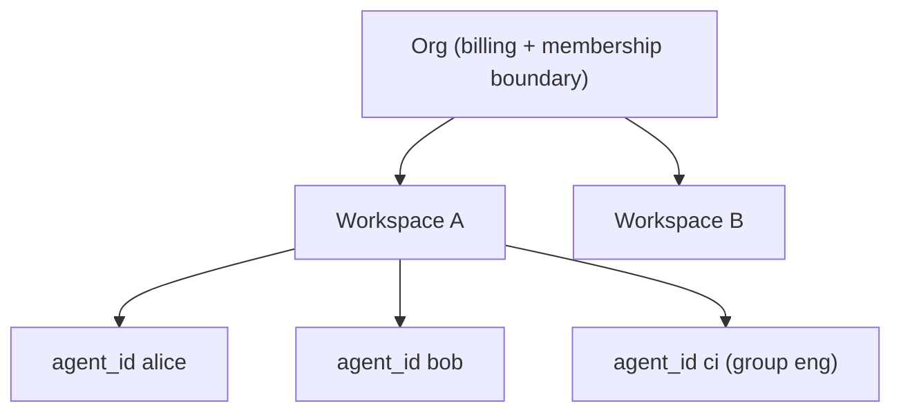

# Org and Workspace Model

> Category: Multi-tenant | Version: 1.0 | Date: June 2026 | Status: Active

The two-level tenancy that makes Honeycomb a team product: org and workspace boundaries enforced at the storage layer, how they nest with within-workspace agent scoping, and the credential and switching mechanics.

**Related:**
- [`../auth/auth-architecture.md`](../auth/auth-architecture.md)
- [`../security/scoping-and-visibility.md`](../security/scoping-and-visibility.md)
- [`../security/credential-storage.md`](../security/credential-storage.md)
- [`../data/deeplake-storage.md`](../data/deeplake-storage.md)
- [`../data/schema.md`](../data/schema.md)

---

## Why tenancy is a storage concern

Honeycomb is team-shared by default, so two teams, and two projects within a team, must never see each other's memory. The decision that makes this safe is to enforce isolation at the storage layer, not only in the API. Org and workspace are the boundary, and DeepLake resolves them so a query in one workspace cannot reach another's rows, partitions, or indexes. An API-only filter can be forgotten on a new code path; a storage-layer boundary cannot.

## Two levels, plus a third inside

Tenancy nests three deep, and each level has a different owner.



The **org** is the top boundary: membership and billing. The **workspace** is the project boundary within an org; storage isolation is enforced here, so two workspaces share nothing. The **agent**, identified by `agent_id`, is the within-workspace boundary: multiple named agents share one workspace and one set of tables but are separated by a read policy. Org and workspace come from Hivemind; `agent_id` scoping comes from our memory engine. Honeycomb stacks them, so a row is reachable only when the org and workspace match and the agent read policy allows it.

## How requests carry tenancy

A request's org and workspace come from the caller's credentials and token. The daemon sends the resolved org on each DeepLake request, and the workspace is part of the storage path resolution. `agent_id` is resolved from the request body, then from a harness session key (for example OpenClaw's `agent:alice:...` form), then defaults to `'default'`. The daemon never hardcodes a tenancy value when a real one is known. The read-policy SQL that applies `agent_id` is documented in [`../security/scoping-and-visibility.md`](../security/scoping-and-visibility.md).

## Credentials and switching

The credentials file carries the token, org id and name, user name, workspace id (often the `default` sentinel), and the daemon URL, at mode `0600`. Switching org re-mints a fresh org-bound token, because the org is baked into the token claim; switching workspace updates the file only, since the workspace resolves server-side. Environment overrides (`HONEYCOMB_ORG_ID`, `HONEYCOMB_WORKSPACE_ID`, `HONEYCOMB_TOKEN`) take precedence for scripted and CI use. The file layout is documented in [`../security/credential-storage.md`](../security/credential-storage.md).

```bash
honeycomb org switch acme
honeycomb workspace use backend
honeycomb status        # shows logged-in org, workspace, agent
```

## Drift healing

A token can drift from the active org, for example after an org switch on another machine. On session start the daemon decodes the token's org claim, compares it to the configured org, and re-mints if they disagree, then realigns the stored org name and workspace. Healing is best-effort: on failure it logs a warning and continues with the stale token rather than blocking the session. This is the tenancy side of the auth flow in [`../auth/auth-architecture.md`](../auth/auth-architecture.md).

## What is shared and what is not

Within an org, workspaces are hard-isolated at storage. Within a workspace, what one agent sees depends on the read policy: `isolated` agents see only their own memories, `shared` agents see workspace-global memories plus their own, and `group` agents see global memories from agents in the same `policy_group` plus their own. This is how a team gets the "one brain for all your agents" effect inside a workspace while still letting a CI agent or a personal agent keep a private lane. The enforcement detail is in [`../security/scoping-and-visibility.md`](../security/scoping-and-visibility.md), and the storage isolation it builds on is in [`../data/deeplake-storage.md`](../data/deeplake-storage.md).
