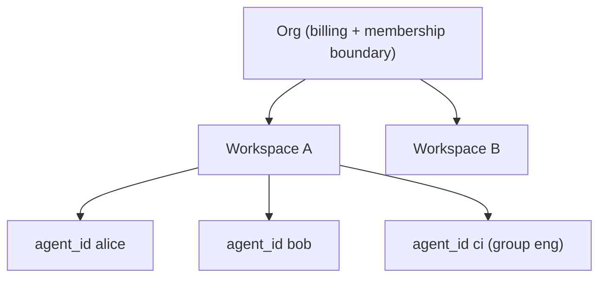

# Org and Workspace Model

> Category: Multi-tenant | Version: 1.0 | Date: June 2026 | Status: Active

The two-level tenancy that makes Honeycomb a team product: org and workspace boundaries enforced at the storage layer, how they nest with within-workspace agent scoping, and the credential and switching mechanics.

**Related:**
- [`../auth/auth-architecture.md`](../auth/auth-architecture.md)
- [`../security/scoping-and-visibility.md`](../security/scoping-and-visibility.md)
- [`../security/credential-storage.md`](../security/credential-storage.md)
- [`../data/deeplake-storage.md`](../data/deeplake-storage.md)
- [`../data/schema.md`](../data/schema.md)
- [`../architecture/multi-project-and-context-switching.md`](../architecture/multi-project-and-context-switching.md)

---

## Why tenancy is a storage concern

Honeycomb is team-shared by default, so two teams, and two projects within a team, must never see each other's memory. The decision that makes this safe is to enforce isolation at the storage layer, not only in the API. Org and workspace are the boundary, and DeepLake resolves them so a query in one workspace cannot reach another's rows, partitions, or indexes. An API-only filter can be forgotten on a new code path; a storage-layer boundary cannot.

## Two levels, plus a third inside

Tenancy nests three deep, and each level has a different owner.



The **org** is the top boundary: membership and billing. The **workspace** is the team boundary within an org; storage isolation is enforced here, so two workspaces share nothing. The **agent**, identified by `agent_id`, is the within-workspace boundary: multiple named agents share one workspace and one set of tables but are separated by a read policy. Org and workspace come from Hivemind; `agent_id` scoping comes from our memory engine. Honeycomb stacks them, so a row is reachable only when the org and workspace match and the agent read policy allows it.

Since PRD-049 there is a fourth segment, **Project**, that sits as a *soft* inner-ring divider between workspace and agent: a folder-bound `project_id`, resolved per session from the working directory, that scopes recall to the repo a session is actually running in. It rides the same column-and-clause mechanism as `agent_id` and never changes the hard org/workspace storage partition, so the two outer rings stay the only hard boundary. The full resolution and isolation model is in [`../architecture/multi-project-and-context-switching.md`](../architecture/multi-project-and-context-switching.md).

## How requests carry tenancy

A request's org and workspace come from the caller's credentials and token. The daemon sends the resolved org on each DeepLake request, and the workspace is part of the storage path resolution. `agent_id` is resolved from the request body, then from a harness session key (for example OpenClaw's `agent:alice:...` form), then defaults to `'default'`. The daemon never hardcodes a tenancy value when a real one is known. The read-policy SQL that applies `agent_id` is documented in [`../security/scoping-and-visibility.md`](../security/scoping-and-visibility.md).

The daemon decodes the org from the real Deep Lake JWT, not from a stub. PR #236 fixed the Wave-1 tenancy gate, which rejected genuine Deep Lake tokens with "token could not be verified": `verifyTokenClaims` now decodes the real JWT and maps its `org_id` claim to the request org. A production token that authenticated fine at mint time is no longer bounced by the tenancy check.

## Explicit tenancy selection

Tenancy is now an explicit choice, never a silent guess. Before PR #232 the device link would quietly assume `orgs[0]` plus a `"default"` workspace, which could bind capture to the wrong tenant on any multi-org account. Capture, skillify, and every write pipeline are dormant until tenancy is confirmed (this mirrors the bound-project gate described in [`../ai/session-capture.md`](../ai/session-capture.md)).

The link is now two-phase:

1. **Enumerate.** After the device flow authenticates, the daemon enumerates the account's orgs and workspaces rather than picking one.
2. **Persist an explicit choice.** The user's selected org and workspace are written through the canonical `/setup/tenancy/*` API (`src/dashboard/setup-tenancy.ts`), which stamps a `tenancyConfirmedAt` marker into the credential record. Capture stays **BLOCKED** until that marker is present.

Selection rules follow the tenancy context:

- **TTY CLI:** the user is prompted to pick an org and workspace.
- **Non-TTY CLI:** `--org` and `--workspace` are required; the link fails fast rather than guessing.
- **Single-tenancy account:** the sole org/workspace pair is auto-selected, so a one-tenant user sees no extra prompt.

Workspace creation is supported inline through Deep Lake `POST /workspaces`, so a user who wants a fresh workspace does not have to leave onboarding to make one. The confirmation plumbing lives in `auth/tenancy-confirmation.ts` alongside `auth/{credentials-store,deeplake-issuer,status-api}.ts`.

### Grandfathering existing installs

An upgrade must not force a working install back through onboarding. Existing installs are grandfathered as confirmed: the `selected` predicate mirrors the capture gate's effective-confirmation check (an additive `confirmedBy` field records how confirmation was reached), so an install that was already capturing before PR #232 is treated as confirmed and keeps capturing. Only a genuinely unconfirmed install (a fresh link that never chose a tenant) is held dormant.

## Credentials and switching

The credentials file carries the token, org id and name, user name, workspace id (often the `default` sentinel), and the daemon URL, at mode `0600`. Switching org re-mints a fresh org-bound token, because the org is baked into the token claim; switching workspace updates the file only, since the workspace resolves server-side. Environment overrides (`HONEYCOMB_ORG_ID`, `HONEYCOMB_WORKSPACE_ID`, `HONEYCOMB_TOKEN`) take precedence for scripted and CI use. The file layout is documented in [`../security/credential-storage.md`](../security/credential-storage.md).

```bash
honeycomb org switch acme
honeycomb workspace use backend
honeycomb status        # shows logged-in org, workspace, agent
```

### Live-reload of tenancy scope (no restart)

The daemon used to snapshot `~/.deeplake/credentials.json` and `projects.json` once at boot and never reload, so a `project bind` or a login after boot never took effect: hooks fired but every capture was dropped and only `memory_jobs` materialized in Deep Lake. PR #236 fixed this with an mtime-gated live-reload. The daemon's storage and assemble paths (`src/daemon/storage/{index,live-reload}.ts`) re-read the daemon tenancy scope and rebuild the storage client when the credential or projects file mtime changes, so a bind or login is honored on the **next request** without a `honeycomb daemon restart`. The reload is gated to real production assembly; injected-fake test paths keep their fixed scope so tests stay deterministic.

## Drift healing

A token can drift from the active org, for example after an org switch on another machine. On session start the daemon decodes the token's org claim, compares it to the configured org, and re-mints if they disagree, then realigns the stored org name and workspace. Healing is best-effort: on failure it logs a warning and continues with the stale token rather than blocking the session. This is the tenancy side of the auth flow in [`../auth/auth-architecture.md`](../auth/auth-architecture.md).

## What is shared and what is not

Within an org, workspaces are hard-isolated at storage. Within a workspace, what one agent sees depends on the read policy: `isolated` agents see only their own memories, `shared` agents see workspace-global memories plus their own, and `group` agents see global memories from agents in the same `policy_group` plus their own. This is how a team gets the "one brain for all your agents" effect inside a workspace while still letting a CI agent or a personal agent keep a private lane. The enforcement detail is in [`../security/scoping-and-visibility.md`](../security/scoping-and-visibility.md), and the storage isolation it builds on is in [`../data/deeplake-storage.md`](../data/deeplake-storage.md).
