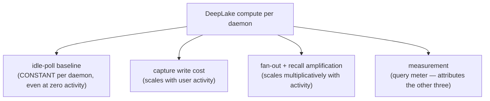

# DeepLake Compute Cost Control

> Category: Operations | Version: 1.0 | Date: June 2026 | Status: Active

How Honeycomb keeps its DeepLake compute bill flat: the four application-layer cost drivers, the measure-first query meter, and the four env-flagged runtime cuts (adaptive poll backoff, single-lease consolidation, capture write batching + envelope trim, and fan-out/recall amplification caps). Read this if you are diagnosing a compute-cost spike, tuning the idle daemon, or wiring a new daemon work loop that touches DeepLake.

**Related:**
- [`local-queue-idle-cost-control.md`](local-queue-idle-cost-control.md)
- [`observability-and-degradation.md`](observability-and-degradation.md)
- [`../data/deeplake-storage.md`](../data/deeplake-storage.md)
- [`../ai/pollinating-loop.md`](../ai/pollinating-loop.md)
- [`../ai/session-capture.md`](../ai/session-capture.md)
- [`../ai/memory-pipeline.md`](../ai/memory-pipeline.md)
- [`../ai/retrieval.md`](../ai/retrieval.md)

---

## Why this exists

DeepLake is GPU-backed and metered, and the daemon is the only process that talks to it. That makes every query the daemon issues a line on a compute bill, and it makes a careless work loop a recurring charge on **every running install**. The system shipped with exactly that failure: compute-hours tracked **install count, not usage** — flat through the pre-rollout window, then ramping steadily as the fleet grew. That curve is the signature of a **fixed per-daemon cost that every install pays whether or not the user does anything**, and it drove a user exodus serious enough to be treated as a P0 incident (PRD-062, shipped in v0.1.7).

The discipline this work established, and the discipline any future cost change must follow, is **measure before you cut**. Cost storms are almost always application-layer concurrent dispatch, and the blast radius is quantified before the fix is designed (the [`cost-anomaly-diagnosis`](../../../../.claude/skills/cost-anomaly-diagnosis/SKILL.md) playbook). A blind global throttle — "just make the poll interval bigger" — adds latency to active sessions for no idle benefit; the real fix is adaptive and idle-aware.

## The cost decomposition

DeepLake compute splits into four drivers, in descending order of blast radius:

| Driver | Mechanism (pre-PRD-062) | Scaling |
|---|---|---|
| **Idle-poll baseline** | Two independent workers (the pipeline stage worker and the pollinating worker) each poll the DeepLake-backed `memory_jobs` queue on a hardcoded **1000ms** timer. Each `lease()` is not one query: the queue is append-only, so lease/reaper discovery does a UNION-ALL scan polled `DISCOVERY_SCAN_POLLS` times with `version DESC` resolution to defeat stale-segment flapping. Each 1Hz tick fans into several physical reads, forever, at zero user activity. | Constant per daemon |
| **Capture write cost** | Every captured hook event writes **one append-only row** to `sessions`, whose `message` column is the full normalized envelope `JSON.stringify({ event, metadata })` — including, for tool calls, the entire serialized tool input and response. One row per event, never batched. | Linear in activity |
| **Fan-out + recall amplification** | One captured event fans to one extraction job, one decision job, then **N controlled-write jobs (one per extracted fact)** — each another `memory_jobs` write the pollers must rediscover. Separately, every recall fires 4+ concurrent arms (semantic + 3 lexical) with **no semaphore**, semantic arms fanning out further. | Multiplicative in activity |

## Measure first: the query meter

The foundation (PRD-062a) is a per-source query meter at the single storage choke point ([`src/daemon/storage/query-meter.ts`](../../../../src/daemon/storage/query-meter.ts), recorded in [`client.ts`](../../../../src/daemon/storage/client.ts)). It tags every DeepLake read/write with a `source` label and tallies reads vs writes per source, so the team can state "idle baseline is X reads/min/daemon, of which Y% is polling" as **fact**, and prove each later cut landed as a measured before/after.

The label set ([`QUERY_SOURCES`](../../../../src/daemon/storage/query-meter.ts)):

| Label | Attributes |
|---|---|
| `poll-lease` | The job-queue lease/discovery scan (idle baseline) |
| `poll-reaper` | The stale-lease reaper scan (idle baseline) |
| `capture-write` | A captured-event append to `sessions` |
| `fan-out-enqueue` | A pipeline fan-out enqueue into `memory_jobs` |
| `controlled-write` | A per-fact controlled write to `memory` |
| `recall-arm` | A recall arm (semantic/lexical) read |
| `embedding` | An embedding-related query |
| `other` | The default for any call site not yet labeled |

The meter is a **pure observer**: in-memory `Map` counters plus a periodic structured log line, adding **zero** DeepLake queries in the default posture. Persistence to the existing `telemetry_counters` tenant group is reserved behind the (unimplemented) `HONEYCOMB_QUERY_METER_PERSIST` flag, so turning the meter on never itself adds write cost.

> **As-built note.** The `poll-lease` / `poll-reaper` / `capture-write` / `recall-arm` call sites are threaded — the idle/poll story (the prime suspect) is fully labeled. `fan-out-enqueue` and `controlled-write` are declared but not yet threaded, so those operations currently count under `other` until a later wave threads them; the [`062a idle-baseline report`](../../../requirements/completed/prd-062-deeplake-compute-cost-reduction/reports/062a-idle-baseline-report.md) documents this explicitly. Live idle reads/min figures are a deferred rollout measurement (the report ships as a scaffold; the in-suite harness `tests/helpers/idle-baseline-harness.ts` proves the meter math offline).

## Cut 1 — adaptive poll backoff + single-lease consolidation

The dominant idle fix (PRD-062b, [`src/daemon/runtime/services/poll-backoff.ts`](../../../../src/daemon/runtime/services/poll-backoff.ts)). Two changes:

1. **Adaptive exponential backoff.** Both poll loops drop the flat 1000ms timer for a state machine that starts at a fast floor, **doubles toward a ~30s ceiling while the queue keeps returning empty**, and **resets to the floor the instant a job is leased**. An idle daemon polls roughly twice a minute instead of once a second; an active session is unchanged, because the first leased job snaps the interval back to the floor. Per-step jitter spreads a fleet's wake-ups so daemons do not synchronize a thundering herd against DeepLake.
2. **Single-lease consolidation.** The pipeline stage worker and the pollinating worker no longer run two independent scans. A [`lease-coordinator.ts`](../../../../src/daemon/runtime/services/lease-coordinator.ts) does **one combined lease pass per tick** over the union of pipeline + pollinating kinds, routing each leased job to its handler, while still leaving foreign kinds queued for their owner (kind isolation preserved). Wired at daemon assembly ([`assemble.ts`](../../../../src/daemon/runtime/assemble.ts)).

Together these take the idle baseline from `2 workers × 1/s × DISCOVERY_SCAN_POLLS reads` down toward `1 pass / 30s × reads` — a 1–2 order-of-magnitude target cut.

| Knob | Env var | Default |
|---|---|---|
| Master switch | `HONEYCOMB_POLL_BACKOFF_ENABLED` | ON in the daemon resolver (schema default `false` so a bare config is the legacy parity path) |
| Fast floor | `HONEYCOMB_POLL_BACKOFF_FLOOR_MS` | `1000` |
| Idle ceiling | `HONEYCOMB_POLL_BACKOFF_CEILING_MS` | `30000` |
| Anti-herd jitter (± fraction) | `HONEYCOMB_POLL_BACKOFF_JITTER` | `0.1` |

> **Correctness rail.** `DISCOVERY_SCAN_POLLS` exists to defeat DeepLake's stale-segment flapping; the convergence read posture in [`../data/deeplake-storage.md`](../data/deeplake-storage.md) is load-bearing. Any reduction of the per-lease scan count must keep lease ownership single-winner and the reaper reclaiming stale leases — the cost cut must never trade money for a correctness bug. The backoff + consolidation wins ship independently of any scan-count reduction.

## Cut 2 — capture write batching + envelope trim

The metadata-bloat fix (PRD-062c, [`capture-config.ts`](../../../../src/daemon/runtime/capture/capture-config.ts), [`capture-buffer.ts`](../../../../src/daemon/runtime/capture/capture-buffer.ts), [`budgeted-stringify.ts`](../../../../src/daemon/runtime/capture/budgeted-stringify.ts)). Two forward-only changes:

1. **Batch the writes.** A flush buffer accumulates captured events and writes them as a **single multi-row append** instead of one INSERT per event, flushing on the time window, on a size cap, or on shutdown (so nothing buffered is lost on a clean stop). A busy session becomes a few writes, not hundreds.
2. **Trim the envelope.** A budgeted serializer caps oversized tool input/response payloads to a per-field byte budget with an explicit truncation marker. It trims **bytes no consumer reads** (multi-MB tool blobs), never signal — every field the extractor and recall consume is preserved by construction.

| Knob | Env var | Default |
|---|---|---|
| Master batch switch | `HONEYCOMB_CAPTURE_BATCH` | `true` (off ⇒ one INSERT per event) |
| Time-flush window (ms) | `HONEYCOMB_CAPTURE_WINDOW_MS` | `1000` |
| Size-flush cap (events) | `HONEYCOMB_CAPTURE_MAX_EVENTS` | `25` |
| Per-field tool-I/O budget (bytes) | `HONEYCOMB_CAPTURE_ENVELOPE_BUDGET_BYTES` | `16384` (`0` disables trimming) |

> **The one deliberate non-trim.** The PRD also proposed lifting session-invariant metadata out of the per-row envelope. That was correctly **declined**: the skillify miner reads `metadata.sessionId` directly from the per-row `message` envelope ([`skillify/miner.ts`](../../../../src/daemon/runtime/skillify/miner.ts)) and no column carries it, so lifting it would be the silent capability cut the PRD's own consumer-audit gate forbids. The envelope-size win was delivered via the 16 KB tool-I/O cap instead. Full per-row metadata dedup is a later, schema-touching change (an additive `session_id` column on `sessions`) out of scope for the P0 pass.
>
> **PII note.** The persisted envelope is captured tool I/O, a known PII surface; trimming reduces but does not eliminate it. See [`../security/trust-boundaries.md`](../security/trust-boundaries.md).

## Cut 3 — fan-out + recall amplification caps

The amplification fix (PRD-062d, [`amplification-config.ts`](../../../../src/daemon/runtime/memories/amplification-config.ts), [`bounded-pool.ts`](../../../../src/daemon/runtime/memories/bounded-pool.ts)). Two independent sources of multiplicative load:

1. **Coalesced fan-out.** A multi-fact decision enqueues **one batched `memory_controlled_write` job carrying all proposals** (sub-linear in the fact count M) instead of M independent enqueues ([`pipeline/fan-out.ts`](../../../../src/daemon/runtime/pipeline/fan-out.ts), [`controlled-writes.ts`](../../../../src/daemon/runtime/pipeline/controlled-writes.ts)). Crucially this batches the **dispatch**, not the writes: each memory keeps its own append/version-bump, because DeepLake coalesces in-place UPDATEs and can silently drop one. Batching that broke version-bump ordering would fall back to enqueue-only.
2. **Bounded recall concurrency.** A semaphore caps in-flight DeepLake queries across the recall arms and the usefulness-grader's contradiction-check batch ([`memories/recall.ts`](../../../../src/daemon/runtime/memories/recall.ts), [`usefulness-grader.ts`](../../../../src/daemon/runtime/memories/usefulness-grader.ts)). A burst of recalls can no longer issue unbounded concurrent queries. The cap changes **timing, not output** — a width-1 (near-serial) recall is byte-identical to a width-100 recall.

| Knob | Env var | Default |
|---|---|---|
| Batched fan-out enqueue | `HONEYCOMB_FANOUT_BATCH` | ON (off ⇒ per-proposal enqueue loop) |
| In-flight recall/grade query ceiling | `HONEYCOMB_RECALL_MAX_CONCURRENCY` | `6` (clamped up to a floor of 1; a pool must admit one task) |

## The flag posture: default-ON, off ⇒ pre-PRD parity

Every cut inverts the usual false-safe convention: because this was a P0 cost incident, all four knobs **default to the cost-reducing posture**, and the flag is the **off-switch**. With every flag off, the daemon reproduces exact pre-PRD behavior, so a regression is a **config rollback, not a redeploy**. Each config module follows the repo's standard provider-seam + single-`safeParse`-boundary + coerce-and-clamp discipline (a fat-fingered numeric knob falls back to its default and is clamped, never taking the always-on capture/poll path down).

The invariants any future cost change must hold:

- **No memory-quality regression.** Recall results, extraction output, and skillify decisions are unchanged within tolerance; in-suite parity is proven and the live `eval:recall` net is the gate. The only acceptable user-visible delta is a slightly longer worst-case pickup latency for a job enqueued into a fully-idle (ceiling) daemon, bounded by the backoff cap.
- **No correctness trade.** Append-only convergence (single-winner leases, reaper reclaim, version-bumped writes) stays intact.
- **Measured, not hoped.** No "we cut X%" claim ships without a query-meter before/after behind it.

## Source map

| Concern | Module |
|---|---|
| Query meter | [`src/daemon/storage/query-meter.ts`](../../../../src/daemon/storage/query-meter.ts), recorded in [`client.ts`](../../../../src/daemon/storage/client.ts) |
| Poll backoff state machine | [`src/daemon/runtime/services/poll-backoff.ts`](../../../../src/daemon/runtime/services/poll-backoff.ts) |
| Single-lease consolidation | [`src/daemon/runtime/services/lease-coordinator.ts`](../../../../src/daemon/runtime/services/lease-coordinator.ts), wired in [`assemble.ts`](../../../../src/daemon/runtime/assemble.ts) |
| Capture batching + envelope trim | [`capture-config.ts`](../../../../src/daemon/runtime/capture/capture-config.ts) · [`capture-buffer.ts`](../../../../src/daemon/runtime/capture/capture-buffer.ts) · [`budgeted-stringify.ts`](../../../../src/daemon/runtime/capture/budgeted-stringify.ts) |
| Amplification caps | [`amplification-config.ts`](../../../../src/daemon/runtime/memories/amplification-config.ts) · [`bounded-pool.ts`](../../../../src/daemon/runtime/memories/bounded-pool.ts) |
| Source spec | [`PRD-062`](../../../requirements/completed/prd-062-deeplake-compute-cost-reduction/prd-062-deeplake-compute-cost-reduction-index.md) (062a/b/c/d), shipped v0.1.7 |
