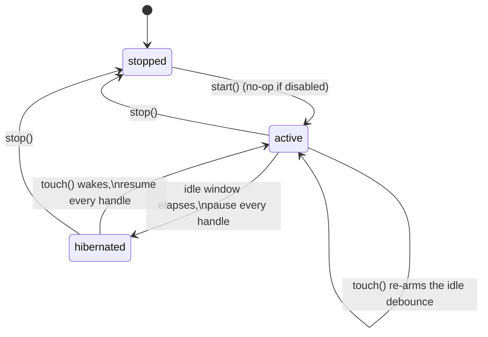

# DeepLake Idle Connection Hibernation

> Category: Operations | Version: 1.0 | Date: July 2026 | Status: Active

How the daemon takes its idle DeepLake compute bill to ~zero by pausing every background timer that touches DeepLake, letting the idle socket close and Activeloop scale the per-tenant compute pod to zero. This is the capstone of the idle-cost story: PRD-062 cut query volume and PRD-066 moved local coordination off DeepLake, but a fully idle daemon still re-touched the shared queue on the poll ceiling and kept the pod warm. Read this if you are diagnosing a per-hour idle compute floor that survives PRD-062, wiring a new daemon work loop that touches DeepLake on a timer, or reasoning about why `/health` does not wake the daemon.

**Related:**
- [`deeplake-compute-cost.md`](deeplake-compute-cost.md)
- [`local-queue-idle-cost-control.md`](local-queue-idle-cost-control.md)
- [`observability-and-degradation.md`](observability-and-degradation.md)
- [`notifications-and-health.md`](notifications-and-health.md)
- [`../data/deeplake-storage.md`](../data/deeplake-storage.md)
- [`../ai/pollinating-loop.md`](../ai/pollinating-loop.md)
- [`../architecture/daemon-surface.md`](../architecture/daemon-surface.md)

---

## Why this exists

Activeloop bills DeepLake on **compute uptime**, not query volume: a per-tenant compute pod is billed per hour while it is provisioned. The pod scales to zero only after the tenant's **last connection disconnects** and a sustained no-connection window elapses. The consequence is unintuitive but decisive: a single recurring query keeps the pod warm forever and bills a flat hourly rate even against a near-empty dataset. Cost tracks whether the pod is up, not how much work it does.

PRD-062 (adaptive poll backoff, shipped v0.1.7, see [`deeplake-compute-cost.md`](deeplake-compute-cost.md)) collapsed the idle-poll baseline from a flat 1Hz to an adaptive cadence that backs off toward a ~30s ceiling. That was the dominant fix, but it stops one step short of the goal: a query every ~30s re-touches the shared queue and re-provisions the pod each cycle, so compute never scales down. The daemon still pays a per-hour compute floor at zero user activity, just a smaller one. PRD-066's local queue removed local coordination reads structurally, but any residual DeepLake-touching timer (the shared reaper in a drain window, the pollinating maintenance tick, the health probe) has the same warming effect.

The key measured fact that makes the fix cheap: **Node's global fetch dispatcher closes an idle DeepLake socket on its own, roughly 9 seconds after the last request** (the server does not extend keep-alive). So the daemon does not need a custom dispatcher or an explicit socket close. It only needs to **stop issuing DeepLake queries while idle**. The connection then closes itself and Activeloop scales the pod to zero. Hibernation (PRD-062e, shipped in [PR #225](https://github.com/legioncodeinc/honeycomb/pull/225), consolidating #198 and #185) is the master switch that silences every DeepLake-touching timer at once.

## The controller

The whole mechanism is one small state machine, [`DeepLakeHibernation`](../../../../src/daemon/runtime/services/deeplake-hibernation.ts), wired at the composition root ([`assemble.ts`](../../../../src/daemon/runtime/assemble.ts)). It owns **no DeepLake access and no wall clock**: it calls the injected `pause()`/`resume()` on its handles and injected `now`/`setTimer`/`clearTimer` seams, so the acceptance-criteria tests drive the entire surface with a manual clock and fake handles, no timers and no network.

Three states (`stopped` then `active` and `hibernated` in a cycle) debounced on the idle window. Every `touch()` pushes the idle deadline out; when the debounce fires with no intervening activity the controller pauses every handle, and the next `touch()` resumes them. `pause`/`resume` are guarded so one handle that throws is logged and skipped rather than aborting the sweep: one wedged worker must never strand the others paused or running.

## The handle set (what goes quiet at idle)

Each `Pausable` is a background activity that touches DeepLake on a timer, with idempotent `pause()`/`resume()`. The set is collected in [`assemble.ts`](../../../../src/daemon/runtime/assemble.ts) only when hibernation is enabled and background workers are starting:

| Handle | `pause()` / `resume()` mechanism |
|---|---|
| `summary`, `skillify` | Delegate to the worker's own idempotent `stop()` / `start()`. Both already run on PRD-062b's shared adaptive poll loop, so an idle worker backs off toward the ceiling before hibernation silences it entirely. |
| `lease-coordinator` **or** `pipeline` + `pollinating` | The consolidated coordinator when PRD-062b consolidation is on, or the two independent workers when it is off (never both). Delegates to `stop()` / `start()`. |
| `pollinating-maintenance-tick` | PRD-223's self-rescheduling 60s tick calls `checkAndEnqueuePollinating`, which queries DeepLake. `pause()` stops and drops the tick; `resume()` re-arms a **fresh** tick (the handle self-schedules and cannot be restarted in place). |
| `health-probe` | The cached-`/health` `SELECT 1` refresher. `pause()` clears its interval; `resume()` re-arms it. |
| `graph-build` | The opt-in tree-sitter codebase-graph rebuild timer, paused and re-armed the same way. |

The pollinating maintenance tick is the consolidation's key integration: it queries DeepLake every 60s and, left unmanaged, would keep the pod warm forever and silently defeat the master switch. The rule it enforces is general: **no background timer that touches DeepLake may escape the controller.** Any new daemon work loop that reads or writes DeepLake on a timer must be registered as a `Pausable`, or it becomes a private line on the idle bill.

## The wake signal: work-carrying inbound HTTP, registered once

A single root middleware (`daemon.app.use("*", () => hibernation?.touch())`) records activity, so every capture, recall, hooks, MCP, and dashboard request resumes the fleet without instrumenting each handler. Background worker queries are not inbound requests, so they never spuriously keep the daemon awake. Only real agent activity does. A woken worker's adaptive loop snaps back to the fast floor on its first leased job, so active-session pickup latency is unchanged. The first post-wake query pays Activeloop's cold start (a few seconds to re-provision the pod); responses are simply slower at spin-up, which is the accepted trade for an idle cost of ~zero.

### Liveness endpoints are deliberately non-waking

`/health` and `/api/status` intentionally do **not** touch the controller, and this is load-bearing design, not an oversight. Monitoring pollers (including `honeycomb status` and `honeycomb daemon status`) hit `/health` on a short interval. If a liveness probe counted as activity, the idle window would never elapse, the pod would stay warm forever, and hibernation would never fire, which is exactly the cost bug the controller exists to fix. A hibernated daemon still answers `/health` from its cached health bit with no DeepLake round trip.

The mechanism enforcing the split is **Hono registration order at the composition root**, not per-route flags:

- `createDaemon()` mounts the terminal `/health` and `/api/status` handlers **before** the wake middleware is registered. Hono composes matched handlers in registration order, so those two liveness routes resolve and return without ever running the wildcard middleware.
- `assembleSeams()` mounts every work-carrying surface **after** the middleware, so real work always wakes the fleet.

A comment at the wiring site warns against reordering, and the non-waking/waking behavior is pinned by [`tests/daemon/runtime/assemble-hibernation.test.ts`](../../../../tests/daemon/runtime/assemble-hibernation.test.ts). If you add a new liveness or monitoring route that must not wake the daemon, it has to be mounted before the wake middleware; anything mounted after it will wake the pod on every poll.

## Two race rules layered on the transition guard

Async transitions (hibernate and wake) are serialized by a `transitioning` guard so a slow pause/resume can never overlap its inverse. On top of that, two race rules (both PR #225 review findings, the second landed in fix commit `23460ed`) keep teardown and mid-flight activity correct:

1. **`stop()` is authoritative.** A hibernate or wake whose pause/resume sweep is in flight when `stop()` runs must not finish afterward and silently reinstate a live state, log a transition, or re-arm the debounce during teardown. Both transitions re-check `state === "stopped"` after their `await` before any state write, log, or arm; `arm()` short-circuits when stopped; and the guarded sweep itself is stop-aware, aborting remaining handles instead of pausing/resuming workers the shutdown path is about to tear down anyway.
2. **A `touch()` that lands mid-transition is never lost.** Mid-pause the state still reads `active`, so a plain wake would see nothing to do and the daemon would end hibernated despite fresh work. Instead the touch sets a `pendingWake` dirty flag; a completing hibernate consumes it and immediately wakes (still respecting the stopped guard), and a completing wake clears it because that wake already satisfied the queued activity.

## Flag posture: default-on, off means PRD-062b parity

Hibernation ships **default-on**, matching PRD-062b's cost-fix posture: because this is a P0 cost incident, the absence of the flag means enabled and the flag is the off-switch. Only an explicit `false` or `0` rolls back; a typo or any other value stays enabled rather than silently disabling the cost fix. With the switch off, `start()` is a no-op, no handle is ever paused, and the daemon behaves exactly as PRD-062b left it (the steady ~30s ceiling cadence). A regression is a **config rollback, not a redeploy**.

| Knob | Env var | Default |
|---|---|---|
| Master switch | `HONEYCOMB_DEEPLAKE_HIBERNATE_ENABLED` | ON when absent; only explicit `false` / `0` rolls back |
| Idle window before hibernating (ms) | `HONEYCOMB_DEEPLAKE_HIBERNATE_IDLE_MS` | `120000` (2 min), clamped up to a `5000` ms floor; non-numeric falls back to default |

Config is resolved once through `envHibernationConfigProvider` following the repo's coerce-and-clamp discipline (`resolveIdleMs` clamps the floor and defaults a non-finite value), so a fat-fingered idle window never thrashes the pod and never takes the daemon down.

## Observability

Transitions and handle failures emit through the daemon's structured logger:

| Event | When |
|---|---|
| `deeplake.hibernated` | Idle window elapsed, every handle paused (fields: `idleMs`, `handles` count) |
| `deeplake.woke` | An inbound request resumed every handle (field: `handles` count) |
| `hibernate.pause.error` | A handle's `pause()` threw during the hibernate sweep (fields: `handle` label, `error`) |
| `wake.resume.error` | A handle's `resume()` threw during the wake sweep (fields: `handle` label, `error`) |

A throwing handle is logged with its label and skipped, never vanished, so a wedged worker is visible in the daemon log rather than silently stranding the rest of the sweep.

## Accepted risks

The security review recorded three Low/Info accepted risks on this diff (no medium-or-higher findings):

- **Shutdown re-arm race.** Bounded by the authoritative-`stop()` rule above; a transition that races teardown re-checks the stopped latch and bails.
- **Stale cached health while hibernated.** `/health` answers from the cached bit without a DeepLake round trip, so a hibernated daemon can report health that is up to one probe-interval stale. This is the deliberate cost of keeping liveness non-waking.
- **Pre-auth touch on the loopback daemon.** The wake middleware runs before auth on the loopback surface, so a local caller can wake the pod. Accepted because the daemon binds loopback-only and waking merely re-provisions the tenant's own pod (the same effect as any real capture).

## Required invariants

Any future change to the idle-cost path must hold these:

- **No timer escapes the master switch.** Every background activity that touches DeepLake on a timer is a controller handle. A new work loop that reads or writes DeepLake on a timer must register as a `Pausable`.
- **Liveness stays non-waking.** `/health` and `/api/status` must remain mounted before the wake middleware; only work-carrying requests may wake the daemon.
- **Nothing is lost while hibernated.** The local HTTP server stays up and the local job queue still accepts captures during hibernation; the next request wakes the fleet to process them.
- **Correctness is untouched.** Hibernation changes cadence only. `memory_jobs` stays append-only version-bumped; retry deadlines remain durable in `memory_jobs.next_run_at`; there is no wake-bus state to race.
- **Rollback is a flag flip.** Setting the flag to `false`/`0` restores PRD-062b's steady cadence with no redeploy and no data migration.

## Why connection hibernation and not a wake bus

PR #225 consolidated two proposals for the same idle-cost problem. The **connection-hibernation** controller (pause every DeepLake-touching timer behind one master switch, wake on any inbound request) is the shipped mechanism because it is the smallest surface that reaches zero: one controller, one wake signal, no per-loop suspend state and no wake bus. The earlier **poll-suspend** proposal (each poll loop grows an idle accumulator and a `wake()` seam fanned out by a `WakeBus` fired at the enqueue chokepoint) was declined: its per-loop state and the wake bus are redundant once the controller owns the whole fleet's pause/resume, and one controller is a smaller, drift-free surface than N loops each carrying suspend state. Both of the poll-suspend proposal's open review majors were moot in the connection-hibernation design (retry deadlines are durable in `memory_jobs.next_run_at`; there is no wake-bus state to race). Two pieces of that proposal survived and were folded in: the summary/skillify adaptive-loop migration (which had already landed with PRD-062b) and the PRD-062e specification.

The deeper structural fix, moving the job queue off DeepLake so idle equals zero DeepLake reads by construction rather than by pausing, is a separate future PRD. It touches the team-sharing contract (the shared queue is per-team in TEAM mode) and is deliberately out of scope here; hibernation is the per-daemon cadence fix that reaches zero without moving the queue.

## Source map

| Concern | Module |
|---|---|
| Hibernation controller (state machine, `Pausable` contract, env provider) | [`src/daemon/runtime/services/deeplake-hibernation.ts`](../../../../src/daemon/runtime/services/deeplake-hibernation.ts) |
| Composition-root wiring (handle set, wake middleware, arm helpers, logger adapter, lifecycle) | [`src/daemon/runtime/assemble.ts`](../../../../src/daemon/runtime/assemble.ts) |
| Pollinating maintenance tick (a managed handle) | [`src/daemon/runtime/pollinating/maintenance-tick.ts`](../../../../src/daemon/runtime/pollinating/maintenance-tick.ts) |
| Shared adaptive poll loop (summary/skillify cadence) | [`src/daemon/runtime/services/poll-loop.ts`](../../../../src/daemon/runtime/services/poll-loop.ts) |
| Controller unit + integration + logging tests | [`tests/daemon/runtime/services/deeplake-hibernation.test.ts`](../../../../tests/daemon/runtime/services/deeplake-hibernation.test.ts) · [`deeplake-hibernation-maintenance-tick.test.ts`](../../../../tests/daemon/runtime/services/deeplake-hibernation-maintenance-tick.test.ts) · [`deeplake-hibernation-logging.test.ts`](../../../../tests/daemon/runtime/services/deeplake-hibernation-logging.test.ts) · [`deeplake-hibernation-stop-race.test.ts`](../../../../tests/daemon/runtime/services/deeplake-hibernation-stop-race.test.ts) |
| Composition-root pins (rollback, default-on, non-waking `/health`) | [`tests/daemon/runtime/assemble-hibernation.test.ts`](../../../../tests/daemon/runtime/assemble-hibernation.test.ts) |
| Verification report | [`library/qa/repo-sweep/2026-07-03-hibernation-consolidation-verification.md`](../../../qa/repo-sweep/2026-07-03-hibernation-consolidation-verification.md) |
| Source spec | [`PRD-062e`](../../../requirements/completed/prd-062-deeplake-compute-cost-reduction/prd-062e-deeplake-compute-cost-reduction-idle-hibernation.md), the capstone of [`PRD-062`](../../../requirements/completed/prd-062-deeplake-compute-cost-reduction/prd-062-deeplake-compute-cost-reduction-index.md) |
