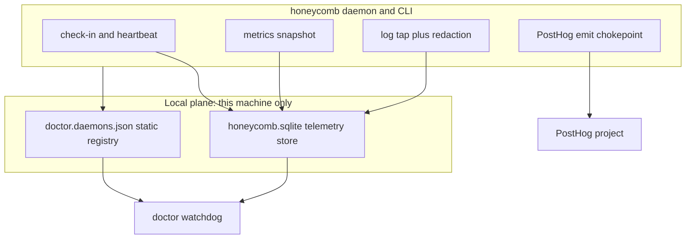

# Fleet and Usage Telemetry

> Category: Operations | Version: 1.0 | Date: July 2026 | Status: Active

How Honeycomb reports on itself: the local per-install telemetry the doctor watchdog polls to observe a live daemon, and the coarse install/usage lifecycle events that reach PostHog. Read this if you operate the fleet, extend either telemetry surface, or need to know exactly what leaves a machine and what does not.

**Related:**
- [`doctor-watchdog.md`](doctor-watchdog.md)
- [`observability-and-degradation.md`](observability-and-degradation.md)
- [`install-and-onboarding.md`](install-and-onboarding.md)
- [`../ai/distillation-and-tier1-keys.md`](../ai/distillation-and-tier1-keys.md)

---

## Why this exists

Honeycomb has two very different questions to answer, and they pull in opposite directions. The operator of one machine (a person, or the doctor watchdog acting for them) needs a live, granular view of *this* daemon: is it bound, is it healthy, is DeepLake reachable, how many actions has it taken since it restarted, what did it just log. The fleet operator needs a coarse, privacy-preserving view of *all* installs: did an install succeed, which products landed, when did a version change. The first view must never leave the box; the second must never carry anything that could fingerprint a user.

So the telemetry splits into two planes with separate transports, separate storage, and separate consent rules. The local plane writes non-sensitive facts to an on-disk SQLite database that doctor reads read-only over the same machine. The usage plane emits a small closed set of lifecycle events to PostHog through a single allow-list-gated chokepoint. Neither plane can borrow the other's data path.

One orientation note before the detail. PR #207 marked PRD-068, PRD-069, PRD-070, and part of PRD-054 as *superseded* by the the-hive and doctor repos: the former "portal" work that would have centralized fleet observation moved out of honeycomb. What remains on honeycomb's side is the slice documented here, the local-SQLite telemetry store plus the check-in seam that lets doctor observe the daemon without honeycomb pushing anything.

## The two telemetry planes

The **local plane** (PRD-071, PR #207 and PR #209) is the daemon describing itself to a co-resident watchdog. honeycomb writes a static registry entry that declares "this daemon should exist" and where its telemetry lives, then writes rolling status, metrics, and log rows into a local SQLite file. doctor reads both, read-only. Nothing on this plane touches the network.

The **usage plane** (PR #214, extending PRD-050e) is the fleet learning that installs and version changes happened. The installer scripts and the packaged CLI emit a closed set of named events to a PostHog project, each carrying only allow-listed operational facts. Everything on this plane is gated by opt-out, an allow-list, and a dedupe ledger.

The identifier boundary is worth stating plainly: the local plane never leaves the machine, so it has no distinct-id problem; the usage plane correlates events only by the anonymized random `installId` (a UUID v4 minted once per machine), never by email, org id, or account id.

## The fleet registry and the check-in heartbeat

doctor's model of the fleet is a static registry plus a runtime store (doctor ADR-0001 and ADR-0002). The registry file honeycomb writes and doctor reads is `~/.honeycomb/doctor.daemons.json`, a `{ "daemons": [...] }` document where each entry names a service that *should* exist. This path is post the decision-#35 rename from the former hivedoctor naming.

honeycomb's registry writer lives in `src/daemon/runtime/telemetry/fleet-registry.ts` and runs from the install flow (`src/commands/install.ts`). It upserts a single `honeycomb` entry carrying the daemon's identity, its `/health` URL (built from the daemon's actually-resolved host and port so a non-default bind advertises the right probe target), its pid-file path, the probe cadence and restart thresholds doctor should use, and a pointer to the telemetry database. The write is idempotent and crash-safe: the file is read tolerantly (a missing or unparseable file degrades to an empty daemon list rather than throwing), honeycomb's entry is replaced by name rather than duplicated on a re-install, and the write is atomic (temp file plus rename). Because several products can register concurrently, the upsert re-reads and re-verifies after its own write, re-merging into a competing writer's document so no other daemon's entry is dropped. Registry failure is fail-soft at the call site: a locked or unwritable file logs a note and never aborts the install.

The registry says a daemon *should* exist; the check-in service says it *does*. `src/daemon/runtime/telemetry/checkin.ts` maintains honeycomb's single `service_status` row in the SQLite store: `start()` stamps a binding time for the current process and writes the first row synchronously, then a fixed-interval heartbeat (default 7.5 seconds) advances `last_seen` and re-reads health even when nothing else changed, so doctor can tell "quiet" apart from "dead." A restart re-stamps the binding time while the registry entry and database path stay unchanged. The health value is never recomputed here: it is read from the same source `/health` reports (the daemon's cached health bit), so the two can never disagree. When the caller can tell, the row also carries whether DeepLake is currently reachable and the timestamp of the last observed reachability. Every write is fail-soft, and the heartbeat timer is unref'd so it never holds the process open on its own.

## The local SQLite store and what it records

The telemetry database is `~/.honeycomb/telemetry/honeycomb.sqlite` (`src/daemon/runtime/telemetry/fleet-store.ts`). It reuses the built-in `node:sqlite` mechanism honeycomb's local job queue already runs on, so it adds no dependency, and it opens WAL mode so doctor's read-only poll never contends with honeycomb's own writes. This module is the one writer; doctor polls the same file read-only.

Three tables hold three shapes of fact:

| Table | Shape | Contents |
|---|---|---|
| `service_status` | single row (`id = 1`), latest-wins UPSERT | name, binding time, last-seen, health, and optional DeepLake-connected flag plus last-comm timestamp |
| `service_metrics` | single row (`id = 1`), latest-wins UPSERT | actions taken, files processed, memories created, plus an updated-at timestamp |
| `service_logs` | append-only, rotated | timestamp, a closed verbosity level (`error` / `warn` / `info` / `debug`), and a redacted free-text message |

The `service_metrics` snapshot (`src/daemon/runtime/telemetry/metrics.ts`) is written on a short interval (default 10 seconds) and reports counters *since the current process started*, so a restart resets them to zero by construction. It reuses existing counters rather than inventing new ones: `memoriesCreated` is the delta of the dashboard's existing memory-corpus count, and `actionsTaken` is the delta of the ROI ledger's row count, both against a baseline captured on the first successful read after `start()`. `filesProcessed` is the one exception: it is a fresh in-memory counter exposed through `recordFilesProcessed`, reset on every start; PRD-071b left its exact wiring an open question, so the honest default is zero rather than a fabricated mapping onto an unrelated counter. A metrics read failure (storage down, a fresh install without credentials) is caught and the snapshot for that tick is skipped; once storage recovers, the next successful read re-establishes the baseline and snapshots resume.

The `service_logs` table mirrors non-sensitive lines from the daemon's existing logger (`src/daemon/runtime/telemetry/logs.ts`) rather than standing up a second logging framework: the fleet log tap is the same narrow write-through seam the durable request-log store already uses, so each record is teed into both. Request lines become a compact `METHOD path -> status (Nms)` summary at a level derived from the status (5xx is error, 4xx is warn, else info); named subsystem events carry the event name plus their coarse fields. The table is rotated on every insert: rows beyond a 5000-row cap are deleted oldest-first, so the file cannot grow without bound.

Fail-soft is the whole contract for this store. If `node:sqlite` is unavailable, or an open, migration, or write fails, the daemon falls back to a no-op store: every write becomes a silent no-op and every read reports empty, the failure is logged exactly once (never per call), and nothing throws into the daemon boot or memory-pipeline path. The composition happens in `fleet-service.ts`, which wires the check-in and metrics sub-services over one already-open store into a single daemon service; logging is wired separately into the request logger so it needs no second lifecycle.

## Redaction guarantees

The two guarantees are structural where they can be and best-effort where they cannot.

For the structured rows, no secret is possible *by construction*. `service_status` and `service_metrics` hold only enum, numeric, and timestamp columns; there is no free-text field a token, credential, path, or memory body could hide in. The same holds for the usage-plane payload, which is built from an allow-list rather than from caller-supplied properties (see below).

For `service_logs`, the message is free text, so `src/daemon/runtime/telemetry/redact.ts` applies a best-effort pattern-based scrub *before* a line ever reaches the store. It works in two tiers. Known secret-shaped spans (an `Authorization` header, a `Bearer` value, `token=` / `api_key=` / `password=` / `secret=` / `cookie=` key-value pairs, an `sk-` prefixed key) are replaced in place with `[REDACTED]`, so the line stays useful (method, path, and status still legible) with only the sensitive span removed. A line carrying material that cannot be safely partially redacted, a private-key block or a long contiguous high-entropy blob (80-plus characters), is *dropped entirely* rather than partially scrubbed. This is defense in depth, not the only guard: the log records the tap receives already carry no header, token, or body field, so redaction here protects mainly against a future caller accidentally formatting a secret-shaped value into an event's fields. The redaction never throws. The net guarantee is that a `service_logs` row, which doctor polls and may eventually surface on a health rail, never carries a token, credential value, raw header, org secret, memory body, or PII.

## Install and usage lifecycle events (PostHog)

The usage plane answers "did installs and version changes happen across the fleet" with a small closed set of events sent to a PostHog project. It has two transports that deliberately do not overlap.

The **installer scripts** (`scripts/install/install.sh` and `scripts/install/install.ps1`, kept at parity) fire events over `curl` using a public PostHog project key baked into the install site, independent of the Node build key, so they survive a keyless build and even an install that fails before the Node CLI ever runs. The funnel is `install_started` (fired first, before any flag or config resolution) and exactly one terminal `install_completed` or `install_failed` at the end. On top of that, per-product transition events, `product_installed`, `product_updated`, and `product_removed`, are computed by diffing this run's resolved product selection against the previous run's install-state, each carrying a `product` payload property naming the one product it describes. A product the user selected but that did not actually land (an unpublished skip, an npm failure, a registration failure, or the doctor opt-out) is tracked in a not-installed list and *excluded* from any installed or updated claim, so the per-product events never over-claim. These calls are fire-and-forget, bounded (a 3-second curl timeout), dry-run-safe (a dry run previews the payload and sends nothing), and a no-op when the key is empty.

The **packaged CLI** emits two more lifecycle events through the Node-side chokepoint:

- `honeycomb_updated` fires when the build version differs from the `lastVersion` baseline persisted in the onboarding state (`src/daemon/runtime/telemetry/version-check.ts`). A first sighting (no baseline, as on a fresh install) records the baseline *without* emitting, since a first sighting is not an update; the cheap common case is a single string compare with no emit. Because the chokepoint's default dedupe is once-per-machine-per-event, which would let an update fire only once ever, the emit passes a `dedupeKey` override of `honeycomb_updated@<version>`: each new version fires once, the same version can never double-send, and the event name on the wire stays the plain `honeycomb_updated` with the version carried in the allow-listed `honeycomb_version` property. It emits first, then advances the baseline, so a failed baseline persist re-detects next run where the version-qualified key blocks a duplicate.
- `honeycomb_uninstalled` fires from the real `uninstall` verb (`src/commands/local-handlers.ts`), specifically the full "reverse everything Honeycomb wired" invocation, not a single-harness re-wire. It fires *before* the connector engine reverses anything, fire-and-forget, so a slow or broken telemetry hop can never delay or fail the uninstall. Note the scope: no honeycomb verb removes the npm package or the `~/.deeplake` state dir, so package-removal coverage stays with the installer's `product_removed` event.

Both new events were added to the `TelemetryEventName` enum and to the Tier-1 set, and both remain behind every existing chokepoint gate.

## The opt-out, consent, and chokepoint model

The usage plane funnels through a single egress chokepoint, `emitTelemetry` in `src/daemon/runtime/telemetry/emit.ts` (PRD-050e). It is the only place in the codebase that posts to the PostHog capture endpoint, which is what makes the guarantees below checkable in one module.

The payload is built from a closed allow-list (`ref`, `source_tool`, `honeycomb_version`, `os`, `arch`, `node`, `tier`, and a coarse `count_bucket`), never from caller-supplied free-form properties. A caller may pass extras, but they are filtered through the same allow-list, so a field not on it, or a non-string value, is structurally dropped and can never leave the machine. A companion banned-key list is what the structural test scans every serialized payload for. Coarse-count buckets (`0`, `1-10`, `11-100`, `100+`) are the only count representation that egresses; a precise number never does. The PostHog project key is a public, write-only ingest key, build-injected via esbuild `define`; an empty key means an unbuilt or dev checkout, which hard-disables telemetry as a no-op.

Four gates run in order, and any one hit means nothing leaves the box:

1. **Empty build key** (an unkeyed dev build) hard-disables the send with no load and no network.
2. **Opt-out** via `HONEYCOMB_TELEMETRY=0` or `DO_NOT_TRACK=1` (the cross-tool standard) silences *both* tiers.
3. **Tier-2 consent**: a Tier-2 usage-count event sends only when the onboarding state's `optInTier2` is true; Tier-1 lifecycle facts (including the two new events above) ride the opt-out default. The effective tier is the stricter of the event-derived tier and the caller-supplied tier, so a Tier-1 event cannot be silently suppressed and a Tier-2 emit cannot bypass opt-in by mislabeling.
4. **Dedupe**: a per-machine ledger in the onboarding state sends each ledger key at most once (the `honeycomb_updated@<version>` override scopes that to per-version instead).

Only past all four does a single bounded (2-second) fire-and-forget POST run. The call is wrapped so a timeout, network error, or non-2xx is swallowed: it resolves a structured outcome the caller may inspect or ignore, but it never throws and never changes a host flow's exit code. Every emit site calls it *after* its user-facing success. On a 2xx the event is recorded in both the dedupe ledger and a glass-box "sent" log in the onboarding state, so a user can inspect exactly what left the machine.

The installer scripts mirror this posture with their own independent transport: same allow-list-shaped minimal payload (products, profile, coarse OS family, repeat-vs-first, and the event name), same empty-key no-op, same fire-and-forget bounded send, and license and code values are never included. The two surfaces are structurally incapable of double-counting: they are different event names, sent from two independent transports, answering two different questions.
