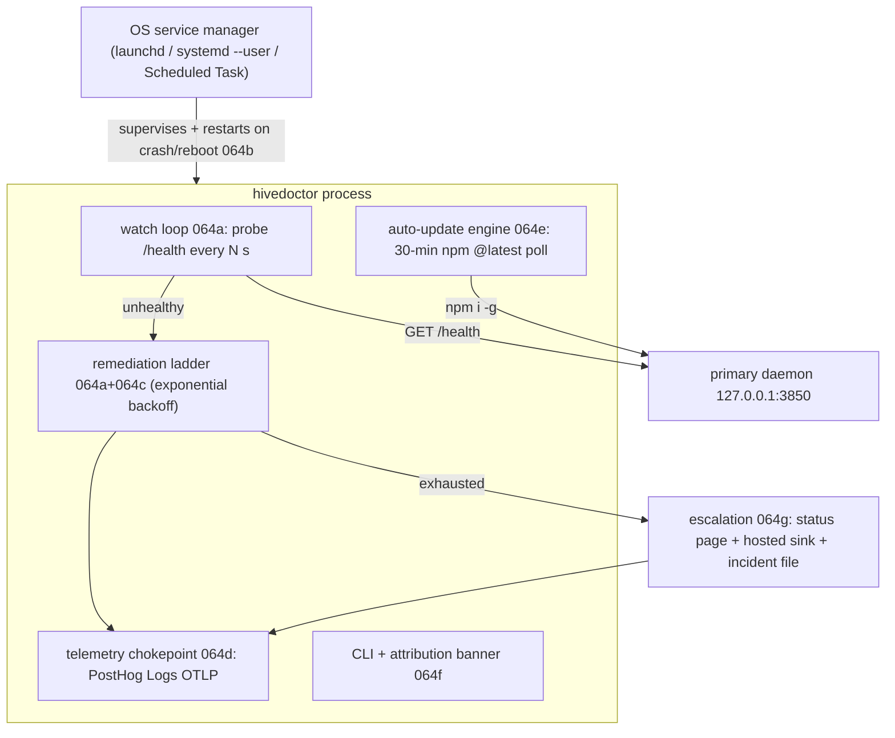

# HiveDoctor: the Self-Healing Watchdog

> Category: Operations | Version: 1.1 | Date: June 2026 | Status: Active (published to npm; standalone install available, bootstrap-installer wiring in progress)

How Honeycomb keeps its primary daemon alive and gives us remote eyes when it cannot auto-heal. Read this if you operate, debug, or extend the watchdog, or if you need to understand the OS-native service lifecycle the primary daemon now prefers.

**Related:**
- [`notifications-and-health.md`](notifications-and-health.md)
- [`observability-and-degradation.md`](observability-and-degradation.md)
- [`install-and-onboarding.md`](install-and-onboarding.md)
- [`../architecture/daemon-surface.md`](../architecture/daemon-surface.md)
- [`../security/scoping-and-visibility.md`](../security/scoping-and-visibility.md)
- [`../infrastructure/npm-publishing.md`](../infrastructure/npm-publishing.md)

---

## Why this exists

The Honeycomb primary daemon (`127.0.0.1:3850`, `src/daemon`) is the single process that opens DeepLake and serves every harness. When it fails, the user sees a broken product and historically **we saw nothing**. The failure modes are well documented from dogfood: the daemon wedges on a `memory_jobs` backlog, it gets spawned from an unwritable cwd (`C:\WINDOWS\system32`) and returns `502 store_failed` on secrets, a stale globally-installed daemon serves old routes, or credentials go bad. Support was reactive because there was zero remote visibility.

HiveDoctor is a second, deliberately tiny, **separate package** (`@legioncodeinc/hivedoctor`, in the `hivedoctor/` directory) whose only job is to keep the install healthy and to tell us when it can't. It does the troubleshooting a careful human operator would: probe `/health`, restart with exponential backoff, escalate through a remediation ladder, keep the daemon current via a gated auto-update, and surface a structured "needs attention" report to the dashboard and to telemetry. It was built end to end from PRD-064 (`library/requirements/in-work/prd-064-hivedoctor-self-healing-watchdog/`, sub-PRDs 064a-064h).

> **Shipping status.** HiveDoctor is now **published** as `@legioncodeinc/hivedoctor` (npm, currently `0.1.x`) and installable on its own (`npm install -g @legioncodeinc/hivedoctor`). It versions **independently** of the root `@legioncodeinc/honeycomb` package and **never auto-updates its own package** (PRD-063 OD-6 / AC-6): esbuild inlines `hivedoctor/package.json`'s version via `define` (`__HIVEDOCTOR_VERSION__`), that one manifest is the single source of truth, and a deliberate `npm version`-style bump is the only way it moves. Its release runs through a dedicated workflow (`.github/workflows/release-hivedoctor.yaml`) using the same OIDC Trusted-Publishing + provenance posture as the parent. What is still in flight is the **bootstrap-installer wiring** (the one-command installer registering HiveDoctor and its OS service automatically, with `--no-hivedoctor` / `HONEYCOMB_NO_HIVEDOCTOR=1` to opt out); until that lands, the standalone install above is the path.

## Five binding design principles

These are load-bearing constraints, not aspirations. Every part of the implementation is shaped by them.

1. **Incapable of crashing.** The runtime uses Node built-ins ONLY (`node:http`, `node:child_process`, `node:fs`, `node:os`, `node:timers`, `node:path`, `node:crypto`) and has **zero runtime npm dependencies**. Every probe and remediation runs inside a `try/catch` that logs and continues; a global `uncaughtException` / `unhandledRejection` net (`installCrashNet`) is the last-resort backstop, not the primary defense.
2. **More reliable than what it watches.** HiveDoctor is supervised by the OS service manager, not by the primary daemon. The two never depend on each other to stay alive.
3. **Loopback + registry only.** HiveDoctor reaches the daemon over `127.0.0.1` and the outside world only over the npm registry and the telemetry sink. It opens no inbound port (the local status page binds loopback only).
4. **Silent on the happy path, loud on the hard path.** A healthy probe is a debug line; a remediation or escalation is a high-signal log plus an incident record.
5. **Honest opt-out, least blast radius.** Telemetry and auto-actions honor `DO_NOT_TRACK=1` / `HONEYCOMB_TELEMETRY=0` / the install flag through a single egress chokepoint; destructive rungs are authority-gated, and a bad auto-update cannot propagate fleet-wide without passing the blessed-version gate.

## Architecture at a glance

## The watch loop (064a)

`hivedoctor/src/supervisor.ts` is the heart: **probe -> classify -> heal -> incident**, persisting state across HiveDoctor restarts. The loop is driven by an injectable clock (`SupervisorClock`) so tests run it deterministically with no real waits. `start()` arms the loop and `stop()` disarms it; both are idempotent.

The probe (`hivedoctor/src/health-probe.ts`) issues `GET /health` over `node:http` with a short timeout and classifies the result into `ok` / `degraded` / `unreachable-refused` / `unreachable-timeout`, parsing the per-subsystem `reasons` shape (`storage`, `embeddings`, `schema`) that the daemon's `src/daemon/runtime/health.ts` emits and that [`observability-and-degradation.md`](observability-and-degradation.md) documents. This is what makes healing **targeted, not blind**: a `degraded` with a specific subsystem reason routes to the matching rung rather than a reflexive restart.

Backoff (`hivedoctor/src/backoff.ts`) is geometric with jitter, a floor and ceiling, and a **persisted rung** that resets on a healthy probe, so an episode survives a HiveDoctor restart mid-incident.

## The remediation ladder (064a + 064c)

`hivedoctor/src/remediation.ts` is the single entry point to the ladder; the higher rungs live in `hivedoctor/src/rungs/*` and are re-exported there. Each rung is one repair action behind an injected runner, so the OS coupling stays out of the pure-ish ladder and every rung is hermetic in tests. The authority model is the binding ruling from PRD-064 OD-4:

| Rung | Action | Authority | Source |
|---|---|---|---|
| 1 | Restart the daemon | **auto** | `createRestartRung` (injected `RestartFn`) |
| 2 | Reinstall the primary | **auto, after 3 failed restarts** | `rungs/reinstall.ts` (`PRIMARY_PACKAGE`) |
| 3 | Uninstall a conflicting `@deeplake/hivemind` | **auto, whenever detected** | `rungs/uninstall-hivemind.ts` (`HIVEMIND_PACKAGE`) |
| 4 | Escalate -> dashboard + telemetry | **auto (terminal)** | `rungs/escalation.ts` (`buildEscalationRecord`, `runEscalation`) |

Two deliberate non-actions: **credential purge is deferred** (v1 escalates rather than deleting `~/.deeplake/credentials.json`, which is the live workspace authority, see the operator-pain memory set), and the uninstall rung removes only the conflicting **package** (`~/.deeplake/` user data is protected by `hivedoctor/src/safe-path.ts`).

Idempotency and the **watchdog-war guard** matter most on rung 1: it does not start a second daemon while the PID/lock (`~/.honeycomb/daemon.pid`) is held and `/health` is answering, and it honors a cooldown after any restart HiveDoctor did not itself initiate, so it never fights the daemon's own `src/daemon/restart-helper.ts`. Crash-safety holds throughout: a thrown rung becomes a `failed` result recorded in the incident, and the loop continues.

## State and incidents (no DeepLake)

HiveDoctor keeps a small local footprint under its own workspace dir (default `~/.honeycomb/hivedoctor/`), written defensively with the same `canWriteDir()` fallback discipline the daemon uses so a read-only or wrong cwd never wedges it:

- `state.json` (`hivedoctor/src/state.ts`) - last-known daemon health, current backoff rung, last successful heal, auto-update channel + blessed version, and the opt-out flags. Atomic write; degrades to defaults on a bad read.
- `incidents.ndjson` (`hivedoctor/src/incidents.ts`) - the append-only, size-capped episode log: timestamp, trigger, `/health` reasons, ordered steps attempted, and outcomes. This is the source both for the escalation report (064g) and for the OTLP episode stream (064d).

There are **no DeepLake schema changes**; presence and incident state stay off the DeepLake substrate by design.

## Telemetry: a single honest chokepoint (064d)

`hivedoctor/src/telemetry/emit.ts` exposes `emitTelemetry`, the **only** function that posts to the network. Three streams flow through it: error events (severity ERROR), installation-health (INFO), and remediation episodes sourced from `incidents.ndjson` (INFO/WARN). Routing all three through one function is what makes opt-out verifiable in one place.

The transport is **PostHog Logs over OTLP/HTTP+JSON** at `{host}/i/v1/logs` with a `Bearer phc_...` project token. Because the OTLP/HTTP+JSON encoding can be hand-rolled (`hivedoctor/src/telemetry/otlp-serializer.ts` builds the `LogsData` envelope), the POST goes through the global `fetch` with **no OpenTelemetry SDK dependency**, honoring the built-ins-only principle. The PostHog key is a public, write-only ingest key sent in the `Authorization` header.

Four gates run in order; any one hit means nothing leaves the box: empty/un-keyed build, `DO_NOT_TRACK=1`, `HONEYCOMB_TELEMETRY=0`, and `state.json` `telemetryDisabled: true` (the dashboard toggle, OD-5). The POST is fire-and-forget behind an `AbortController` timeout and a swallowing `try/catch`: it returns a structured `EmitOutcome` but never rejects into the healing loop.

The **no-secret invariant** is structural, mirroring the daemon's own scrubbing posture ([`observability-and-degradation.md`](observability-and-degradation.md)): only fields on `ALLOWED_ATTRIBUTE_KEYS` are serialized, so credential contents, tokens, file paths, and PII are not droppable so much as impossible to include. `BANNED_ATTRIBUTE_KEYS` is the negative enumeration the tests assert is absent. Installs are correlated by the stable per-install `device_id` (the PRD-033 UUID), never by org id.

## Auto-update: gated, verified, reversible (064e)

The auto-update engine (`hivedoctor/src/update/*`) polls npm for `@legioncodeinc/honeycomb@latest` on a 30-minute TTL and, when enabled, updates the **primary daemon** (never itself). The single highest risk in the whole design is a bad `@latest` publish auto-propagating to every install within 30 minutes, so the update is mandatorily gated:

1. **Blessed-version gate** (`update/blessed-channel.ts`) - a static `blessed-version.json` on the install CDN (`get.theapiary.sh`), flipped by a CI "bless" step gated on canary + smoke health. The poll **fails closed**: if the blessed channel is unreachable, HiveDoctor stays on the current version.
2. **Post-update `/health` verify + rollback** (`update/update-engine.ts`) - after the update it re-probes; on a failed verify it rolls back to the prior version.
3. A **shared install lock** (`hivedoctor/src/install-lock.ts`) serializes the update against any concurrent reinstall rung.

HiveDoctor **never auto-updates its own package** (AC-6): the only code path that bumps `@legioncodeinc/hivedoctor` is an explicit `hivedoctor self-update` (`hivedoctor/src/cli/self-update.ts`).

## Escalation when the daemon is down (064g)

When the ladder exhausts and the daemon (and its dashboard) is unreachable, HiveDoctor still has to surface the failure. All three paths from OD-7 ship:

- **Needs-attention file** (`hivedoctor/src/escalation/needs-attention-store.ts`) - the structured diagnosis the dashboard renders once the daemon recovers.
- **Hosted escalation sink** (`hivedoctor/src/escalation/hosted-sink.ts`) - a high-severity record through the same telemetry chokepoint, so we see unhealable installs remotely (a PostHog alert fires on it).
- **Local status page** (`hivedoctor/src/status-page/server.ts`) - a minimal read-only `node:http` server bound to `127.0.0.1` on a config-driven port (default `3852`, distinct from `3850`/`3851`). It serves `GET /` (HTML: health, latest escalation, suggested `hivedoctor` commands) and `GET /status.json`. It is strictly read-only, never proxies to the daemon, never mutates, and **swallows bind errors** so a port conflict or `EACCES` never crashes HiveDoctor.

## Who supervises HiveDoctor, and the daemon liveness floor (064b + 064h)

HiveDoctor registers itself with the OS service manager so it survives its own crash and a reboot (`hivedoctor/src/service/*`). The per-OS defaults (resolved in `service/platform.ts`) are user-scope everywhere so no root/admin is needed:

- **macOS** -> launchd LaunchAgent (`~/Library/LaunchAgents`).
- **Linux** -> systemd `--user` unit (`~/.config/systemd/user`).
- **Windows** -> a per-user **Scheduled Task** (no admin, no UAC) is the default; a Windows Service (`sc.exe`) is the enterprise opt-in.

PRD-064h extends the same idea to the **primary daemon itself**, and this part landed in the main package (`src/cli/daemon-service.ts`, consumed by `src/cli/runtime.ts`). The shipped daemon was brought up by a detached `spawn()` that dies with the machine and is not restarted on crash. 064h makes the OS service manager the **liveness floor**: it restarts the daemon on crash and starts it on boot, while HiveDoctor stays the intelligent healing layer above it (wedged-but-alive, stale routes, version updates, escalation). The change is strictly additive:

- **Service-preferred with spawn fallback.** `detectServiceManager` cheaply reads platform + a couple of env probes (it never shells out); `runtime.ts` prefers service mode when a manager is available and falls back to the detached spawn where registration is impossible (CI, locked-down corp machines, existing tests). `HONEYCOMB_DAEMON_SERVICE=spawn` forces the fallback everywhere.
- **Writable workspace pinned into the unit.** The generated unit pins both the working directory and `HONEYCOMB_WORKSPACE` to the caller-resolved writable workspace, so a service-started daemon never boots from `C:\WINDOWS\system32`. This closes the documented **"secrets 502" class** (the daemon-cwd-is-system32 failure) at the lifecycle level. `runtime.ts` owns the writable-probe and threads the workspace in; the service module never re-resolves it.
- **Restart routed through the service manager** so a service-managed daemon is not double-bound by a competing spawn restart.

Every shell-out to `launchctl` / `systemctl` / `schtasks` goes through an injected `ServiceRunner` with fixed argv (never a shell string), so a unit test asserts the exact command without executing anything.

## The operator surface (064f)

Running `hivedoctor` with no args renders a branded **attribution banner** and a menu of diagnostic and repair commands (`hivedoctor/src/cli/*`, dispatched by `cli/dispatch.ts`). The banner is ASCII-only by design (`hivedoctor/src/cli/banner.ts`): it shows the Legion Code Inc. and Activeloop wordmarks on one ruled line plus a "powered by deeplake.ai" collaboration line, with `[LC]` / `[AL]` monogram stand-ins for the real logos a terminal cannot render. It replaced the earlier "hive doctor" bee figure so the output renders identically on every terminal and code page (no box-drawing or exotic glyphs to mojibake), and it is colorized through the injected `Colors` surface so it degrades cleanly under `NO_COLOR` / non-TTY. The banner and menu are pure string builders (no I/O), so tests capture the exact output without spawning a process.

`dispatch.ts` resolves `--version` / `-v` / `-V` **before** the bare-invocation banner fallback, printing just the inlined `HIVEDOCTOR_VERSION` and exiting `EXIT_OK` (so `hivedoctor --version` is a clean version string, never the banner). The CLI is otherwise the manual path over the same machinery the loop uses: tail incidents, run a fix-it command, toggle opt-outs (`cli/opt-out.ts`), and the explicit `self-update`. The composition root (`hivedoctor/src/compose/index.ts`) wires the real I/O implementations into the injectable seams the rest of the package is built around.

## How an operator reads it

When an install looks broken: the **local status page** (`127.0.0.1:3852`) is the thing to look at while the daemon is down, showing the latest escalation and the suggested next command. On recovery, the dashboard renders the **needs-attention** report from the incident file. Remotely, the **PostHog alert** on the hosted escalation sink is the proactive signal. For a deeper local read, `incidents.ndjson` under `~/.honeycomb/hivedoctor/` is the full episode history: each entry names the trigger, the `/health` reasons, the ordered rungs attempted, and their outcomes.
