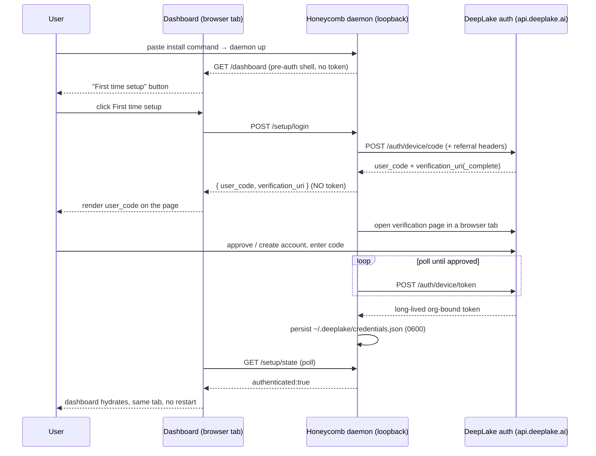

# Install and Onboarding

> Category: Operations | Version: 1.1 | Date: June 2026 | Status: Active

How a brand-new user goes from a single pasted command to a working, authenticated Honeycomb dashboard, the one-command installer, the one-daemon/two-phase model, the on-page device-flow login, Hivemind migration, and operator adoption telemetry.

**Related:**
- [`cli-command-architecture.md`](cli-command-architecture.md)
- [`../auth/auth-architecture.md`](../auth/auth-architecture.md)
- [`../security/credential-storage.md`](../security/credential-storage.md)
- [`../infrastructure/npm-publishing.md`](../infrastructure/npm-publishing.md)
- [`notifications-and-health.md`](notifications-and-health.md)
- [`../architecture/daemon-surface.md`](../architecture/daemon-surface.md)

---

## Why this exists

Honeycomb's older onboarding was a developer gauntlet: have a modern Node/npm, install a global package, know to run `honeycomb setup`, know to run a login verb, complete an RFC 8628 device flow **in a terminal**, and only then see anything. Every step is a cliff a non-expert falls off, and the first surface they ever touch is a shell prompt, not the product.

The install-and-onboarding path inverts that. There is **one command** to paste, and it ends with a **browser tab open on a familiar dashboard** carrying a **"First time setup"** button that runs the credential-linking flow *for* the user instead of asking them to type it. The terminal degrades to a progress log; the dashboard is the first surface.

Two outcomes drive every decision:

> **Goal 1, Time-to-dashboard:** one command → a familiar dashboard, with login performed *through the UI*, not the CLI.
> **Goal 2, Referral capture:** every install authenticates with a referral code (shipped default `mario`) baked in, so signups originating from this repo / the `@legioncodeinc/honeycomb` package are attributed to the operator.

---

## The one-command installer

The front door is a single line:

- **macOS / Linux:** `curl -fsSL https://get.theapiary.sh | sh`
- **Windows PowerShell:** `irm https://get.theapiary.sh/install.ps1 | iex`

`get.theapiary.sh` is a Cloudflare Pages site (`site/install/`) that content-negotiates, a shell pipe receives `install.sh`/`install.ps1` as `text/plain`, a browser gets an "inspect before piping" page, and publishes a `SHA256SUMS` checksum file. It is deployed by `.github/workflows/deploy-install-site.yaml` on `v*` tags.

### What the shell scripts own (and what they hand off)

The two entrypoints (`scripts/install/install.sh`, `scripts/install/install.ps1`) are deliberately thin and idempotent. They own only the **host-bootstrap half**:

1. **Detect-then-install Node/npm** if absent (via `fnm` + a pinned LTS). A junior user will not have npm; if installation needs elevation it cannot obtain, the script prints the exact copy-paste command and exits cleanly (non-zero, no stack trace).
2. **Install the embedding runtime dependencies** the daemon needs, notably `@huggingface/transformers`, whose model weights are *not* pulled synchronously (that download is the embed daemon's lazy warmup, so the installer finishes fast).
3. **Install `@legioncodeinc/honeycomb` globally** (`npm i -g @legioncodeinc/honeycomb@latest`).

The moment a `honeycomb` bin exists, the scripts hand off to the **`honeycomb install` verb** for everything between "package installed" and "browser open on the dashboard." This keeps the daemon-ensure + health-gate + dashboard-open logic in **one** place (`src/commands/install.ts`, TypeScript, unit-tested) rather than duplicated across two shell dialects.

> **The npm global-bin handoff trap:** `npm i -g` does not refresh the *current* shell's `PATH`, so calling a freshly-installed `honeycomb` by bare name in the same run can fail with "command not found." The scripts resolve the absolute bin path (`npm prefix -g`) and invoke the CLI through it.

### Securing the installer-site deployment

The installer endpoint serves bytes that users pipe straight into `sh` or `iex`, so the workflow that publishes it (`.github/workflows/deploy-install-site.yaml`) is itself a supply-chain attack surface. The threat is concrete: any collaborator with **tag-creation** permission could push a `v*` tag pointing at an *arbitrary* commit (not on `main`), and the deploy would ship attacker-controlled installer scripts to `get.theapiary.sh` with no review. The deploy job therefore runs three defense-in-depth controls, all of which must hold before any bytes reach Cloudflare Pages:

1. **Protected `production` environment.** The deploy job declares `environment: { name: production, url: https://get.theapiary.sh }`. The environment is configured at **Settings → Environments → production** with **required reviewers** (trusted maintainers only), so even a tag that passes every other check pauses for an explicit human approval before deploying. This is a one-time operator setup step; without required reviewers the workflow still names the environment but will not pause, so the protection is only real once a reviewer is configured.

2. **Branch-ancestry verification.** A guard step (`Guard — verify tag is on protected main branch`) runs *before* the build and deploy steps, gated on `github.event_name == 'push' && github.ref_type == 'tag'`. With `fetch-depth: 0` it runs `git merge-base --is-ancestor "$TAG_SHA" "$MAIN_SHA"`; if the tag's commit is **not** reachable from `origin/main` the step `exit 1`s and aborts before any installer bytes are read or built. Because a commit only lands on `main` through the required PR reviews and `ci.yaml` quality gate (`.github/rulesets/main-protection.json`), this proves the tagged tree was vetted. Legitimate releases (a tag on `main` or one of its ancestors, including commits brought in by a merge commit) pass; a tag on an unmerged feature branch, a commit ahead of `main`, or any off-`main` commit is rejected. `workflow_dispatch` deploys skip the guard (no tag to verify; manual deploys from `main` are operator-initiated).

3. **Immutable tag semantics.** Tags are immutable refs, so once a `v*` tag is pushed and deployed, re-pushing the same tag name is rejected by Git. A known-good release cannot be silently swapped for malicious bytes under the same name.

These controls are documented for operators in `SECURITY.md` (§ Production deployment protection) and `site/install/README.md`, and are regression-locked by `tests/security/deploy-install-site-guard.test.ts`, which parses the workflow YAML to assert the environment block, the guard step, and the guard-before-build ordering are all present, and unit-tests the `merge-base --is-ancestor` ancestry logic across the exploit and legitimate-release scenarios. Do not weaken the environment protection or the ancestry check without a documented security review. This pipeline is **distinct from** the npm publish pipeline (see [npm Publishing](../infrastructure/npm-publishing.md)), which protects the `@legioncodeinc/honeycomb` tarball with its own OIDC + pack-check + fails-closed guards.

### The `honeycomb install` verb

`runInstallCommand` (`src/commands/install.ts`) composes existing seams, it is a thin daemon client, never a daemon-core import:

1. **Health-gate the daemon up.** Reuses `ensureDaemonRunning` (`src/commands/daemon.ts`), which is idempotent via the PID/lock guard, an already-healthy daemon is a no-op, never a second bind of `127.0.0.1:3850`. If the daemon never becomes reachable within the wait budget, the verb prints "daemon didn't start" + a retry hint and exits non-zero.
2. **Persist the onboarding marker.** Stamps `phase: "installed"` + the effective `ref` into `~/.deeplake/onboarding.json` via the shared onboarding store. The write is fail-soft, an onboarding hiccup logs a warning, never fails the install.
3. **Open the dashboard.** Tries `http://honeycomb.local:3850/dashboard` first (best-effort), and *always* falls back to the `http://127.0.0.1:3850/dashboard` loopback URL. The opener (`openLocalDashboardUrl`) is a fixed-argv `execFileSync`, never a shell, that refuses any URL whose host is not the loopback IP, `localhost`, or `honeycomb.local`. A failed launch is non-fatal: the URL is printed for the user to open by hand.

Every handled failure is a single readable line and a non-zero exit; the verb never lets a raw stack reach the bin. Re-running is safe: ensure-running short-circuits, the onboarding write is a stable upsert, and the dashboard is simply re-opened.

---

## The one-daemon / two-phase model

The pivotal architectural realization is **no second daemon: one daemon, two phases.**

The Honeycomb daemon already serves a self-hydrating, token-free dashboard shell over loopback (`renderShell` / `mountDashboardHost` in `src/daemon/runtime/dashboard/host.ts`), and it does **not** need DeepLake credentials to *boot*, only to serve the surfaces that read DeepLake (capture, recall, graph). So the lifecycle is:

1. **Pre-auth phase.** The daemon boots with zero credentials on disk and serves `GET /dashboard` plus the guided-setup wizard. The DeepLake-backed surfaces show an empty "connect me" state, nothing throws or fails closed on a missing token. This rests on `loadCredentials()` returning `null` (not throwing) on an absent file (`src/daemon/runtime/auth/credentials-store.ts`).
2. **Authenticated phase.** When login writes the shared credential, the **same** running daemon serves the authenticated surfaces on the next request, no `honeycomb daemon restart`, no second tab. The dashboard polls `GET /setup/state` while on the setup screen and swaps to the authenticated views the instant a valid credential loads.

The embeddings runtime is the closest thing to "another daemon," but it is a **lazily-warmed sub-daemon** that comes up in the background when first needed and never gates the dashboard or the login. Until the model is warm, recall degrades to the BM25/lexical fallback.

### The setup state read

`GET /setup/state` (`src/daemon/runtime/dashboard/setup-state.ts`) is the loopback, local-mode-only read the wizard polls to decide which state to render. Its body is install/onboarding metadata only, **no token, no secret, no PII** (the probes are `existsSync` on directories, never a read of the credential value):

```
{
  credentials: { deeplake, honeycomb, hivemind },   // existsSync on ~/.deeplake, ~/.honeycomb, ~/.hivemind
  phase,                                             // onboarding hint for the wizard copy
  priorTool: { hivemind: "absent" | "present" | "migrated" },
  firstTimeSetupComplete,
  authenticated,                                     // DERIVED: a valid credential loads
  warmup: { enabled, live, warm },                   // embeddings warmup signal (never blocking)
  migration?: { phase, startedAt, backupPath }       // present only mid/post-migration
}
```

`authenticated` is **derived** from `loadCredentials(...) !== null`, never from the onboarding `phase`. The onboarding file is a *hint* for which wizard copy to show; it can disagree with the credential (a half-written file), so it never decides auth. This is what lets the dashboard flip from guided-setup to authenticated the instant the credential lands, even if the onboarding file still reads `"linking"`.

All setup routes (`GET /setup/state`, `POST /setup/login`, `POST /setup/migrate-from-hivemind`) sit beside `mountDashboardHost` on the unprotected root group and obey the same `mode === "local"` gate. In team/hybrid the routes are never mounted and a request gets a clean 404, indistinguishable from an unmounted path.

---

## The guided "First time setup" device flow

When the dashboard renders the fresh-install state, the **"First time setup"** button POSTs to `POST /setup/login` (`src/daemon/runtime/dashboard/setup-login.ts`). That route begins the DeepLake device flow and returns *only* the `user_code` + verification URIs for the dashboard to **render on the page itself**, the user never copies a code out of a terminal.

The browser flow:



Secret discipline is preserved end to end: the response body carries only `user_code` + the verification URIs, never the device/bearer token and never the `device_code` poll handle. The reporter sink is swallowed so no token-adjacent line is logged, and `verification_uri_complete` is re-validated to an **https-only** URL before it is echoed to the page as a clickable link. On approval the flow mints and persists the shared `~/.deeplake/credentials.json` (0600) through the existing `persistFromToken` path, unchanged except for the added attribution headers (see [Referral attribution](#referral-attribution-the-growth-engine)).

---

## Referral attribution (the growth engine)

Every Honeycomb signup originates from the operator's repo and the `@legioncodeinc/honeycomb` package, separate from Activeloop/DeepLake's own repos and package, so every signup is attributed to the operator. The mechanic is a referral header on the device-code request, ported from Hivemind's `hivemindReferrerHeader`.

The live implementation (`referrerHeaders` in `src/daemon/runtime/auth/deeplake-issuer.ts`) sends **both** headers on `POST /auth/device/code`, and only there:

- `X-Hivemind-Referrer`, recognized by the Activeloop backend *today* (the verbatim Hivemind port).
- `X-Honeycomb-Referrer`, the forward-looking Honeycomb-namespaced header.

Both carry the trimmed ref, and both are **omitted entirely** when the ref is empty/whitespace (trim-and-omit parity with Hivemind, an empty referrer is never attributed). The header rides only on the device-code request (attribution-on-registration); it never appears on `/me`, mint, or any data-plane call, and the ref is never placed in a URL or a log line.

### Ref resolution

The effective ref resolves with precedence **`--ref <code>` override → `onboarding.ref` → build-time default**. The default is the esbuild-injected `__HONEYCOMB_REF_DEFAULT__` (`HONEYCOMB_REF_DEFAULT` CI var, shipped `"mario"`), one build-var change for a fork or a future operator, never a name hard-baked into source. Attribution is automatic; the user (and the operator) never has to remember a code. An explicit `honeycomb install --ref <someone-else>` overrides it; an explicit blank ref omits the headers.

---

## Hivemind coexistence and migration

Honeycomb and Hivemind are siblings that **share one credential file** (`~/.deeplake/credentials.json`) and overlapping harness wiring, but running both on one machine is unsupported (duplicate capture/recall hooks, competing daemons). A user arriving at setup who already has a credential folder almost certainly has a prior Hivemind install.

`GET /setup/state` detects this: when the onboarding record still reads `priorTool.hivemind: "absent"` but a `~/.hivemind` directory exists, it reports `"present"` so the dashboard renders the **coexistence-warning** wizard rather than plain first-time setup. The warning states clearly that coexistence is unsupported and what "Proceed with Honeycomb" will do, before any destructive action.

**"Proceed with Honeycomb"** POSTs to `POST /setup/migrate-from-hivemind` (`src/daemon/runtime/dashboard/setup-migrate.ts`), which runs the migration as one guarded transaction with a **durable recovery marker**. Before any destructive step it writes a `migration: { phase, startedAt, backupPath }` marker and advances `phase` through `backup → uninstall → link → done` (or `rolled_back`):

1. **Back up** `~/.hivemind` (and any Hivemind harness markers) to a timestamped path, reversible by design.
2. **Uninstall** Hivemind idempotently.
3. **Link to DeepLake.** Because the credential file is byte-shared, the common case is **no re-auth at all**: a valid `~/.deeplake/credentials.json` is verified via `GET /me` and adopted. Only a missing/invalid/expired credential triggers a fresh referral-attributed device flow.

If the daemon is killed mid-migration, on restart `GET /setup/state` surfaces the non-terminal `migration.phase` and the dashboard offers **resume** or **roll back** (restore the backup, via `POST /setup/migrate-from-hivemind/rollback`), a half-migrated machine is never presented as cleanly migrated or cleanly reverted. A failed/partial uninstall surfaces a plain-language message + the backup location and never deletes the shared credential.

---

## Operator adoption telemetry

The referral header attributes *new DeepLake registrations*. It structurally cannot credit a **Hivemind→Honeycomb upgrader**, who is an already-registered account that (per the migration above) often adopts the shared credential without re-authenticating, so no device-code request is even issued. The referral header is blind to exactly the cohort Goal 2 most wants to count.

Operator adoption telemetry is the **operator-owned measurement floor** that closes that gap without depending on Activeloop. The daemon emits three anonymized lifecycle events through a single chokepoint (`emitTelemetry` in `src/daemon/runtime/telemetry/emit.ts`):

- `honeycomb_installed`, daemon first boot after install.
- `honeycomb_first_link`, a fresh-user device flow completes.
- `honeycomb_hivemind_upgrade`, a migration completes (this fires even on the silent credential-adopt path, the only signal that captures the adopt-without-re-auth cohort).

Each event carries an **allow-list-only** payload: an anonymized `distinct_id` (a random install-id in the onboarding file), the `ref`, `source_tool`, `honeycomb_version`, coarse `os`/`arch`/`node`, and a timestamp. The chokepoint builds the payload from the allow-list, never from caller free-form props, so a leak is structurally impossible. The token, email, `userName`, cwd/repo paths, branch names, recall queries, and memory/session content are **never** in the payload (asserted by a structural banned-set test), and there is no per-item (per-memory/per-query/per-file) emit path.

The gates, in order (every return is silent, telemetry never throws):

1. Build-injected `__HONEYCOMB_POSTHOG_KEY__` empty → hard-disabled (the fail-soft default for an unkeyed dev build).
2. `HONEYCOMB_TELEMETRY=0` or `DO_NOT_TRACK=1` → opted out, both tiers.
3. A Tier-2 (usage-count) event without explicit opt-in → not consented.
4. Event already in the `reported` dedupe ledger → already sent once per machine.

Only past all four does a single bounded-timeout POST fire to `${POSTHOG_HOST}/i/v0/e/` (default `https://us.i.posthog.com`), with body `{ api_key, event, properties, distinct_id }`, ingesting into the operator-owned PostHog project "Honeycomb" (id `485287`, deliberately separate from product analytics `legionsight.ai`). The POST is fire-and-forget and fail-soft, a timeout, error, or 4xx/5xx is swallowed and never changes a host flow's exit code; install/login/migration call it *after* their user-facing success and ignore the result.

The PostHog project key (`phc_…`) is a **public write-only ingest key**, build-injected via the esbuild `define` `__HONEYCOMB_POSTHOG_KEY__` (sourced from the `HONEYCOMB_POSTHOG_KEY` CI build secret, never committed). It can ingest, not read, so it is safe to ship in the published tarball. `honeycomb telemetry --show` glass-boxes the egress: it renders, in plaintext, exactly what has been and would be sent, sourced from the same local events, so the displayed set provably *is* the egress set. The full bright-line egress policy lives in [Trust Boundaries](../security/trust-boundaries.md).

---

## Build-time configuration

The installer's referral default and the telemetry destination are single-sourced the same way the version is, a compile-time esbuild `define`, never a runtime `process.env` read. `esbuild.config.mjs` sources each from a CI env var with a safe default and `JSON.stringify`s it into the `VERSION_DEFINE` map alongside `__HONEYCOMB_VERSION__`:

```52:57:esbuild.config.mjs
const VERSION_DEFINE = {
  __HONEYCOMB_VERSION__: JSON.stringify(HONEYCOMB_VERSION),
  __HONEYCOMB_REF_DEFAULT__: JSON.stringify(HONEYCOMB_REF_DEFAULT),
  __HONEYCOMB_POSTHOG_KEY__: JSON.stringify(HONEYCOMB_POSTHOG_KEY),
  __HONEYCOMB_POSTHOG_HOST__: JSON.stringify(HONEYCOMB_POSTHOG_HOST),
};
```

The defaults are `mario` (ref), `""` (PostHog key, empty means telemetry disabled, the fail-soft default), and the PostHog US cloud (host). The keys arrive only via CI build env at release time. The `release.yaml` workflow sets `HONEYCOMB_POSTHOG_KEY` (secret) and `HONEYCOMB_REF_DEFAULT` (var) as **step-scoped env on just the build + publish steps** (least privilege, `npm ci`, the gate, and audits never see them), and only on `release.yaml`, never `ci.yaml`. An unset key bakes `""` → telemetry disabled, so a fork or local dev build silently no-ops instead of spamming the project. See [npm Publishing](../infrastructure/npm-publishing.md) for the release pipeline that bakes these in.
