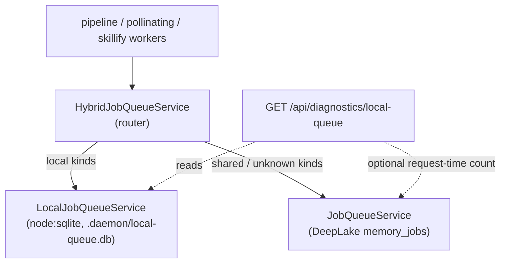

# Local Queue Idle-Cost Control

> Category: Operations | Version: 1.0 | Date: June 2026 | Status: Active

How the daemon stops paying DeepLake compute to ask "is there local work?" by scheduling per-device jobs in a local SQLite queue, routing only memory/vector work to DeepLake. Read this if you are tuning single-machine idle cost, debugging why a job did not process, planning an upgrade or rollback of the local queue, or wiring a new daemon job kind.

**Related:**
- [`deeplake-compute-cost.md`](deeplake-compute-cost.md)
- [`deeplake-idle-hibernation.md`](deeplake-idle-hibernation.md)
- [`observability-and-degradation.md`](observability-and-degradation.md)
- [`../architecture/adr/0006-local-queue-as-interim-idle-cost-control.md`](../architecture/adr/0006-local-queue-as-interim-idle-cost-control.md)
- [`../architecture/adr/0004-honeycomb-control-plane-and-postgres-boundary.md`](../architecture/adr/0004-honeycomb-control-plane-and-postgres-boundary.md)
- [`../data/deeplake-storage.md`](../data/deeplake-storage.md)

---

## Why this exists

PRD-062 (shipped v0.1.7, see [`deeplake-compute-cost.md`](deeplake-compute-cost.md)) cut the idle DeepLake bill by one to two orders of magnitude with adaptive poll backoff and single-lease consolidation. That work was the right emergency patch, but it left the shape wrong: an idle daemon still polled a GPU-backed, metered, eventually-consistent memory substrate to discover purely local work. The cost still tracked install count rather than usage, just with a smaller constant.

The local queue is the structural fix that PRD-062's mitigations only approximated. The reasoning is the same one the persistent log store used when it chose SQLite: per-device job coordination is high-frequency, local, ephemeral, and needs immediate queryability without DeepLake's convergence reads. A single machine already knows when local capture, summary, skillify, pollinating, and retry work is created. It should never ask a remote substrate. ADR-0006 locks this decision; this doc is the as-built record of how it works.

The target idle behavior:

```text
No user activity + empty local queue = zero DeepLake reads for coordination.
```

DeepLake remains the system of record for memory rows, shared sessions, embeddings, recall candidates, and team skills. The local queue is not a replacement for shared memory. It is the local scheduler that decides when the daemon has real work worth sending to DeepLake. Cross-device and fleet coordination still belongs to the hosted control plane in ADR-0004; the local queue does not solve that and is not throwaway when the control plane arrives (it keeps offline-first buffering and crash-safe drain).

## The three layers



The seam stays stable: every consumer still depends on a single `JobQueueService`. The hybrid router is the only new wiring point, and when the feature is off it returns the existing shared queue unchanged, so a disabled daemon is byte-for-byte the legacy path.

## Layer 1: the local SQLite queue

[`src/daemon/runtime/services/local-job-queue.ts`](../../../../src/daemon/runtime/services/local-job-queue.ts) is a durable, daemon-local queue built on the built-in `node:sqlite` driver. It is intentionally local-only: it never imports or calls the DeepLake storage client. The database lives at `.daemon/local-queue.db` under the daemon runtime directory. Specifically, as of PR #285 (v0.10.1), that is the fleet state root: `<fleetRoot>/honeycomb/.daemon/local-queue.db` via `resolveLocalQueueBaseDir()` = `honeycombStateDir()`, resolved from `os.homedir()`/`APIARY_HOME` and never `process.cwd()`, so a restart from any launch directory reopens the same durable queue instead of orphaning pending jobs (see [`../data/workspace-layout.md`](../data/workspace-layout.md)). It is a single `local_job` table with the columns `id`, `kind`, `payload_json`, `status`, `priority`, `attempts`, `max_attempts`, `run_after`, `lease_owner`, `leased_until`, `created_at`, `updated_at`, `completed_at`, and `last_error_class`.

The service exposes the same lifecycle the DeepLake queue does, so it is a drop-in behind the router: `enqueue`, `lease(kinds?)`, `complete`, `fail`, `reclaimExpiredLeases`, `pruneCompleted`, `counts`, and `close`. A job moves through five statuses: `queued`, `retrying`, `leased`, `done`, `failed`. Lease ownership is single-winner within a daemon process; the reaper reclaims expired leases so a crashed run does not strand work. Because the store is local SQLite rather than an append-only eventually-consistent log, lease discovery is a direct indexed read with no convergence-poll multiplier, which is the entire point of the cost win.

The service reports `persistent: boolean`. When SQLite cannot be opened (an unwritable runtime directory, a missing native binding), `persistent` is false and the router declines to route to it, so the daemon fails soft to the shared path rather than silently dropping local work.

## Layer 2: the hybrid router

[`src/daemon/runtime/services/hybrid-job-queue.ts`](../../../../src/daemon/runtime/services/hybrid-job-queue.ts) keeps the one-`JobQueueService` seam stable while splitting traffic by job kind. The local-classified kinds are fixed in `DEFAULT_LOCAL_JOB_KINDS`: `memory_extraction`, `memory_decision`, `memory_controlled_write`, `memory_graph_persist`, `memory_retention`, `summary`, `skillify`, `pollinating`, `source_index`, and `document_ingest`. Everything else (and any unknown kind) stays on the DeepLake-backed shared queue.

`createHybridJobQueueService` returns the plain shared queue when the feature flag is off or when the local queue is not persistent, so the router only exists when it can actually help. When active, it tracks which job ids it sent local in an in-memory set so `complete` and `fail` route back to the same queue that owns the job. `lease` tries local-classified kinds against the local queue first and only falls through to the shared queue for the remaining kinds.

The migration story lives in one flag. In the default non-drain mode the router leaves the shared reaper stopped: callers can still lease shared work on demand, but an idle local-only daemon does not resume DeepLake polling just because the adapter is wired. Turning on the drain flag puts the router into migration-compatibility mode, where a worker for a local-classified kind tries the local queue first and then falls back to the shared queue so pre-existing DeepLake `memory_jobs` rows can drain. Once migration is clear, the drain flag goes back off to reach the zero-idle-read target.

## Layer 3: the poll loop and the compounding-timer fix

The local and shared queues are both driven by the shared adaptive poll loop in [`src/daemon/runtime/services/poll-loop.ts`](../../../../src/daemon/runtime/services/poll-loop.ts) (PRD-062b). The loop runs one cadence behind one seam: a flat repeating interval when backoff is off (the pre-PRD parity path), and a self-rescheduling one-shot loop when backoff is on (idle steps toward a ceiling, a leased job resets to the floor). An overlap guard skips a tick while a previous run is still in flight, and a skipped tick does not feed the backoff state machine.

PRD-066f hardened this loop against a real defect: repeated worker starts stacked background loops. `start()` now short-circuits when the loop is already armed (`if (!this.stopped && this.handle !== undefined) return;`), so calling start more than once cannot leave two timers firing into the same tick. Every background timer the loop arms is also unref'd, so a poll timer never keeps the process alive or burdens test and shutdown teardown. Both fixes matter for cost: a stacked timer is a silent multiplier on every read the loop issues.

## Upgrade and rollback diagnostics

PRD-066e adds an operator-facing inspection endpoint, [`src/daemon/runtime/local-queue-diagnostics-api.ts`](../../../../src/daemon/runtime/local-queue-diagnostics-api.ts), mounted at `GET /api/diagnostics/local-queue` on the already-protected `/api/diagnostics` group. The builder, [`src/daemon/runtime/services/local-queue-diagnostics.ts`](../../../../src/daemon/runtime/services/local-queue-diagnostics.ts), is pure except for an optional request-time DeepLake pending-job count. It never runs on an idle timer, so inspecting upgrade state does not reintroduce the idle cost the feature exists to remove.

The response reports four things:

1. **Local queue state.** Whether the feature is enabled, whether the store is persistent, the drain flag, the local kind set, and live counts by status and kind.
2. **Topology.** Resolved from `HONEYCOMB_TOPOLOGY` or `HONEYCOMB_INSTALL_TOPOLOGY` (`single_machine`, `multi_device`, `fleet`, or `unknown`). Single-machine installs are eligible for default-on; multi-device and fleet stay on the shared queue unless `HONEYCOMB_LOCAL_QUEUE_EXPLICIT_OPT_IN` overrides the guard. This is the gate that keeps a future default-on rollout from silently breaking cross-device coordination.
3. **Rollback status.** Whether disabling the flag would strand local work. The key safety signal is `localWorkWillNotProcess`: if the flag is off but `.daemon/local-queue.db` still holds queued, retrying, or leased jobs, the response carries a warning that the work will not be processed until the flag is re-enabled. Rollback never requires a DeepLake migration or a local-DB deletion; it is a flag flip.
4. **Pending shared local jobs.** An optional count of local-classified kinds still sitting in the DeepLake `memory_jobs` table, used to decide when migration drain is complete. The read is bounded by a 5-second timeout and degrades to `unavailable` rather than hanging the endpoint. Its query reads the latest version of each job (a `MAX(version)` self-join, matching the append-only convergence posture) and is built with validated bare table identifiers after `sqlIdent()`, closing the Aikido SQL finding PRD-066f remediated.

## Flag posture

The local queue inverts PRD-062's default-ON convention. Because it changes where local coordination happens, it ships **opt-in**: with every flag unset the daemon runs the exact pre-PRD shared-queue path.

| Knob | Env var | Default |
|---|---|---|
| Master switch | `HONEYCOMB_LOCAL_QUEUE_ENABLED` | off (bare config keeps the shared DeepLake queue) |
| Migration drain of shared local-kind rows | `HONEYCOMB_LOCAL_QUEUE_DRAIN_SHARED` | off (non-drain leaves the shared reaper stopped) |
| Topology signal | `HONEYCOMB_TOPOLOGY` / `HONEYCOMB_INSTALL_TOPOLOGY` | `unknown` (not eligible for default-on) |
| Explicit default-on override | `HONEYCOMB_LOCAL_QUEUE_EXPLICIT_OPT_IN` | off |

## Required invariants

These come from ADR-0006 and are load-bearing for any future change:

- An empty local queue at idle must not issue DeepLake coordination reads.
- The local queue must never store raw secrets or plaintext DeepLake credentials. It holds job kinds and payloads only.
- Queue writes are local and fail-soft: a non-persistent store degrades to the shared path rather than dropping work.
- Job ownership and retry semantics stay single-winner within a daemon process.
- The migration is reversible behind the flag until live cost and correctness are proven, and rollback never demands a data migration or DB deletion.

## Publish-readiness verification

PRD-066f gated the release on three local-queue smoke scripts that prove the packaged artifact behaves, not just the source tree:

| Concern | Script |
|---|---|
| Live idle proof (idle and active read deltas against a real install) | [`scripts/local-queue-packaged-live-proof.mjs`](../../../../scripts/local-queue-packaged-live-proof.mjs) |
| Packaged upgrade smoke (upgrade from the latest published npm package by default) | [`scripts/local-queue-packaged-upgrade-smoke.mjs`](../../../../scripts/local-queue-packaged-upgrade-smoke.mjs) |
| Source-tree upgrade smoke | [`scripts/local-queue-upgrade-smoke.mjs`](../../../../scripts/local-queue-upgrade-smoke.mjs) |

The live proof reports read counts in the form `idle_poll_reads=0 active_poll_reads=0 recall_reads_delta=N`, the direct evidence that an idle daemon with the local queue on issues zero coordination reads. These are local-queue-specific gates and sit alongside, not inside, the general npm publish pipeline documented in [`../infrastructure/npm-publishing.md`](../infrastructure/npm-publishing.md).

## Source map

| Concern | Module |
|---|---|
| Local SQLite queue | [`src/daemon/runtime/services/local-job-queue.ts`](../../../../src/daemon/runtime/services/local-job-queue.ts) |
| Hybrid router | [`src/daemon/runtime/services/hybrid-job-queue.ts`](../../../../src/daemon/runtime/services/hybrid-job-queue.ts) |
| Shared adaptive poll loop + compounding-timer guard | [`src/daemon/runtime/services/poll-loop.ts`](../../../../src/daemon/runtime/services/poll-loop.ts) |
| Single-lease consolidation | [`src/daemon/runtime/services/lease-coordinator.ts`](../../../../src/daemon/runtime/services/lease-coordinator.ts) |
| Upgrade/rollback diagnostics builder | [`src/daemon/runtime/services/local-queue-diagnostics.ts`](../../../../src/daemon/runtime/services/local-queue-diagnostics.ts) |
| Diagnostics endpoint mount | [`src/daemon/runtime/local-queue-diagnostics-api.ts`](../../../../src/daemon/runtime/local-queue-diagnostics-api.ts), wired in [`assemble.ts`](../../../../src/daemon/runtime/assemble.ts) |
| Decision record | [`ADR-0006`](../architecture/adr/0006-local-queue-as-interim-idle-cost-control.md) |
| Source spec | PRD-066 (066a local store, 066b routing/migration, 066c verification, 066d/066e/066f hardening + publish readiness) |
