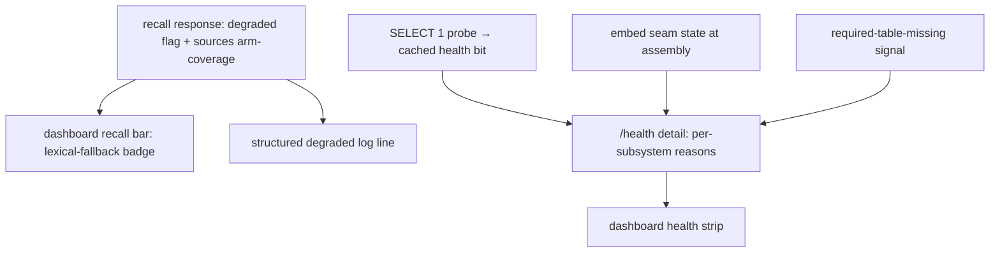

# Observability and Degradation

> Category: Operations | Version: 1.2 | Date: July 2026 | Status: Active

How Honeycomb surfaces the engine's degradation modes, embeddings off, lexical fallback, partial storage degradation, a missing table, in recall responses, `/health`, and the dashboard, so a degraded daemon never silently looks healthy.

**Related:**
- [`notifications-and-health.md`](notifications-and-health.md)
- [`doctor-watchdog.md`](doctor-watchdog.md)
- [`fleet-and-usage-telemetry.md`](fleet-and-usage-telemetry.md)
- [`deeplake-compute-cost.md`](deeplake-compute-cost.md)
- [`../ai/retrieval.md`](../ai/retrieval.md)
- [`../ai/memory-pipeline.md`](../ai/memory-pipeline.md)
- [`../data/deeplake-storage.md`](../data/deeplake-storage.md)
- [`../architecture/daemon-surface.md`](../architecture/daemon-surface.md)
- [`../security/scoping-and-visibility.md`](../security/scoping-and-visibility.md)

---

## The silent-degradation problem

The engine degrades gracefully, and that is exactly the trap. With embeddings off, recall falls back to lexical BM25/ILIKE search and still returns rows. A sibling arm that has not been created yet on a fresh partition (`memory` or `sessions` missing) yields empty for that arm but a non-empty result overall. A stale DeepLake segment under-reports a count. In every case the system keeps working, and tells the operator nothing.

The cost is that a degraded engine *looks* healthy. Recall returns fewer or worse hits, a counter looks un-incremented, a dashboard KPI lags, and nothing flags that the answer was produced in a fallback mode. The dogfood repeatedly hit a degraded engine that passed a surface glance. The remedy is not to hide degradation but to **make it visible**: the signal already exists in the runtime; this layer threads it out to where a human can see it.

The posture is deliberately **no hard error**. Degradation is surfaced, not fixed: turning embeddings on, creating a missing table, or restoring storage is the operator's call (or a separate remediation). The job here is to ensure those calls are made from knowledge, not from a green light that was lying.

## The three degradation signals

Three signals are surfaced, each read from state the runtime already computes.

### Recall degradation (per query)

Recall already computes and returns a `degraded` boolean and a `sources` arm-coverage field on its result, and the route already serializes them. Degradation here is **per-query**, *this* query fell back, so it rides the recall *response*, exactly where the code already puts it, not smeared onto a daemon-wide status. When a recall runs degraded (embeddings off → lexical fallback, or an arm missing), two things now happen: the dashboard recall bar renders a "lexical fallback" badge, and a structured log line records the degraded mode and which arms were covered.

### Subsystem health (daemon-wide status)

Storage reachability, embeddings on/off, and schema completeness are a daemon-wide **status**, not a per-query fact, so they live on `/health`, refreshed by the existing probe loop. The `/health` contract was coarse: a bare `ok` / `degraded` / `unconfigured` bit refreshed by a `SELECT 1` probe. When it flipped to `degraded` there was no *why*, storage unreachable, embeddings off, or a table missing all looked identical.

The contract is now extended, **additively**. The coarse bit and its existing consumers (`/api/status`, the connectivity banner, the 503 gate) are unchanged. A new per-subsystem `reasons` block names which subsystem is down:

| Reason | States | Source |
|---|---|---|
| `storage` | `reachable` / `unreachable` | The cached pipeline bit the `SELECT 1` probe maintains. `ok` → reachable. |
| `embeddings` | `on` / `off` | The embed-seam state known at assembly, `on` when the real embedder is wired, `off` for the no-op or an explicit `HONEYCOMB_EMBEDDINGS=false`. |
| `schema` | `ok` / `missing_table` | Best-effort: `ok` unless a required table is known-missing. With no cheap always-on signal, it stays conservatively `ok` rather than risk a false alarm; a caller that holds a known-missing signal passes `missing_table` explicitly. |
| `capture` | `droppedEvents` count (integer, `≥ 0`) | The acked-but-dropped events counter (C-4). The capture seam increments it fail-soft when a captured event is dropped *after* the daemon already acked it, so an event the harness believes landed is surfaced rather than lost silently. The same count also feeds the dashboard KPIs. |

No new probe is introduced, the `reasons` read facts the runtime already knows. The structured detail is built by a pure contract module (`src/daemon/runtime/health.ts`); the `storage` / `embeddings` / `schema` reasons are each a closed enum of string literals, and `capture.droppedEvents` is a monotonic integer count rather than a literal.

### Partial storage degradation

A partial degradation, storage reachable but a single arm or table missing, is captured by the combination of the two signals above. The overall `/health` bit can still report `ok` for reachability while `schema` reports `missing_table`, and a recall over the missing arm returns `degraded: true` with that arm absent from `sources`. The operator sees a reachable store with one subsystem named as down, rather than a flat "degraded" with no decomposition.

### Capture durability (the outbox backlog)

The `capture.droppedEvents` count above records events that were acked then lost. PRD-079a (PR #287, v0.11.0) changes what happens to the other capture-loss class, a batch append that fails against a degraded DeepLake window: instead of being dropped it is now persisted to a durable `capture_outbox` and retried by a background drainer (see [`../ai/session-capture.md`](../ai/session-capture.md)). That turns a silent loss into a *visible backlog*, which needs its own signal so a store that is quietly behind on draining does not look healthy.

`/health` therefore gains a `captureOutbox { pending, retrying, deadLettered }` block: `pending` is the count of failed captures waiting to re-append, `retrying` the count currently in backoff, and `deadLettered` the terminal count of rows that gave up (added by PRD-079b, PR #289, v0.12.0). A non-zero-and-climbing `pending` under an otherwise-`ok` reachability bit is the tell that DeepLake writes are timing out even though a `SELECT 1` probe passes, exactly the warm-window degradation the coarse bit misses. The path also emits the secret-free `capture.outbox.{enqueued,drained,retry,dead_lettered,shed}` events (counts, durations, and attempt/age numbers only, no row payload), so the enqueue-then-drain lifecycle is traceable the same way the pipeline lifecycle events are. All three counts are non-negative integers built by the same pure `health.ts` contract module, so they inherit the no-secret invariant below (a bare integer cannot carry a free-form secret). The normalizer clamps a `NaN`-shaped input to `0` rather than serializing `null` on the wire, so a transient read never renders the field meaningless; a legacy caller passing only `{ pending, retrying }` still type-checks, with `deadLettered` normalizing to `0`.

PRD-079b/c (PR #289) also changed *how the backlog resolves*, which changes what the operator reads. The old backlog drained only on the 30s interval; now a successful capture append kicks an immediate single-flighted drain, so `pending` collapses toward `0` the moment DeepLake recovers rather than on the next tick, and the drainer goes quiet during hibernation (it no longer keeps the Activeloop pod warm while idle) and re-arms on the `deeplake.woke` wake. A `deadLettered` that climbs is the "some captures are permanently unwritable" signal (a row hit `maxAttempts` or aged past `maxAgeMs`), distinct from a transient `pending` spike; a `capture.outbox.shed` event means the active backlog hit its `maxRows` cap and the oldest pending rows were dropped oldest-first (counted, never silent). For the times the operator wants to force the issue rather than wait, `honeycomb capture drain` (POSTing to `POST /api/diagnostics/capture-drain` on the protected diagnostics group) forces one drain pass and prints `{ drained, retried, deadLettered }`. The recovery mechanics are detailed in [`../ai/session-capture.md`](../ai/session-capture.md) and [`../storage/deeplake-recall-and-capture-findings-2026-07-10.md`](../storage/deeplake-recall-and-capture-findings-2026-07-10.md) §3.4.

## The memory pipeline: a queue snapshot and a driver heartbeat

The recall and `/health` signals above answer "is the store reachable and did this query fall back." They do not answer a different silent-degradation question the pipeline raised: the daemon captures sessions and queues extraction jobs, but forms zero memories, and nothing says why. The durable `memory_jobs` queue was a black box, and a stalled driver looked identical to an empty one. Two additions close that gap: a read-only queue snapshot (PR #244) and the pipeline's own lifecycle log events (PR #246).

### The job-queue snapshot (`GET /api/diagnostics/jobs`)

Before PR #244 the queue endpoint returned `501` and there was no way to see that 400+ `memory_extraction` jobs were sitting queued. `JobQueueService.stats()` now returns a current-status breakdown by kind: `{ byKind: [{ kind, queued, leased, done, failed, dead, total }], total }`. The counts are computed from the highest-version row per job, the same discovery scan `lease()` uses, so they reflect real current status rather than raw append-only append counts (a job that went queued then leased then done shows once as `done`, not three times across the history). Every queue implementation carries it: the Deep Lake queue, the local SQLite queue (which maps its `retrying` state to `failed` and its terminal states to `dead`), the hybrid queue (which merges both), and the no-op. The route `GET /api/diagnostics/jobs` attaches to the already `protect:true` `/api/diagnostics` group (`src/daemon/runtime/dashboard/jobs-diagnostics-api.ts`), so it is operator-only and strictly read-only: it reports the queue, it never leases or mutates a job.

An operator reading a stuck pipeline sees the backlog directly: a large `queued` with a zero or stale `leased` for the `memory_extraction` kind is the O(N) lease wedge (or a driver that never started), and a climbing `failed` / `dead` is a handler problem rather than a scheduling one.

### The driver heartbeat (pipeline lifecycle log events)

The queue snapshot shows the backlog; the pipeline's log events show whether anything is draining it. PR #246 wired the daemon logger into the stage worker and the lease coordinator (they had logging seams but were assembled with no logger, so every event was a silent no-op) and added the load-bearing lifecycle events an operator reads to answer "is a loop actually pumping the queue":

| Event | Meaning |
|---|---|
| `stage.worker.started` | The stage worker's own poll loop came up. |
| `lease.coordinator.started` | The lease coordinator came up; carries `leaseKinds` / `unionKinds` and the participant count. In the production consolidate-poll default (`HONEYCOMB_POLL_CONSOLIDATE`) the coordinator, not the stage worker's loop, drives the pipeline, so this is the "did the driver start, and does its union include the backlogged kind" signal. |
| `lease.coordinator.dispatched` | Fires per leased job, so a running-but-empty coordinator is distinguishable from one actually handing work to stage handlers. |
| `stage.completed` / `stage.failed` | Per-stage outcome (these predate #246 but were silent until the logger was wired). |

The diagnostic reading is direct: absence of a `started` event means no loop is pumping the queue, which is exactly the state the lease wedge and the trailing-space `HONEYCOMB_PIPELINE_ENABLED` bug both produced (both fixed in PR #248; see [`../ai/memory-pipeline.md`](../ai/memory-pipeline.md)). A `started` with no `dispatched` under a non-empty `queued` count from `/api/diagnostics/jobs` is a coordinator whose union does not include the backlogged kind. These events carry stage and kind names and counts only, so they inherit the no-secret invariant below.

### Controlled-write dedup-probe failures

The write stage adds one diagnostic the driver-heartbeat events do not carry. When the controlled-writes dedup SELECT fails for a genuine reason (not a heal-able missing table or column), the stage emits `controlled_write.dedup_probe_failed { classification, kind, status, transient, reason }` and throws an enriched error that lands in the queue's `last_error_class` (BUG-04, PR #293, v0.12.2). Before this, a memory dropped here against an opaque `query_error` that hid the real DeepLake error text and HTTP status, so an operator could not tell a 5xx backend flap from a 402 balance exhaustion from a permission fault. The event and the enriched error now name the failure class and status. The SHA-256 `content_hash` the probe SQL interpolates is stripped before it reaches either surface, so this diagnostic inherits the no-secret invariant below. The full mechanics, including the correctness-preserving safety throw and the still-open durability follow-up (BUG-04b), are in [`../ai/memory-pipeline.md`](../ai/memory-pipeline.md).

## Mode-gated detail: do not leak topology

Exposing the full subsystem map is itself a security consideration, an internal topology handed to an unauthenticated remote is a smell. So the detail is graduated by deployment mode:

- In **`local`** mode (loopback, single-user) the full `reasons` detail is exposed on `/health`. It is the dogfood operator's own daemon.
- In **`team`** / **`hybrid`** mode the public `/health` returns only the coarse bit, a remote caller learns up/down, not internal topology, and the full detail is gated to the protected `/api/diagnostics/health` surface.

The gating lives at the caller (`server.ts`), not in the contract module. A `publicHealthDetail` helper strips `reasons` for the public-by-mode body, so the gate is one named call. A test proves the full detail appears on `local` `/health` but not on the public `team`/`hybrid` `/health`.

## The no-secret invariant

Every new field and log line is scrubbed. The health detail and degraded logs carry subsystem **names and states only**, never a token, endpoint credential, full org GUID, header value, or URL. Because each reason is either a fixed string literal from a closed set or a bare integer count (`capture.droppedEvents`), a value *cannot* carry a free-form secret-bearing string. This reuses the same redaction posture the request log records and the SQL tracer already enforce, and a grep/test proves no token, credential, org GUID, or header appears in any new field, the degraded badge payload, or the degraded log line. The discipline is the same thread that runs through [`../security/scoping-and-visibility.md`](../security/scoping-and-visibility.md): the system refuses rather than over-shares.

## How an operator reads it

The practical flow when something looks off: open the dashboard. The per-subsystem health strip names the down subsystem at a glance; the recall bar's lexical-fallback badge tells you the last recall ran without embeddings. For a deeper look, read `/health` (or `/api/diagnostics/health` in team/hybrid) for the structured `reasons`, and scan the structured degraded log lines to see which recalls fell back and which arms they covered. From there the remediation is the operator's: turn embeddings on, let the heal engine create the missing table, or restore storage connectivity. The observability layer's contract is only that the signal is never silent.
