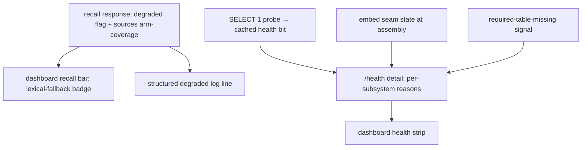

# Observability and Degradation

> Category: Operations | Version: 1.0 | Date: June 2026 | Status: Active

How Honeycomb surfaces the engine's degradation modes, embeddings off, lexical fallback, partial storage degradation, a missing table, in recall responses, `/health`, and the dashboard, so a degraded daemon never silently looks healthy.

**Related:**
- [`notifications-and-health.md`](notifications-and-health.md)
- [`deeplake-compute-cost.md`](deeplake-compute-cost.md)
- [`../ai/retrieval.md`](../ai/retrieval.md)
- [`../data/deeplake-storage.md`](../data/deeplake-storage.md)
- [`../architecture/daemon-surface.md`](../architecture/daemon-surface.md)
- [`../security/scoping-and-visibility.md`](../security/scoping-and-visibility.md)

---

## The silent-degradation problem

The engine degrades gracefully, and that is exactly the trap. With embeddings off, recall falls back to lexical BM25/ILIKE search and still returns rows. A sibling arm that has not been created yet on a fresh partition (`memory` or `sessions` missing) yields empty for that arm but a non-empty result overall. A stale DeepLake segment under-reports a count. In every case the system keeps working, and tells the operator nothing.

The cost is that a degraded engine *looks* healthy. Recall returns fewer or worse hits, a counter looks un-incremented, a dashboard KPI lags, and nothing flags that the answer was produced in a fallback mode. The dogfood repeatedly hit a degraded engine that passed a surface glance. The remedy is not to hide degradation but to **make it visible**: the signal already exists in the runtime; this layer threads it out to where a human can see it.

The posture is deliberately **no hard error**. Degradation is surfaced, not fixed: turning embeddings on, creating a missing table, or restoring storage is the operator's call (or a separate remediation). The job here is to ensure those calls are made from knowledge, not from a green light that was lying.

## The three degradation signals

Three signals are surfaced, each read from state the runtime already computes.

### Recall degradation (per query)

Recall already computes and returns a `degraded` boolean and a `sources` arm-coverage field on its result, and the route already serializes them. Degradation here is **per-query**, *this* query fell back, so it rides the recall *response*, exactly where the code already puts it, not smeared onto a daemon-wide status. When a recall runs degraded (embeddings off → lexical fallback, or an arm missing), two things now happen: the dashboard recall bar renders a "lexical fallback" badge, and a structured log line records the degraded mode and which arms were covered.

### Subsystem health (daemon-wide status)

Storage reachability, embeddings on/off, and schema completeness are a daemon-wide **status**, not a per-query fact, so they live on `/health`, refreshed by the existing probe loop. The `/health` contract was coarse: a bare `ok` / `degraded` / `unconfigured` bit refreshed by a `SELECT 1` probe. When it flipped to `degraded` there was no *why*, storage unreachable, embeddings off, or a table missing all looked identical.

The contract is now extended, **additively**. The coarse bit and its existing consumers (`/api/status`, the connectivity banner, the 503 gate) are unchanged. A new per-subsystem `reasons` block names which subsystem is down:

| Reason | States | Source |
|---|---|---|
| `storage` | `reachable` / `unreachable` | The cached pipeline bit the `SELECT 1` probe maintains. `ok` → reachable. |
| `embeddings` | `on` / `off` | The embed-seam state known at assembly, `on` when the real embedder is wired, `off` for the no-op or an explicit `HONEYCOMB_EMBEDDINGS=false`. |
| `schema` | `ok` / `missing_table` | Best-effort: `ok` unless a required table is known-missing. With no cheap always-on signal, it stays conservatively `ok` rather than risk a false alarm; a caller that holds a known-missing signal passes `missing_table` explicitly. |

No new probe is introduced, the `reasons` read the three facts the runtime already knows. The structured detail is built by a pure contract module (`src/daemon/runtime/health.ts`); each reason is a closed enum of string literals.

### Partial storage degradation

A partial degradation, storage reachable but a single arm or table missing, is captured by the combination of the two signals above. The overall `/health` bit can still report `ok` for reachability while `schema` reports `missing_table`, and a recall over the missing arm returns `degraded: true` with that arm absent from `sources`. The operator sees a reachable store with one subsystem named as down, rather than a flat "degraded" with no decomposition.

## Mode-gated detail: do not leak topology

Exposing the full subsystem map is itself a security consideration, an internal topology handed to an unauthenticated remote is a smell. So the detail is graduated by deployment mode:

- In **`local`** mode (loopback, single-user) the full `reasons` detail is exposed on `/health`. It is the dogfood operator's own daemon.
- In **`team`** / **`hybrid`** mode the public `/health` returns only the coarse bit, a remote caller learns up/down, not internal topology, and the full detail is gated to the protected `/api/diagnostics/health` surface.

The gating lives at the caller (`server.ts`), not in the contract module. A `publicHealthDetail` helper strips `reasons` for the public-by-mode body, so the gate is one named call. A test proves the full detail appears on `local` `/health` but not on the public `team`/`hybrid` `/health`.

## The no-secret invariant

Every new field and log line is scrubbed. The health detail and degraded logs carry subsystem **names and states only**, never a token, endpoint credential, full org GUID, header value, or URL. Because each reason is a fixed string literal from a closed set, a value *cannot* carry a free-form secret-bearing string. This reuses the same redaction posture the request log records and the SQL tracer already enforce, and a grep/test proves no token, credential, org GUID, or header appears in any new field, the degraded badge payload, or the degraded log line. The discipline is the same thread that runs through [`../security/scoping-and-visibility.md`](../security/scoping-and-visibility.md): the system refuses rather than over-shares.

## How an operator reads it

The practical flow when something looks off: open the dashboard. The per-subsystem health strip names the down subsystem at a glance; the recall bar's lexical-fallback badge tells you the last recall ran without embeddings. For a deeper look, read `/health` (or `/api/diagnostics/health` in team/hybrid) for the structured `reasons`, and scan the structured degraded log lines to see which recalls fell back and which arms they covered. From there the remediation is the operator's: turn embeddings on, let the heal engine create the missing table, or restore storage connectivity. The observability layer's contract is only that the signal is never silent.
