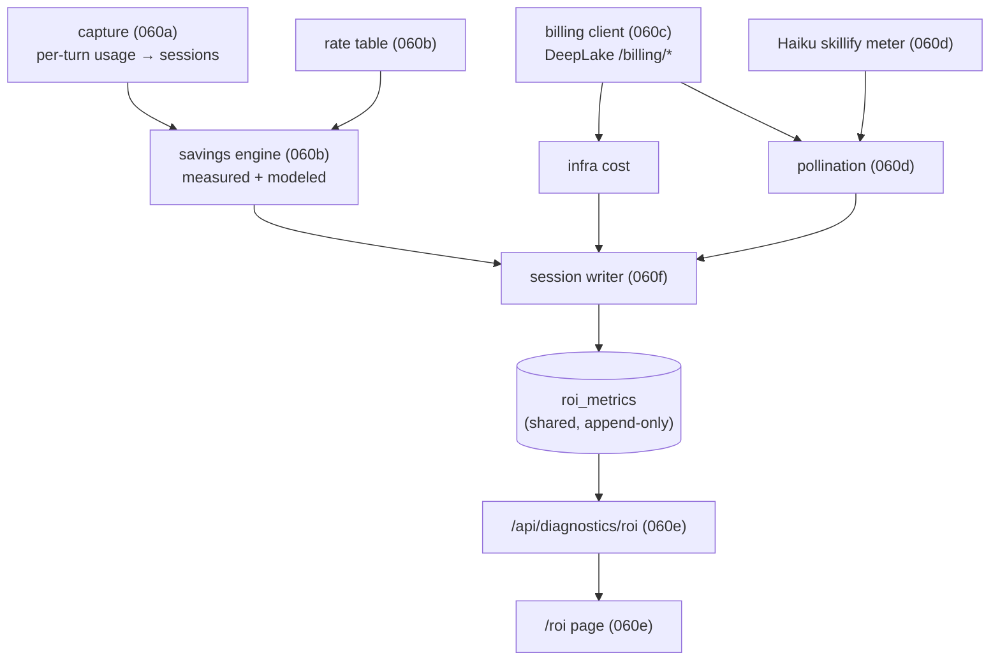

# ROI Tracker

> Category: Operations | Version: 1.1 | Date: June 2026 | Status: Active

How Honeycomb proves the memory layer pays for itself: the `/roi` dashboard page and the read-model behind it. This is the credibility surface, it turns the value claim into a ledger, `Net ROI = estimated LLM $ saved − (DeepLake infra cost + Honeycomb pollination cost)`. The spine is an **honesty contract**: measured, modeled, and allocated numbers are structurally separated and a modeled figure can never masquerade as a billed fact. Read this if you are tuning the savings math, wiring a new capture harness into the token pipeline, touching the billing client, or extending the spend ledger. Shipped in PRD-060 (PR #138); the local loopback surface only, the hosted cross-org admin/leaderboard surface is the separate PRD-061.

**Related:**
- [`deeplake-compute-cost.md`](deeplake-compute-cost.md)
- [`observability-and-degradation.md`](observability-and-degradation.md)
- [`../data/schema.md`](../data/schema.md)
- [`../dashboard/adding-a-page.md`](../dashboard/adding-a-page.md)
- [`../ai/session-capture.md`](../ai/session-capture.md)
- [`../ai/model-provider-router.md`](../ai/model-provider-router.md)
- [`../security/trust-boundaries.md`](../security/trust-boundaries.md)
- [`../security/credential-storage.md`](../security/credential-storage.md)

---

## Why this exists

Honeycomb captures every coding session and injects memory into every turn, but before this it had **no way to show whether that machinery pays for itself**. The operator (and every prospective upgrader) had to take the value on faith. The ROI Tracker turns the faith claim into a ledger:

```
Net ROI = estimated LLM $ saved − (DeepLake infra cost + Honeycomb pollination cost)
  estimated LLM $ saved = cache savings (MEASURED) + memory-injection savings (MODELED estimate)
  DeepLake infra cost   = DeepLake billing API (compute GPU-hours / storage / transfer, integer cents)
  pollination cost      = DeepLake embedding+ingestion+query GPU sessions (billing API, by session_type)
                          + Honeycomb's own Haiku skillify token cost
```

The thing that makes this hard is that the ledger spans **two cost worlds that never see each other**:

- **World 1, the LLM tokens the user's coding assistant burns.** Claude Code / Codex / Cursor pay Anthropic/OpenAI per token. This is where Honeycomb *creates value*: prompt caching returns cache-read tokens at 0.1× the input rate, and memory injection (modeled) lets the assistant reach an answer in fewer turns. **DeepLake never sees these tokens.**
- **World 2, the DeepLake GPU sessions Honeycomb's own machinery burns.** Every embedding, ingestion, and recall query is a DeepLake compute session billed in integer cents, itemized by `session_type`. Plus Honeycomb's *own* Haiku inference for the skillify loop is a token cost the daemon pays. **This is the cost side.** DeepLake's `/billing/*` API exposes infra cost only, in integer cents, with **no token or cache notion**, it cannot tell you what the user's LLM cost was, only what DeepLake's GPUs cost.

## The honesty contract (the spine)

The credibility crux runs through the savings half. The two kinds of number must never be confused:

- **Cache savings are MEASURED.** `cache_read_input_tokens × (base_input_rate − cache_read_rate)` is arithmetic over a billed fact, *if* the per-turn token counts are captured. This is the green, defensible **headline**.
- **"Honeycomb saved you X overall" is a COUNTERFACTUAL.** It is a *model* of what the user would have spent without memory injection. It is shown as a clearly-labeled, separate **estimate** carrying its tunable assumption as a data field (`modeled_assumption_ref`), never buried in code.

The contract is enforced **structurally, at compile time**, not by a naming convention. [`roi-honesty-contract.ts`](../../../../src/daemon/runtime/dashboard/roi-honesty-contract.ts) carries no runtime logic: it is a `tsc`-checked witness module (excluded `*.test.ts` cannot enforce a typecheck-gated contract, so this lives in a real source file). The savings engine ([`roi-savings.ts`](../../../../src/daemon/runtime/dashboard/roi-savings.ts)) brands its outputs `Measured<T>` and `Modeled<T>`, and the witness asserts via `@ts-expect-error` that:

1. `measuredCacheSavings()` accepts `readonly CapturedTurn[]` and **never** a `Modeled<…>`, so a measured figure can never derive from a modeled input.
2. `netRoi()` folds a modeled term, so its return is `Modeled<NetRoi>`, the `est.` taint propagates through the type and cannot be assigned to `Measured<…>`.

If the engine's types ever loosen to permit a measured-from-modeled derivation, the `@ts-expect-error` lines go "unused" and **`npm run typecheck` goes red**. That is the structural enforcement, not a code-review hope.

A third basis exists for cost: **allocated**. DeepLake infra cost is only measured org/workspace-wide; splitting it to a team or user is necessarily an *allocation*. Those rows carry `cost_basis='allocated'` with a non-empty `allocation_method` and are rendered distinctly from measured net, never as a billed fact. A mixed-basis rollup is detectable via `COUNT(DISTINCT cost_basis) > 1`.

## The module map

The subsystem is six sub-PRDs, each a discrete seam:

| Sub-PRD | Concern | Key source |
|---|---|---|
| **060a** | Token + cache + model capture (Claude Code first). Extends the capture contract to carry the per-turn `usage` object and `model` id it used to discard; reads both from the transcript JSONL (the `Stop` hook payload has neither); adds additive token plus `model` columns to `sessions`. | [`transcript.ts`](../../../../src/hooks/claude-code/transcript.ts), [`shim.ts`](../../../../src/hooks/claude-code/shim.ts), [`event-contract.ts`](../../../../src/daemon/runtime/capture/event-contract.ts), [`normalize.ts`](../../../../src/hooks/normalize.ts), [`sessions-summaries.ts`](../../../../src/daemon/storage/catalog/sessions-summaries.ts) |
| **060b** | Cost + savings engine + rate table. Measured cache savings, the labeled modeled estimator, the honesty witness. | [`roi-savings.ts`](../../../../src/daemon/runtime/dashboard/roi-savings.ts), [`roi-rates.ts`](../../../../src/daemon/runtime/dashboard/roi-rates.ts), [`roi-honesty-contract.ts`](../../../../src/daemon/runtime/dashboard/roi-honesty-contract.ts) |
| **060c** | DeepLake billing client + infra read-model. Creds-gated, fail-soft, TTL-cached, `session_type` breakdown. | [`roi-billing.ts`](../../../../src/daemon/runtime/dashboard/roi-billing.ts) |
| **060d** | Pollination cost metering. Haiku skillify token cost + DeepLake GPU-session cost composed. | [`roi-pollination.ts`](../../../../src/daemon/runtime/dashboard/roi-pollination.ts), [`roi-skillify-meter.ts`](../../../../src/daemon/runtime/dashboard/roi-skillify-meter.ts), [`transport-anthropic.ts`](../../../../src/daemon/runtime/inference/transport-anthropic.ts) |
| **060e** | The `/roi` dashboard page + composite read-model. | [`api.ts`](../../../../src/daemon/runtime/dashboard/api.ts), [`roi.tsx`](../../../../src/dashboard/web/pages/roi.tsx), [`roi-chart.tsx`](../../../../src/dashboard/web/pages/roi-chart.tsx) |
| **060f** | Shared cross-device spend ledger + teams roster. | [`roi-ledger.ts`](../../../../src/daemon/runtime/dashboard/roi-ledger.ts), [`roi-session-writer.ts`](../../../../src/daemon/runtime/dashboard/roi-session-writer.ts), [`tenancy.ts`](../../../../src/daemon/storage/catalog/tenancy.ts) |



## Token + cache capture (060a): the foundation

The whole measured half rests on per-turn token counts, and **Honeycomb did not capture them before this.** The capture contract normalized an assistant turn to `{ kind: "assistant_message", text }` and discarded the API `usage` object; the inference transport parsed only `content`; no token columns existed.

060a is a **build, not a research** problem because the data exists at the source: Claude Code writes per-message `usage` (`input_tokens`, `output_tokens`, `cache_read_input_tokens`, `cache_creation_input_tokens`) to its transcript JSONL. The build:

- Adds an **optional** `usage` field to the assistant-turn contract. **Absent ≠ zero**, a turn with no usage is "token data absent", structurally different from a real zero.
- Extracts the counts from the Claude Code transcript and persists them on `sessions` via **additive schema healing**: four nullable-BIGINT token columns (`input_tokens` / `output_tokens` / `cache_read_input_tokens` / `cache_creation_input_tokens`) plus a `source_tool` discriminant so Claude-Code rows are distinguishable from future Codex/Cursor rows. A missing/legacy column degrades the read to "token data absent" rather than throwing (the daemon boots and the page renders with or without the columns).
- **Claude Code first** is locked for v1 (richest cache data). Codex/Cursor are explicit follow-ups; Cursor in particular may not surface cache-read counts at all, capping its measured savings.

### The transcript-read fix (PR #166)

060a's *contract* shipped intact, but its first wiring quietly produced **zero measured savings on the real Claude Code path**, the canonical "completed != live" gap. The cause is where the `usage` lives. The `assistant_message` turn is captured off Claude Code's `Stop` / `SubagentStop` hook, and **that hook payload carries no message and no `usage`**: only `session_id`, `cwd`, and `transcript_path`. The shim's payload-level `extractTurnUsage` therefore read `undefined`, `cache_read_input_tokens` persisted `NULL`, and the headline savings were always `$0`. The unit tests had injected `usage` straight into the capture body, which masked the gap (a measured `0` and a structurally-absent value look the same to a test that fabricates the input).

The real per-message `usage` **and the model id** live *inside* the transcript JSONL at `transcript_path`. The fix adds a dedicated reader, [`transcript.ts`](../../../../src/hooks/claude-code/transcript.ts):

- `parseTurnUsage(jsonlText)` is **pure and fixture-tested** (no disk, no throw). It finds the **last `type:"user"` line** as the turn boundary, **sums** the token + cache counts across every `type:"assistant"` entry after it (a single `Stop` can span multiple assistant entries, one per tool-use round), and takes the **model id from the last assistant entry**. `readTranscriptTurnUsage(path)` is the thin **fail-soft** file reader: any error (missing/unreadable file, empty read, or a non-Claude-Code grouping key) degrades to `{}` and never throws, exactly like the pre-fix "no usage" path.
- The shim's `assistant_message` branch now reads `meta.path` (the `transcript_path`) as the **primary** source, with the payload-level `extractTurnUsage` kept as a **fallback** so any wiring that *does* surface `usage` on the payload never regresses. The `zero != absent` discipline holds end to end: a real `0` survives; an absent count stays `NULL`.

### Per-turn model pricing (PR #166)

060a originally captured no model at all, so **every priced turn fell back to the Sonnet default**: an Opus turn was under-priced and its savings understated. The fix adds a `model` TEXT column to `sessions` (additive heal, `NOT NULL DEFAULT ''`, where `'' = "model unknown"`), threaded from the transcript reader, to the `assistant_message` event (zod-validated; blank/whitespace normalized to absent), to the capture INSERT (`modelFor`).

Both read paths now resolve the rate **per turn by its captured model** so the live view and the shared ledger agree:

- The dashboard read-model ([`api.ts`](../../../../src/daemon/runtime/dashboard/api.ts) `rowToCapturedTurn`) and the per-session ledger writer ([`roi-session-writer.ts`](../../../../src/daemon/runtime/dashboard/roi-session-writer.ts)) both surface `model` and infer `provider = "anthropic"` when `source_tool === "claude-code"` or the model is `claude-`-prefixed. The rate table keys on `(provider, model)`, so **both must be present** for a non-default rate to resolve; an unknown/blank model leaves both undefined and `resolveRate` falls back to the conservative Sonnet default (savings are never overstated). An Opus turn now prices at the Opus row in **both** the live `/roi` view and the shared `roi_metrics` ledger.

## The rate table (060b)

The savings math prices captured token counts against a **maintained provider→model rate table** ([`roi-rates.ts`](../../../../src/daemon/runtime/dashboard/roi-rates.ts)), single-sourced in code (mirroring the `vault/catalog.ts` pattern), **not** a live pricing feed. A rate is a one-line edit and every consumer reflects it.

- Every column is **integer cents per million tokens**; the engine divides by `1e6` only at the arithmetic edge and carries integer cents, never a float-dollar.
- The Anthropic cache multipliers are **first-class columns**, not a read-time fudge: `cache_read_cents_per_mtok` = `0.1×` input (`ANTHROPIC_CACHE_READ_MULTIPLIER`), `cache_write_cents_per_mtok` = `1.25×` input (`ANTHROPIC_CACHE_WRITE_MULTIPLIER`). A test asserts the encoded rows honor the multipliers.
- A visible `RATES_AS_OF` stamp is surfaced on the page so a stale rate is **auditable**, not buried. Updating a rate bumps that date alongside the row edit.
- Shipped rows: `claude-sonnet-4-6` (300/1500), `claude-opus-4-8` (1500/7500), `claude-haiku-4-5` (100/500), all cents/Mtok in/out. The **Haiku row matters for cost, not savings**: the skillify gate runs Haiku, and without its own row `priceHaikuTokens` fell back to the Sonnet default and mis-priced Honeycomb's own-inference cost. The default row (Sonnet) is the conservative fallback for an unattributed turn so savings are never overstated.

## DeepLake billing + pollination cost (060c / 060d)

**Infra cost** is read from the DeepLake `/billing/*` API by a daemon-side, creds-gated, fail-soft client ([`roi-billing.ts`](../../../../src/daemon/runtime/dashboard/roi-billing.ts)) that mirrors the hardening of [`deeplake-issuer.ts`](../../../../src/daemon/runtime/auth/deeplake-issuer.ts): injectable `fetch`, retry on 429/5xx, bounded timeout, bearer redaction in logs, a fixed base URL (no SSRF), and a TTL in-memory cache (no persisted billing table, the ledger is *derived*, never a stored ledger of record). It returns compute/storage/transfer cost plus a `session_type` breakdown (`query` / `embedding` / `ingestion`).

**Pollination cost** ([`roi-pollination.ts`](../../../../src/daemon/runtime/dashboard/roi-pollination.ts)) is the cost Honeycomb's *own* machinery burns, composed from two contributors with **no second egress**:

1. Honeycomb's Haiku skillify token cost, metered at the inference transport ([`roi-skillify-meter.ts`](../../../../src/daemon/runtime/dashboard/roi-skillify-meter.ts)) by surfacing the `usage` object `transport-anthropic.ts` now carries.
2. The DeepLake `embedding`+`ingestion`+`query` GPU-session cost from 060c's billing read.

Worst-status propagates: if either contributor is degraded, the composed pollination total carries the worse status.

## The status model (the page never lies)

Every ledger section reports one of **`ok` / `partial` / `absent` / `unreachable` / `unauthenticated`**, so a **measured `$0` is visibly different from `unknown`**, and the **net is never computed from incomplete inputs**. Degradation is by construction:

- Token capture absent → measured-savings section shows `absent` placeholders (em-dashes, **not** `$0.00`); `blendedCentsPerMtok` is `null` until capture is live.
- Claude-Code-only data → a `partial` "Claude Code only" badge.
- Billing API unreachable/unauthenticated → a dash glyph on the affected line and a scoped retry, **never a fabricated number**, and the net is withheld.
- First run → dash-glyph placeholders, not a misleading `$0.00`.

The honey brand color **never encodes sign** (positive net = `var(--verified)`, negative = `var(--severity-critical)`), and a *rising* cost must not render green, a barely-using user can legitimately show a negative net and the page frames that honestly rather than as "this tool costs you money".

## The /roi page and read-model (060e)

The page follows the one-registry-entry + one-component contract (see [`adding-a-page.md`](../dashboard/adding-a-page.md)): no sidebar or router file is hand-edited. It is a **pure function of the view-model**, it does no fetching itself and holds **no credentials**. Two daemon read routes back it, sitting beside the existing diagnostics fetchers in [`api.ts`](../../../../src/daemon/runtime/dashboard/api.ts) under the same loopback + local-mode gate as `mountDashboardHost`:

- `GET /api/diagnostics/roi`, a single **composite** read returning a `RoiView` with the per-section status discriminants. All money is integer cents, formatted to dollars only at the render edge.
- `GET /api/diagnostics/roi/trend`, the time-series backing the **inline-SVG trend chart** ([`roi-chart.tsx`](../../../../src/dashboard/web/pages/roi-chart.tsx), the house GraphCanvas idiom, no new npm chart dependency).

**Daemon is the sole egress.** Billing credentials live only in the daemon; the page reads a composite read-model over loopback. This is the same credential-isolation posture as the rest of the daemon surface.

## The shared spend ledger and teams (060f)

The per-session ROI figure is **shared, not device-local**. It is appended to a new tenant-scoped DeepLake table `roi_metrics` so ROI **aggregates across devices** and rolls up per org / workspace / project / agent / team. See [`schema.md`](../data/schema.md#spend-ledger-and-teams-roi) for the column DDL. Key invariants, enforced by the writer ([`roi-session-writer.ts`](../../../../src/daemon/runtime/dashboard/roi-session-writer.ts)) and the ledger reader ([`roi-ledger.ts`](../../../../src/daemon/runtime/dashboard/roi-ledger.ts)):

- **Append-only, never UPDATE.** One immutable row per session via `appendOnlyInsert`. A re-price appends a **new** row with a fresh `price_ref`; the canonical row per `session_id` is `MAX(created_at)`. (The same backend-non-convergence reasoning behind `api_keys` version-bumping.)
- **All money is BIGINT integer cents**, never FLOAT, a ledger must reconcile to the penny. Measured, modeled, gross, and infra cost are **separate, self-describing columns**.
- **Per-user is gated, no spoofable fallback.** `user_id` is populated **only** when `verifiedClaim?.source === 'backend-token'` and is `''` otherwise. Git-email, `$USER`, and OS-login are **never** consulted, and there is no historical backfill. Honeycomb has no person identity today (the DeepLake token is org-bound; `author` = `agent_id` = the machine), so the column ships empty and the page shows a "per-user requires verified login" empty state until a backend claim lands.
- **Per-team is a real dimension today.** `team_id` (FK to the new version-bumped `teams` roster) is resolved by a roster lookup at write time. `agent`-type member rows work now, independent of the per-user gate; `user`-type rows are structurally valid but inert until `user_id` is verified.
- Indexes are **lookup-only** on the rollup columns (`org_id`/`workspace_id`/`team_id`/`period_start` + drill-down `project_id`/`user_id`). **No BM25, no vector, no JSONB**, this is a ledger, not a search corpus.

The local `/roi` page reads this shared ledger only at its own org/workspace scope, governed by the existing `read_policy`. The **hosted, authenticated, cross-org admin/leaderboard surface is the separate [PRD-061](../../../requirements/backlog/prd-061-hosted-roi-admin-surface/prd-061-hosted-roi-admin-surface-index.md)**, which deliberately flips this module's local-only posture and shares only the 060f data foundation and the per-user backend-claim dependency.

## What stays open

- **Modeled-formula authority.** The exact memory-injection savings model (turns-saved × avg-turn-cost? a fixed % of measured spend?) and the operator-signed-off assumption string the UX surfaces are still a placeholder pending sign-off. Until pinned, the modeled number is illustrative; the *contract* (it can never read as measured) holds regardless.
- **Per-user identity.** Blocked on a verified `backend-token` claim that does not exist yet, an auth/backend dependency shared with PRD-061. No per-user rollups until then, by construction.
- **Roster authoring.** The `teams` table is ready, but a surface to create teams and assign agents (local admin page? CLI? the hosted PRD-061?) is undecided, so `team_id` may be `''` for everyone until one ships.
- **PII / erasure on an append-only ledger.** Once `user_id` is populated, a row is per-person spend (PII), and an append-only ledger cannot UPDATE/DELETE one field for a GDPR-style erasure. Tombstone-vs-purge is owned by PRD-061's privacy/retention sub-PRD, surfaced here.
- **Billing granularity + cadence.** Whether `/billing/*` itemizes per project/dataset or only per workspace (the page must say "workspace-wide" if coarse), and the TTL/refresh policy, are 060c tuning items.
