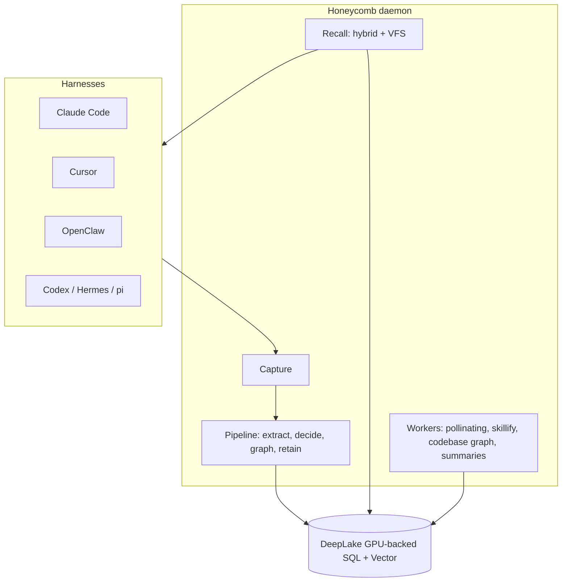

# Honeycomb Knowledge Base

> Category: Overview | Version: 1.0 | Date: June 2026 | Status: Active

The entry point for everyone working on Honeycomb: what it is, how the pieces fit, and where to read next.

**Related:**
- [`architecture/system-overview.md`](architecture/system-overview.md)
- [`architecture/request-lifecycle.md`](architecture/request-lifecycle.md)
- [`data/deeplake-storage.md`](data/deeplake-storage.md)
- [`ai/memory-pipeline.md`](ai/memory-pipeline.md)
- [`integrations/harness-integration.md`](integrations/harness-integration.md)
- [`standards/documentation-framework.md`](standards/documentation-framework.md)

---

## What Honeycomb is

Honeycomb is the ultimate harness memory system: one shared, self-improving memory layer that works across every common AI coding harness. One agent solves a problem on Monday, and every agent on the team can recall and reuse that work afterward, with the context inspectable, scoped, and repairable instead of trapped behind a black-box recall API.

Honeycomb is the merger of two systems. Hivemind contributed the broad product: capture across six-plus harnesses, a trace-to-skill mining pipeline, team skill sharing, a live codebase graph, a Cursor extension, multi-tenant org and workspace boundaries, and GPU-backed DeepLake storage. Our memory engine contributed the memory layer, which is the better one: a durable extraction-to-recall pipeline, hybrid retrieval, a knowledge-graph ontology, a pollinating maintenance loop, a model and provider router, fine-grained agent scoping, and source-backed recall with provenance. Where the two overlapped on how memory works, our memory engine won.

The result is one daemon that captures everything a harness does, distills it into structured, source-backed memory, and serves it back, all on a DeepLake substrate that a team can share.

## The shape

Capture, distill, recall, compound. A harness hook captures every prompt, tool call, and response as a raw event. The daemon's pipeline distills those events into facts, entities, and skills with provenance back to the source. Recall serves the right context before the next turn through hybrid search and a browsable virtual filesystem. Over time the pollinating loop and the skillify miner consolidate what was learned, so the memory gets sharper instead of noisier.

## Top-level architecture

Honeycomb is daemon-centric. The honeycomb daemon (default port 3850) is the only process that talks to DeepLake. It runs the capture intake, the distillation pipeline, hybrid retrieval, the knowledge-graph ontology, the pollinating maintenance loop, the model and provider router, and the background workers for summaries, skillify, and the codebase graph. Harness shims, lifecycle hooks, the CLI, the SDK, and the MCP server are thin clients of the daemon.

DeepLake is the substrate. It is a GPU-backed SQL and vector store, and all durable state lives in its tables. Org and workspace boundaries are enforced at the storage layer so two workspaces never share a row, partition, or index, and within a workspace our memory engine's agent_id scoping separates multiple agents. The storage mechanics (lazy schema healing, hand-escaped SQL because the query endpoint takes no bound parameters, append-only version-bumped writes around the UPDATE-coalescing quirk) are documented in [`data/deeplake-storage.md`](data/deeplake-storage.md).

## Key components

| Component | Where | Responsibility |
|---|---|---|
| Daemon | `honeycomb daemon` (port 3850) | Pipeline, retrieval, ontology, pollinating, router, workers, the only DeepLake client |
| DeepLake substrate | storage layer | GPU-backed SQL + vector tables, org/workspace isolation |
| Capture hooks | per-harness shims | Turn lifecycle events into raw `sessions` rows via the daemon |
| Skillify miner | daemon worker | Mine recurring traces into reusable skills |
| Codebase graph | daemon worker | Live graph of files, symbols, and imports |
| CLI | `honeycomb` | Setup, status, recall, agents, ontology, sources, skills, org/workspace |
| SDK + MCP | `@honeycomb/sdk`, MCP server | Typed and tool-based access for apps and harnesses |

## Reading guide

New to the codebase: this overview, then [`architecture/system-overview.md`](architecture/system-overview.md), then [`architecture/request-lifecycle.md`](architecture/request-lifecycle.md).

Installing and onboarding: [`operations/install-and-onboarding.md`](operations/install-and-onboarding.md), then [`infrastructure/npm-publishing.md`](infrastructure/npm-publishing.md).

Working on the memory engine: [`ai/session-capture.md`](ai/session-capture.md), [`ai/memory-pipeline.md`](ai/memory-pipeline.md), [`ai/retrieval.md`](ai/retrieval.md), [`ai/knowledge-graph-ontology.md`](ai/knowledge-graph-ontology.md), [`ai/pollinating-loop.md`](ai/pollinating-loop.md), [`ai/model-provider-router.md`](ai/model-provider-router.md).

Working on memory recall and priming: [`ai/retrieval.md`](ai/retrieval.md), [`ai/session-priming-architecture.md`](ai/session-priming-architecture.md), [`ai/three-tier-memory-strategy.md`](ai/three-tier-memory-strategy.md).

Working on storage: [`data/deeplake-storage.md`](data/deeplake-storage.md), [`data/schema.md`](data/schema.md), [`data/memory-virtual-filesystem.md`](data/memory-virtual-filesystem.md), [`data/codebase-graph.md`](data/codebase-graph.md), [`data/memory-compaction.md`](data/memory-compaction.md), [`data/workspace-layout.md`](data/workspace-layout.md).

Working on learning and sharing: [`ai/skillify-pipeline.md`](ai/skillify-pipeline.md), [`ai/wiki-summary-workers.md`](ai/wiki-summary-workers.md), [`collaboration/team-skills-sharing.md`](collaboration/team-skills-sharing.md), [`collaboration/asset-sync-substrate.md`](collaboration/asset-sync-substrate.md).

Working on integrations and surfaces: [`integrations/harness-integration.md`](integrations/harness-integration.md), [`integrations/hook-lifecycle.md`](integrations/hook-lifecycle.md), [`integrations/mcp-and-sdk.md`](integrations/mcp-and-sdk.md), [`frontend/cursor-extension-architecture.md`](frontend/cursor-extension-architecture.md), [`frontend/dashboard-architecture.md`](frontend/dashboard-architecture.md).

Working on access, tenancy, and security: [`auth/auth-architecture.md`](auth/auth-architecture.md), [`multi-tenant/org-workspace-model.md`](multi-tenant/org-workspace-model.md), [`architecture/multi-project-and-context-switching.md`](architecture/multi-project-and-context-switching.md), [`security/scoping-and-visibility.md`](security/scoping-and-visibility.md), [`security/secrets.md`](security/secrets.md), [`security/credential-storage.md`](security/credential-storage.md), [`security/trust-boundaries.md`](security/trust-boundaries.md), [`sources/source-lifecycle.md`](sources/source-lifecycle.md).

Build, CLI, and ops: [`infrastructure/monorepo-build-release.md`](infrastructure/monorepo-build-release.md), [`infrastructure/npm-publishing.md`](infrastructure/npm-publishing.md), [`operations/cli-command-architecture.md`](operations/cli-command-architecture.md), [`operations/install-and-onboarding.md`](operations/install-and-onboarding.md), [`operations/notifications-and-health.md`](operations/notifications-and-health.md), [`operations/observability-and-degradation.md`](operations/observability-and-degradation.md), [`operations/doctor-watchdog.md`](operations/doctor-watchdog.md), [`operations/fleet-and-usage-telemetry.md`](operations/fleet-and-usage-telemetry.md).

Working on cost and ROI: [`operations/deeplake-compute-cost.md`](operations/deeplake-compute-cost.md), [`operations/deeplake-idle-hibernation.md`](operations/deeplake-idle-hibernation.md), [`operations/local-queue-idle-cost-control.md`](operations/local-queue-idle-cost-control.md), [`operations/roi-tracker.md`](operations/roi-tracker.md), then [`data/schema.md`](data/schema.md) for the `roi_metrics` + `teams` ledger tables.

Conventions: [`standards/documentation-framework.md`](standards/documentation-framework.md), [`standards/coding-standards-typescript.md`](standards/coding-standards-typescript.md), [`standards/api-design-conventions.md`](standards/api-design-conventions.md).

## Coverage

This knowledge base covers the merged Honeycomb runtime end to end: install and onboarding, capture, pipeline, retrieval and session priming, ontology, pollinating and compaction, model routing, DeepLake storage and schema, the virtual filesystem, the codebase graph, skillify and team sharing, asset sync, the six harness integrations, the dashboard and Cursor extension surfaces, auth and tenancy, multi-project context switching, operational observability, npm publishing, security, and standards. It was built by merging the Hivemind and our-memory-engine knowledge bases. Source authority is the code first, then these docs. Where this base disagrees with the implementation, the implementation wins and this base should be corrected.
