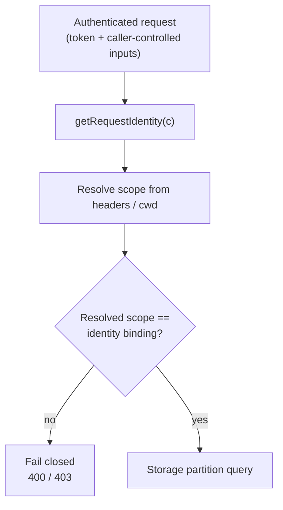

# Request-Layer Identity Validation

> Category: Security | Version: 1.0 | Date: June 2026 | Status: Active

How Honeycomb closes the gap between *what a caller claims* and *what storage will actually do*: the daemon validates every resolved tenancy and project scope against the authenticated identity before a query runs, so a caller-controlled input (a forged header or a manipulated cwd) can never widen access beyond the token's own binding.

**Related:**
- [`scoping-and-visibility.md`](scoping-and-visibility.md)
- [`trust-boundaries.md`](trust-boundaries.md)
- [`../auth/auth-architecture.md`](../auth/auth-architecture.md)
- [`../multi-tenant/org-workspace-model.md`](../multi-tenant/org-workspace-model.md)

---

## Why this exists

Storage-layer isolation (the org/workspace partition) and the within-workspace `agent_id` read policy described in [`scoping-and-visibility.md`](scoping-and-visibility.md) are the durable backstop: two workspaces never share a row. But the daemon's request handlers decide *which* org, workspace, and project a query partitions by, and several of those values were historically read from caller-controlled inputs:

- the `x-honeycomb-org` header,
- the `x-honeycomb-workspace` header,
- the session **cwd** (body field or `x-honeycomb-cwd` header), from which the daemon derives the project segment.

An authenticated caller bound to org A, workspace W, project P could forge a header or pass a different cwd and steer a handler to read or write org B, a sibling workspace, or a different project, all under a perfectly valid token. The token's permission gate passed; the scope it executed against did not match the token. This is a confused-deputy bypass: the request layer trusted an input the storage layer never re-checked against identity.

The fix is a single discipline applied across every scope resolver and every project-scoped handler: **once the permission middleware has authenticated the request and stamped a validated `Identity` onto the context, the resolved scope MUST equal the identity's own binding.** A mismatch fails closed. The header is trusted only in `local` mode, where there is no `Identity` to contradict it.



## The guard primitive

`getRequestIdentity(c)` (`src/daemon/runtime/middleware/permission.ts`) returns the validated `Identity` the permission middleware stamped onto the Hono context in `team`/`hybrid` mode, or `undefined` in `local` mode. Every guard branches on it the same way: no identity means local mode (the mode gate already passed, trust the input), an `admin` identity bypasses scope, an identity with no binding for that dimension may access any value, and a bound identity must match the resolved value exactly.

There are three guard points, one per caller-controlled dimension.

### Org: forged `x-honeycomb-org`

The shared header reader `resolveScopeFromHeaders` (`src/daemon/runtime/scope.ts`) is the single place the org/workspace headers are parsed. When a validated identity is present, a header org that disagrees with `identity.org` resolves to `null`, and the handler returns its existing fail-closed `400`.

```ts
const org = c.req.header("x-honeycomb-org");
if (org === undefined || org.length === 0) return null;
const identity = getRequestIdentity(c);
// A forged org header can never cross the token's own org boundary.
if (identity !== undefined && org !== identity.org) return null;
```

### Workspace: forged `x-honeycomb-workspace`

For the same reason, an authenticated caller must not forge `x-honeycomb-workspace` to reach a sibling workspace within the same org. When an identity is present the workspace is taken from `identity.workspace`, **not** from the header; the header is honored only in local mode.

```ts
if (identity !== undefined) {
    return { org: identity.org, workspace: identity.workspace };
}
// Local mode (no Identity): trust the header, with optional workspace.
const workspace = c.req.header("x-honeycomb-workspace");
return workspace !== undefined && workspace.length > 0 ? { org, workspace } : { org };
```

### Project: cwd-derived project resolution

The subtler case. A project-scoped caller can *omit* the explicit project hint, so `ctx.project` is undefined and the RBAC policy's `clearsProjectScope` gate passes, yet still supply a `cwd` that resolves to a different project. The authorization middleware only validates the explicit hint; it never sees the project the query will actually run against. `isAuthorizedForResolvedProject` (`src/daemon/runtime/memories/api.ts`) is the defense-in-depth check that validates the **resolved** project, the one derived from cwd, against the identity's project binding.

```ts
function isAuthorizedForResolvedProject(c: Context, resolvedProject: RequestProjectScope): boolean {
    const identity = getRequestIdentity(c);
    if (identity === undefined) return true;        // local mode
    if (identity.role === "admin") return true;     // admin bypasses project scope
    if (identity.project === undefined) return true; // unscoped identity → any project
    return resolvedProject.projectId === identity.project;
}
```

A project-scoped identity hitting a different resolved project gets a `403`; the recall, store, list, and grep arms all call this guard before the query runs.

## Fail-closed responses

| Dimension | Caller-controlled input | Guard location | Mismatch result |
|---|---|---|---|
| Org | `x-honeycomb-org` | `resolveScopeFromHeaders` (`scope.ts`); inline check in `capture-handler.ts` | `null` scope → `400 bad_request` (`org mismatch` / `x-honeycomb-org header is required`) |
| Workspace | `x-honeycomb-workspace` | `resolveScopeFromHeaders` (`scope.ts`) | header ignored; workspace forced to `identity.workspace` |
| Project | `cwd` / `x-honeycomb-cwd` | `isAuthorizedForResolvedProject` (`memories/api.ts`) | `403 forbidden` (`project scope violation`) |

The posture matches the rest of the system: when the resolved scope and the validated identity disagree, deny rather than over-share.

## Where the guard is applied

The org/workspace guard lives in the shared `resolveScopeFromHeaders` reader, so every handler that resolves scope through it (directly or via `resolveScopeOrLocalDefault`) inherits the check, plus an inline equivalent on the capture path that reads the org header directly. The cross-workspace and cross-tenant hardening was swept across all scope resolvers and API handlers at once: capture, the inference gateway, maintenance compaction, notifications, pollinating, project scope-enumeration and sync, secrets, session pruning, and sources. The project-scope guard is applied per arm in the memories, dashboard, product, and VFS APIs, the four modules that derive a project from cwd.

## Test coverage

Each guard carries a regression test that fails before the fix:

- `tests/daemon/runtime/scope-cross-workspace.test.ts` exercises the forged `x-honeycomb-workspace` path end to end.
- `tests/daemon/runtime/capture/capture-cross-tenant-guard.test.ts` asserts a forged org on the capture path is rejected with a `400 org mismatch`, restoring dedicated capture coverage that a broader resolver sweep had left implicit.
- `tests/daemon/runtime/memories/project-scope-cwd-bypass.test.ts` covers the cwd-derived project bypass across the recall, store, list, and grep arms.
- `tests/daemon/runtime/secrets/api.test.ts` and `tests/daemon/runtime/sources/api.test.ts` verify the cross-workspace guard on those handlers.

## Relationship to the rings

This layer sits *above* the two rings in [`scoping-and-visibility.md`](scoping-and-visibility.md) and the request-level `scope` check in [`../auth/auth-architecture.md`](../auth/auth-architecture.md). The auth `scope` check validates an *explicit* hint (a query param or header the caller set on purpose); this guard validates the *resolved* value the query will actually execute against, including values the caller can influence indirectly through cwd. Storage-layer org/workspace isolation remains the final backstop, but identity validation at the request layer means a forged input is rejected with a clean `400`/`403` long before it reaches a partition it has no business touching.
