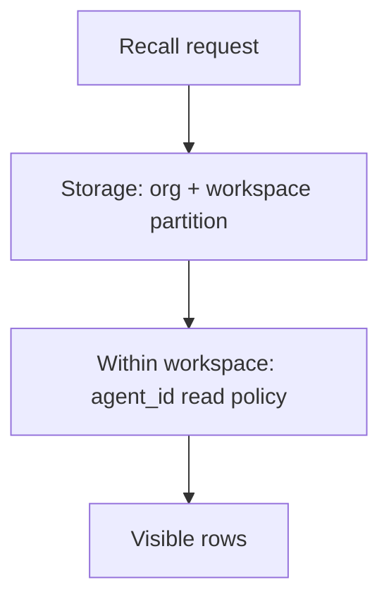
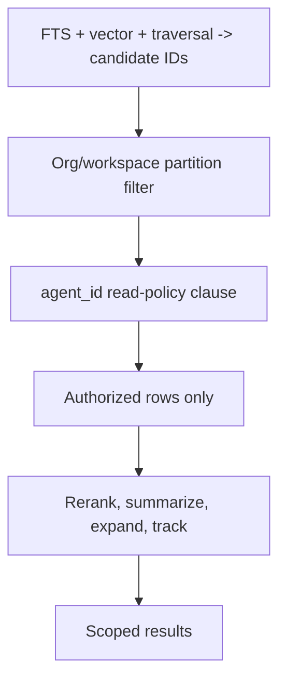

# Scoping and Visibility

> Category: Security | Version: 1.0 | Date: June 2026 | Status: Active

How Honeycomb keeps memory in its lane: storage-level org and workspace isolation, within-workspace agent_id read policies, the authorization boundary in recall, and the fail-closed rules.

**Related:**
- [`../multi-tenant/org-workspace-model.md`](../multi-tenant/org-workspace-model.md)
- [`../auth/auth-architecture.md`](../auth/auth-architecture.md)
- [`secrets.md`](secrets.md)
- [`trust-boundaries.md`](trust-boundaries.md)
- [`../ai/retrieval.md`](../ai/retrieval.md)
- [`../data/deeplake-storage.md`](../data/deeplake-storage.md)

---

## Two rings of scoping

Honeycomb scopes memory in two rings. The outer ring is tenancy: org and workspace, enforced at the DeepLake storage layer so two workspaces never share a row, partition, or index. The inner ring is the agent: within a single workspace, `agent_id` and a read policy separate multiple agents that share the same tables. The outer ring is the team boundary inherited from Hivemind; the inner ring is the multi-agent boundary inherited from Otherhive. Both have to hold for a row to be visible.



## agent_id everywhere

Inside a workspace, every read and write that touches user data threads `agent_id` (or `agentId`). The daemon resolves it from an explicit field, then from a harness session key (OpenClaw's `agent:alice:...` form parses automatically), then defaults to `'default'`. The rule from the engine's contribution policy is blunt: never hardcode `'default'` for a scoped path when a real agent id is known, and scope memories, ontology, sources, sessions, analytics, and diagnostics consistently. Cross-agent links, proposal applies, and claim updates are explicitly rejected or handled, never silently allowed.

## The three read policies

An agent's roster row in the `agents` table carries a `read_policy` and an optional `policy_group`.

| Policy | What the agent sees within its workspace |
|---|---|
| `isolated` (fail-closed default) | only its own memories |
| `shared` | workspace-global memories plus its own |
| `group` | global memories from agents in the same `policy_group`, plus its own |

Archived memories are excluded from all three. These policies are what give a team the shared-brain effect inside a workspace while letting a CI or personal agent keep a private lane, as described in [`../multi-tenant/org-workspace-model.md`](../multi-tenant/org-workspace-model.md).

## Enforcement is in the SQL

The inner ring is compiled into a SQL clause that every memory query carries, so a new code path either includes it or does not, which makes scoping auditable. A clause builder takes the agent id, read policy, and policy group and returns the WHERE fragment plus its escaped values (DeepLake takes no bound parameters, so the values are escaped through the helpers in [`../data/deeplake-storage.md`](../data/deeplake-storage.md)).

```sql
-- isolated
AND m.agent_id = '<id>' AND m.visibility != 'archived'

-- shared
AND (m.visibility = 'global' OR m.agent_id = '<id>') AND m.visibility != 'archived'

-- group
AND ((m.visibility = 'global'
      AND m.agent_id IN (SELECT id FROM "agents" WHERE policy_group = '<group>'))
     OR m.agent_id = '<id>')
AND m.visibility != 'archived'
```

The outer ring (org and workspace) is enforced beneath this, at the storage partition, so even a buggy clause cannot cross a workspace boundary.

## The authorization boundary in recall

Recall is where scoping has to be exactly right, because the candidate channels (full-text, vector, graph traversal, hints) cast a wide net. The defense is ordering: those channels produce memory IDs only, and the scope clause authorizes candidates before any content loads. Every content-bearing stage that follows, reranking, summaries, transcript expansion, access tracking, runs only on the authorized set. A strong vector hit or a high-degree entity can surface an ID, but it cannot leak content past the read policy. The recall flow is detailed in [`../ai/retrieval.md`](../ai/retrieval.md).



## Fail-closed rules

The subsystem leans toward refusing rather than over-sharing. A malformed caller falls back to `isolated` instead of widening access. Tenancy, scope, graph policy, mutation gates, and source access all fail closed. Errors are not swallowed and behavior is not silently downgraded; failures return structured errors with enough context (path, org, workspace, agent id, source id, session key, runtime path, route) to diagnose. This is the same posture as the request-level scope checks in [`../auth/auth-architecture.md`](../auth/auth-architecture.md) and the trust model in [`trust-boundaries.md`](trust-boundaries.md): when in doubt, deny.
