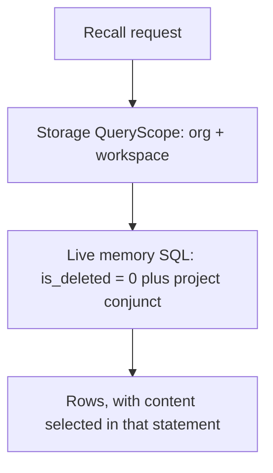
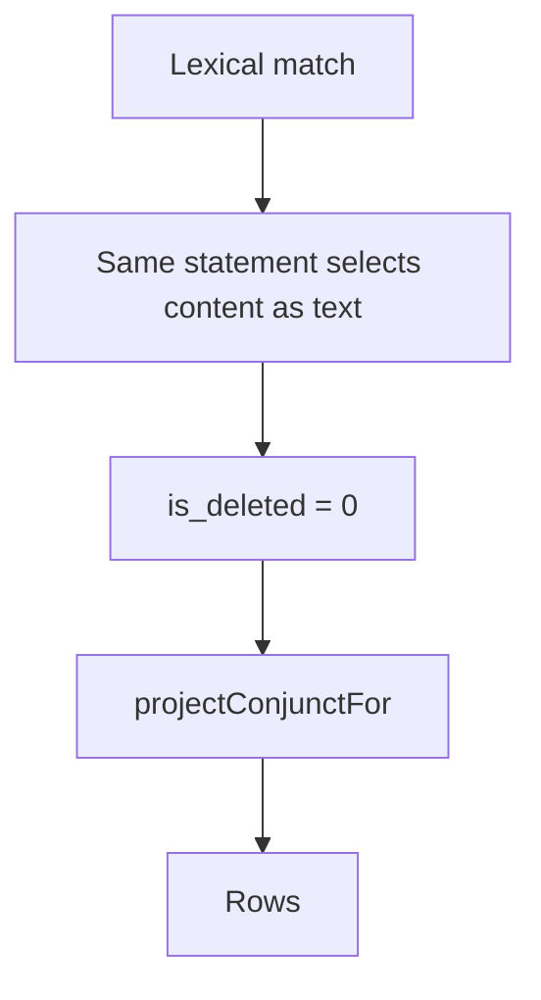

# Scoping and Visibility

> Category: Security | Version: 1.0 | Date: June 2026 | Status: Active

How Honeycomb keeps memory in its lane: storage-level org and workspace isolation, the agent read-policy vocabulary, the project predicate on live recall, and the clause builder's isolated fallback.

**Related:**
- [`../multi-tenant/org-workspace-model.md`](../multi-tenant/org-workspace-model.md)
- [`../auth/auth-architecture.md`](../auth/auth-architecture.md)
- [`request-identity-validation.md`](request-identity-validation.md)
- [`secrets.md`](secrets.md)
- [`trust-boundaries.md`](trust-boundaries.md)
- [`../ai/retrieval.md`](../ai/retrieval.md)
- [`../data/deeplake-storage.md`](../data/deeplake-storage.md)

---

## Tenancy, agent policy, and project

Honeycomb scopes memory with an outer tenancy ring, an inner agent read-policy vocabulary, and a project predicate beside them. The outer ring is tenancy: org and workspace, enforced at the DeepLake storage layer so two workspaces never share a row, partition, or index. The inner ring is the agent: within a single workspace, `agent_id` and a read policy name separate multiple agents that share the same tables. `buildProjectScopeClause` in `src/daemon/runtime/recall/scope-clause.ts` compiles the project predicate. Live memory recall appends it through `projectConjunctFor` in `src/daemon/runtime/memories/recall.ts`, in the same statement as the match. The outer ring is the team boundary inherited from Hivemind; the inner ring is the multi-agent vocabulary from the memory engine.


```mermaid
flowchart TD
    req["Recall request"] --> tenancy["Storage QueryScope: org + workspace"]
    tenancy --> live["Live memory SQL: is_deleted = 0 plus project conjunct"]
    live --> result["Rows, with content selected in that statement"]
```

## agent_id everywhere

Inside a workspace, every read and write that touches user data threads `agent_id` (or `agentId`). The daemon resolves it from an explicit field, then from a harness session key (OpenClaw's `agent:alice:...` form parses automatically), then defaults to `'default'`. The rule from the engine's contribution policy is blunt: never hardcode `'default'` for a scoped path when a real agent id is known, and scope memories, ontology, sources, sessions, analytics, and diagnostics consistently. Cross-agent links, proposal applies, and claim updates are explicitly rejected or handled, never silently allowed.

## The three read policies

An agent's roster row in the `agents` table carries a `read_policy` and an optional `policy_group`.

| Policy | What the agent sees within its workspace |
|---|---|
| `isolated` (fail-closed default) | only its own memories |
| `shared` | workspace-global memories plus its own |
| `group` | global memories from agents in the same `policy_group`, plus its own |

The clause builder excludes archived rows from all three with `is_deleted = 0`. These three names are the agents-roster vocabulary. How a workspace uses that vocabulary is described in [`../multi-tenant/org-workspace-model.md`](../multi-tenant/org-workspace-model.md).

## The clause builder and live recall

`buildScopeClause` in `src/daemon/runtime/recall/scope-clause.ts` compiles the inner-ring vocabulary into a WHERE fragment. It takes the agent id, read policy, and a caller-supplied `groupAgentIds` list, and it escapes values through the helpers in [`../data/deeplake-storage.md`](../data/deeplake-storage.md) because DeepLake takes no bound parameters. `POST /api/memories/recall` resolves the caller with `resolveRecallAgentScope` and ANDs that fragment into the `memories` lexical arm, the `memories` semantic match, and the `memories` hydration select, beside `is_deleted = 0` and `projectConjunctFor`. A named `x-honeycomb-agent` with no policy is `isolated`. An unnamed caller uses agent `default` and policy `shared`. The fast-path local ANN index does not store `agent_id`, so an isolated caller skips it and takes the scoped SQL arm.

```sql
-- isolated
(agent_id = '<id>' AND is_deleted = 0)

-- shared
((visibility = 'global' OR agent_id = '<id>') AND is_deleted = 0)

-- group, when the caller supplies member ids
(((visibility = 'global' AND agent_id IN ('<member>', ...)) OR agent_id = '<id>') AND is_deleted = 0)

-- group with an empty member list: own-only
(agent_id = '<id>' AND is_deleted = 0)
```

The group arm renders the caller-supplied member ids. An empty member list degrades to own-only. The outer ring (org and workspace) is enforced beneath this, at the storage partition, so even a buggy clause cannot cross a workspace boundary.

## The authorization boundary in recall

Recall is where scoping has to be exactly right, because the candidate channels (full-text, vector, graph traversal, hints) cast a wide net. The live memories arm in `src/daemon/runtime/memories/recall.ts` selects `content` as `text` in the same statement as the lexical match, together with `is_deleted = 0`, the project conjunct, and the `buildScopeClause` fragment. The recall flow is detailed in [`../ai/retrieval.md`](../ai/retrieval.md).


```mermaid
flowchart TD
    match["Lexical match"] --> same["Same statement selects content as text"]
    same --> deleted["is_deleted = 0"]
    deleted --> project["projectConjunctFor"]
    project --> out["Rows"]
```

## Fail-closed rules

`buildScopeClause` refuses a wider policy. A blank agent id or an unknown read policy returns the `isolated` fragment and attaches a `ScopeClauseError` (`src/daemon/runtime/recall/scope-clause.ts`). The memories recall path uses that fragment before content enters fusion. Request-level scope checks are described in [`../auth/auth-architecture.md`](../auth/auth-architecture.md) and [`trust-boundaries.md`](trust-boundaries.md).
