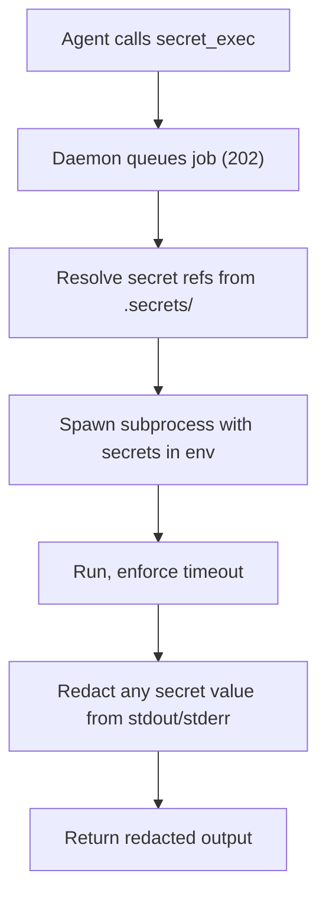

# Secrets

> Category: Security | Version: 1.0 | Date: June 2026 | Status: Active

How Honeycomb stores credentials so an agent can use them without ever reading them: the secrets plugin, machine-bound encryption, the exec model, and the redaction rules.

**Related:**
- [`scoping-and-visibility.md`](scoping-and-visibility.md)
- [`credential-storage.md`](credential-storage.md)
- [`../auth/auth-architecture.md`](../auth/auth-architecture.md)
- [`../ai/model-provider-router.md`](../ai/model-provider-router.md)
- [`../data/workspace-layout.md`](../data/workspace-layout.md)

---

## The threat

If an agent can read `OPENAI_API_KEY`, then a single prompt injection can exfiltrate it. The whole point of the secrets subsystem is to break that link: secrets are encrypted at rest, agents can cause them to be used, and agents never receive the decrypted values. The governing rule is that secrets are never recallable memories and must never leak into chat, logs, memory rows, or source files. Secrets are the one class of data that does not live in DeepLake; they sit encrypted on the daemon host so that even a full dump of the store yields no credentials.

## The plugin

Secrets are owned by a bundled core plugin, `honeycomb.secrets` (under `plugins/core/secrets`). Routing secret access through a plugin means the capability is explicit and can be granted or denied, and every secret operation is audited.

## Storage and encryption

Secrets live in `$HONEYCOMB_WORKSPACE/.secrets/` as encrypted JSON with mode 0600: human-readable names, ciphertext values. Encryption is XSalsa20-Poly1305 (libsodium `crypto_secretbox_easy`). The key is derived by hashing a machine-bound identifier (`/etc/machine-id` on Linux, `IOPlatformUUID` on macOS, with a hostname-plus-username fallback) and stretching it to 32 bytes. Each value gets a random nonce prepended to its ciphertext. The practical consequence is that the secret store cannot be decrypted on another machine without the same machine identity, so copying `.secrets/` to a different box yields nothing usable.

This is distinct from the device-flow credentials file used by the daemon's own auth and provider sign-in, which is covered in [`credential-storage.md`](credential-storage.md). User secrets and the daemon's stored credentials are deliberately separate stores with separate rules.

## What agents can and cannot do

The API exposes names but never values.

| Endpoint | Method | Purpose |
|---|---|---|
| `/api/secrets` | GET | list secret names only |
| `/api/secrets/:name` | POST | store a secret |
| `/api/secrets/:name` | DELETE | delete a secret |
| `/api/secrets/exec` | POST | queue a command with secrets in its environment |
| `/api/secrets/exec/:jobId` | GET | inspect a queued exec job |

There is deliberately no `GET /api/secrets/:name`. An agent cannot read a value through the API, the SDK, MCP, the dashboard, a connector, or plugin diagnostics. It can list names and it can ask for a secret to be used, nothing more.

## The exec model

The way a secret gets used without being revealed is `secret_exec`. It is asynchronous: the request queues a job and returns immediately. The daemon resolves the secret references, spawns the subprocess with the secrets injected into its environment, enforces a timeout (5 minutes default, 30 max), and bounds the worker pool. Crucially, output is redacted: any secret value appearing in stdout or stderr is replaced with `[REDACTED]` before the caller sees it. So a command can authenticate to an external service, and the agent gets the result without the credential ever passing through its context.

## Provider integrations

Beyond local storage, the subsystem can pull from external secret managers, with routes under `/api/secrets/bitwarden/*` and `/api/secrets/1password/*`. These let a workspace reference items in an existing vault rather than duplicating them. OS keychain and passphrase-protected backends are noted as planned and should be treated as not-yet-implemented until confirmed in the code.

## Where secrets show up elsewhere

The router's inference accounts reference secrets rather than embedding raw keys, so a config dump never contains a credential; see [`../ai/model-provider-router.md`](../ai/model-provider-router.md). Git sync resolves a `GITHUB_TOKEN` for `github.com` only and never injects it into a non-GitHub remote. The audit log for secret operations (`secret.listed`, `secret.stored`, `secret.resolved_for_exec`, `secret.exec_started`, and so on) is written as structured NDJSON under `.daemon/`, with sensitive fields redacted before they are stored. The thread running through all of it is the same one in [`scoping-and-visibility.md`](scoping-and-visibility.md): the system is built to refuse rather than to over-share.
