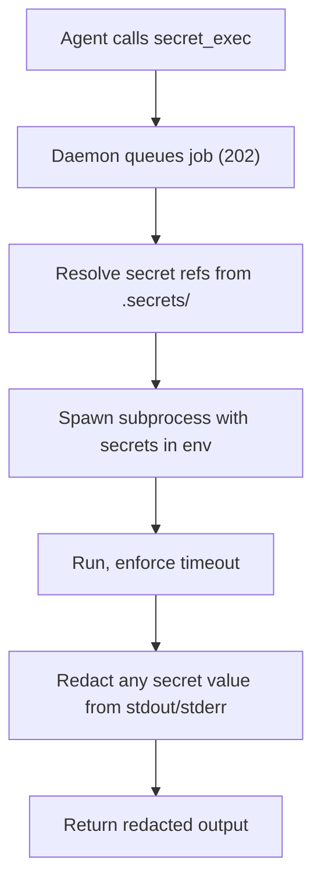

# Secrets

> Category: Security | Version: 1.0 | Date: June 2026 | Status: Active

How Honeycomb stores credentials so an agent can use them without ever reading them: the secrets plugin, machine-bound encryption, the exec model, and the redaction rules.

**Related:**
- [`scoping-and-visibility.md`](scoping-and-visibility.md)
- [`credential-storage.md`](credential-storage.md)
- [`../auth/auth-architecture.md`](../auth/auth-architecture.md)
- [`../ai/model-provider-router.md`](../ai/model-provider-router.md)
- [`../data/workspace-layout.md`](../data/workspace-layout.md)

---

## The threat

If an agent can read `OPENAI_API_KEY`, then a single prompt injection can exfiltrate it. The whole point of the secrets subsystem is to break that link: secrets are encrypted at rest, agents can cause them to be used, and agents never receive the decrypted values. The governing rule is that secrets are never recallable memories and must never leak into chat, logs, memory rows, or source files. Secrets are the one class of data that does not live in DeepLake; they sit encrypted on the daemon host so that even a full dump of the store yields no credentials.

## The plugin

Secrets are owned by a bundled core plugin, `honeycomb.secrets` (under `plugins/core/secrets`). Routing secret access through a plugin means the capability is explicit and can be granted or denied, and every secret operation is audited.

## Storage and encryption

Secrets live under `.secrets/` as encrypted JSON with mode 0600 (dirs 0700): human-readable names, ciphertext values. As of PR #229 (PRD-072) the secrets store and the unified vault moved under the migrated fleet state root `~/.apiary/honeycomb/`, resolved through the Tier-1 canonical chain in `src/shared/fleet-root.ts` from `os.homedir()` and never from `process.cwd()`; the `.apiary` migration is covered in [`../data/workspace-layout.md`](../data/workspace-layout.md). A daemon that comes up pinned to an unwritable directory makes every secret write fail with a `502 store_failed`; the writable-workspace resolution and the Windows `system32` failure mode are covered in the same doc. Encryption is XSalsa20-Poly1305 (the libsodium `crypto_secretbox` construction) implemented with the audited, zero-dependency `@noble/ciphers` library rather than a native libsodium binding, there is no native module to compile or heal. The key is derived from a machine-bound identifier (`/etc/machine-id` on Linux, `IOPlatformUUID` on macOS, with a hostname-plus-username fallback) stretched to 32 bytes with HKDF, scope-bound so org/workspace records derive distinct keys. Each value gets a random nonce prepended to its ciphertext. The practical consequence is that the store cannot be decrypted on another machine without the same machine identity, so copying the encrypted tree to a different box yields nothing usable.

This is distinct from the device-flow credentials file used by the daemon's own auth and provider sign-in, which is covered in [`credential-storage.md`](credential-storage.md). User secrets and the daemon's stored credentials are deliberately separate stores with separate rules, though the vault below now offers an encrypted-at-rest *copy* of the DeepLake login token.

## The unified vault

The secret store generalizes into one local, machine-bound encrypted **vault** that holds several typed record classes behind a single seam, keyed by `(class, scope, name)`. It reuses the secrets crypto, machine-key derivation, and `0600`/`0700` discipline verbatim, no new crypto, and adds breadth, not a new encryption story. Two classes ship built-in:

| Class | Read posture | Holds |
|---|---|---|
| `secret` | internal-only (value never returned) | provider API keys (`ANTHROPIC_API_KEY`, `OPENAI_API_KEY`, `OPENROUTER_API_KEY`) and a copy of the DeepLake login token |
| `setting` | daemon-readable (typed value may be returned) | active inference provider/model, `pollinating.enabled` and sibling feature toggles, dashboard prefs |

The read posture is **data, not scattered conditionals**: a record-class registry declares each class's posture and a zod value schema, and the store asks the registry before returning any decrypted value. An attempt to read a `secret`-class value through the settings accessor is rejected at that choke point, a secret can never be read through the daemon-readable path. A future class (cached tokens, connector configs) slots in by registering a descriptor (id, posture, schema) with no storage rewrite and existing records untouched. The `secret` class keeps its on-disk path at `.secrets/<scope>/<name>`, so a pre-existing key written by the old store decrypts unchanged; other classes live under `.vault/<class>/<scope>/<name>`.

### The no-SQLite rule

The vault deliberately stays a per-record encrypted **file** store; it is not a SQLite database. The file store already owns the encryption primitive, machine binding, permission discipline, scope segmentation, and redacted audit, and it is `audit:sql`-clean precisely because it touches no SQL. SQLite would add a native dependency and a *second* at-rest encryption story (SQLCipher or app-level field encryption, re-deriving the same machine key anyway) to buy a queryability that tens of settings and a handful of secrets per scope do not need. A settings read is one file read; a settings write is one atomic file write. The vault is local by design and is never a DeepLake table, and copying its directory to another host yields nothing, because the machine key differs.

### The vault-scatter fix (fixed root, not cwd)

PR #240 closed a cwd-scatter bug that split both the secrets vault and the settings vault across directories. The vault base dir had been derived from `resolveWorkspaceBaseDir()`, which falls back to `process.cwd()` when `HONEYCOMB_WORKSPACE` is unset. Because a daemon inherits the working directory of whatever spawned it, daemon-global config (the Portkey key, the active provider and model, `pollinating.enabled`, `embeddings.enabled`) landed in whatever directory the daemon happened to launch from. This was confirmed on disk: the same toggle appeared under three roots at once, `~/.apiary/honeycomb/.vault`, `~/GitHub/the-apiary/honeycomb/.vault`, and `~/GitHub/honeycomb/.vault`. A boot read saw an inconsistent subset of those files, so the Portkey key took several restarts to stick and `pollinating.enabled` never engaged at all.

The fix pins the vault to a fixed, cwd-independent path rather than to the cwd-sensitive workspace base dir. Daemon-global config is fleet-global, so it must resolve from the fleet state root (`os.homedir()` down the `fleet-root.ts` chain), not from the directory the daemon started in. This is the same lesson as the trailing-space split (see [`../data/workspace-layout.md`](../data/workspace-layout.md)): state that must be found again later cannot be anchored on a value that varies per launch.

### COPY-not-move credential migration

The vault offers an encrypted-at-rest copy of the DeepLake login token, and the migration that creates it is the single highest-risk operation in the subsystem, so it is non-destructive **by construction**. The shared `~/.deeplake/credentials.json` is the user's live login, byte-cross-compatible with Hivemind. The migration **copies** the token into the vault as a `secret`-class record (`DEEPLAKE_TOKEN`) and performs zero writes to `~/.deeplake`: there is no move, delete, rewrite, re-chmod, or rename of the plaintext file anywhere in the migration path. The plaintext file stays byte-unchanged and authoritative for the shared login; the vault copy is an additive cache, not a replacement.

Token resolution then follows a fixed precedence, **vault → env → plaintext file**: the migrated vault copy first, then a `HONEYCOMB_TOKEN` env override, then the plaintext file as the never-regressed fallback. The login resolves in every case, so an empty vault is not a regression. Tightening or removing the plaintext file is deliberately deferred to a later change gated on this proving out; this subsystem never makes the user's login unrecoverable. The credentials file contract itself is documented in [`credential-storage.md`](credential-storage.md).

Because the `DEEPLAKE_TOKEN` vault record is anchored to a resolved directory, it inherits the path-hygiene concerns of the roots it sits under. PR #238 fixed a case where a trailing space in `HONEYCOMB_WORKSPACE` sent `.secrets/` (and with it the `DEEPLAKE_TOKEN` record) to a divergent `"<dir> "` directory the CLI and uninstaller never look in, while telemetry landed at the clean path. That split can break inference-key delivery and, downstream, session-to-memory consolidation. The resolver now trims the environment variable so the vault cannot land in a phantom trailing-space directory; the full two-source trailing-space story is in [`../data/workspace-layout.md`](../data/workspace-layout.md).

## What agents can and cannot do

The API exposes names but never values.

| Endpoint | Method | Purpose |
|---|---|---|
| `/api/secrets` | GET | list secret names only |
| `/api/secrets/:name` | POST | store a secret |
| `/api/secrets/:name` | DELETE | delete a secret |
| `/api/secrets/exec` | POST | queue a command with secrets in its environment |
| `/api/secrets/exec/:jobId` | GET | inspect a queued exec job |

There is deliberately no `GET /api/secrets/:name`. An agent cannot read a value through the API, the SDK, MCP, the dashboard, a connector, or plugin diagnostics. It can list names and it can ask for a secret to be used, nothing more.

### The `honeycomb secret` CLI contract

PR #240 fixed the `honeycomb secret` CLI, which had been silently broken. The generic command dispatch turned `secret set <name> <value>` into `POST /api/secrets/set {args:[name,value]}`, so the daemon stored a secret literally named `set` and dropped the value entirely. A bespoke secret command builder now maps each subcommand to the correct route:

| CLI command | HTTP call |
|---|---|
| `secret set <name> <value>` | `POST /api/secrets/<name>` with `{value}` |
| `secret rm <name>` | `DELETE /api/secrets/<name>` |
| `secret list` | `GET /api/secrets` (names only) |

The read posture is preserved: `secret list` returns names only, and there is still no CLI path that returns a decrypted value.

## The exec model

The way a secret gets used without being revealed is `secret_exec`. It is asynchronous: the request queues a job and returns immediately. The daemon resolves the secret references, spawns the subprocess with the secrets injected into its environment, enforces a timeout (5 minutes default, 30 max), and bounds the worker pool. Crucially, output is redacted: any secret value appearing in stdout or stderr is replaced with `[REDACTED]` before the caller sees it. So a command can authenticate to an external service, and the agent gets the result without the credential ever passing through its context.

## Provider integrations

Beyond local storage, the subsystem can pull from external secret managers, with routes under `/api/secrets/bitwarden/*` and `/api/secrets/1password/*`. These let a workspace reference items in an existing vault rather than duplicating them. OS keychain and passphrase-protected backends are noted as planned and should be treated as not-yet-implemented until confirmed in the code.

## Where secrets show up elsewhere

The router's inference accounts reference secrets rather than embedding raw keys, so a config dump never contains a credential; see [`../ai/model-provider-router.md`](../ai/model-provider-router.md). Git sync resolves a `GITHUB_TOKEN` for `github.com` only and never injects it into a non-GitHub remote. The audit log for secret operations (`secret.listed`, `secret.stored`, `secret.resolved_for_exec`, `secret.exec_started`, and so on) is written as structured NDJSON under `.daemon/`, with sensitive fields redacted before they are stored. The thread running through all of it is the same one in [`scoping-and-visibility.md`](scoping-and-visibility.md): the system is built to refuse rather than to over-share.
