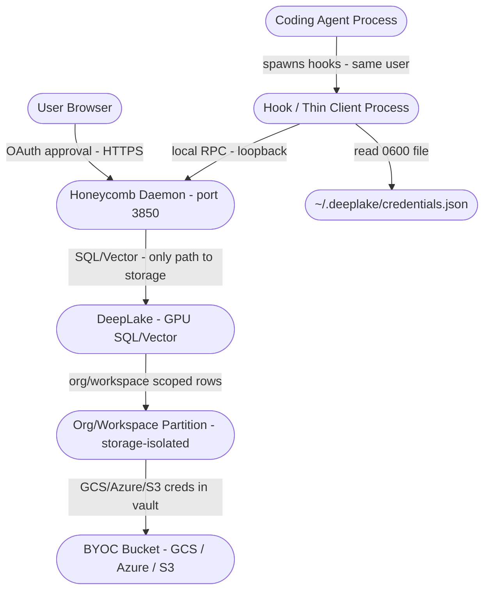
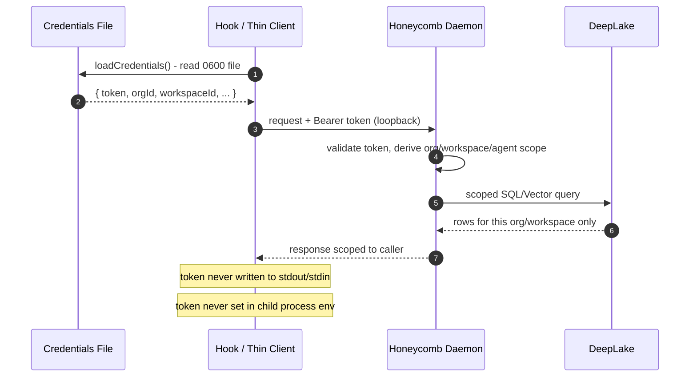

# Trust Boundaries

> Category: Security | Version: 1.0 | Date: June 2026 | Status: Active

Maps every trust boundary in the Honeycomb system: where code runs, what it can access, who controls each boundary, and what defenses prevent privilege escalation or data leakage between zones. The Honeycomb daemon is the central chokepoint; only it talks to DeepLake.

**Related:**
- [`scoping-and-visibility.md`](scoping-and-visibility.md)
- [`secrets.md`](secrets.md)
- [`credential-storage.md`](credential-storage.md)
- [`../multi-tenant/org-workspace-model.md`](../multi-tenant/org-workspace-model.md)
- [`../data/deeplake-storage.md`](../data/deeplake-storage.md)

---

## Trust Boundary Map

Note: the credentials file and the BYOC bucket are the data-at-rest nodes, distinct from the process nodes. The single most important property of the map is that no process other than the daemon has a line into DeepLake.

---

## Zone Definitions

| Zone | Owner | What runs there | Trust level |
|---|---|---|---|
| **User Browser** | User's OS | OAuth device-flow approval page | User-trusted (separate from agent) |
| **Agent Process** | Coding agent (Claude Code, Codex, Cursor, etc.) | Agent LLM loop, tool calls | Host OS user |
| **Hook / Thin Client Process** | Agent runtime | Spawned Node bundles at lifecycle events; call the daemon | Same OS user as agent |
| **Honeycomb Daemon** | `honeycomb daemon` on port 3850 | Capture, recall, pipeline, secrets decrypt, the only DeepLake client | Same OS user; sole storage authority |
| **Credentials File** | File system | `~/.deeplake/credentials.json` | Mode 0600; OS user only |
| **DeepLake** | GPU-backed SQL/Vector backend | Session storage, memory, skill mining, vector search | Reached only by the daemon; org/workspace isolation enforced here |
| **Org/Workspace Partition** | DeepLake backend | Row- and partition-level org/workspace isolation | Server-enforced; AES-256 at rest |
| **BYOC Bucket** | Customer's cloud (GCS/Azure/S3) | Raw object storage | Customer-controlled; creds in DeepLake vault |

---

## The Daemon as Chokepoint

Honeycomb is daemon-centric. Hooks and CLI commands are thin clients: they assemble a request, hand it to the daemon over a local loopback connection, and render the response. They never open a connection to DeepLake themselves. This collapses the storage-facing attack surface to a single process.

Consequences for the trust model:

- The bearer token and any secrets-subsystem decryption happen inside the daemon. A compromised hook can ask the daemon to do work on the user's behalf, but it cannot reach storage directly and cannot read another org's data because the daemon re-derives scope from the validated token on every request.
- SQL construction, escaping, and the VFS allowlist all live in the daemon. A thin client cannot smuggle raw SQL to DeepLake because it has no DeepLake handle to smuggle it to.
- Org and workspace isolation is enforced at the storage layer behind the daemon, not at a client the user could patch.

---

## Token Handling at Boundaries

The access token is the primary client-side security primitive. It moves across boundaries as follows:

Key invariants:
- The token is read from disk at hook startup and handed to the daemon. It is never passed as a command-line argument (visible in `ps aux`) or written to `process.env` (visible to child processes).
- Only the daemon makes the network call to the backend, over TLS, with the token in an HTTP header rather than a URL query parameter.
- `authLog` writes to `process.stderr`, not `stdout`, so token-adjacent messages cannot be parsed by callers that read hook stdout as structured data.

---

## Hook Consent Model

Honeycomb installs hooks into agent lifecycle events (`sessionStart`, `beforeSubmitPrompt`, `postToolUse`, `afterAgentResponse`, `stop`, `sessionEnd`). Each agent platform enforces its own consent model before running foreign hooks:

| Platform | Consent mechanism |
|---|---|
| **Codex** | "Hooks need review" terminal prompt on first run. User must choose "Trust all and continue"; otherwise hooks are inert. |
| **Cursor** | `hooks.json` is written to `~/.cursor/hooks.json`. Cursor 1.7+ reads this file; the user controls the Cursor installation. |
| **Claude Code** | Plugin marketplace install; Claude Code's own approval flow for marketplace plugins. |
| **OpenClaw** | `openclaw plugins install clawhub:honeycomb`; ClawHub approval. |
| **Hermes** | `config.yaml` hooks section; operator-controlled config file. |
| **pi** | `AGENTS.md` marker block + TypeScript extension; user controls the `~/.pi/agent/` directory. |

In all cases, no hook runs silently without an explicit user action. The install command (`honeycomb install`) displays a one-line consent notice before opening the browser for authentication.

---

## VFS Allowlist

The virtual filesystem intercepts reads and writes to the memory path and routes them through the daemon. Commands routed through this layer are matched against an allowlist of approximately 70 built-in operations. Any command not on the allowlist is denied with an error. This prevents an agent from using the VFS path to execute arbitrary shell commands under the guise of memory operations.

Because DeepLake has no parameterized-query interface, the daemon builds SQL by string composition and must escape every agent-supplied value itself. Values passed into VFS-backed queries are escaped through three utility functions:
- `sqlStr(value)` - safe string literal
- `sqlLike(value)` - safe LIKE pattern
- `sqlIdent(value)` - safe identifier (table/column name)

These prevent SQL injection from agent-provided values such as memory keys or search terms. The escaping runs inside the daemon, which is the only place SQL is ever assembled.

---

## Org, Workspace, and Agent Isolation

DeepLake enforces multi-tenant isolation at the storage layer, behind the daemon, not only at the request layer:

- Sessions never share a row, partition, or index with another workspace. Org and workspace are the primary tenancy boundary.
- The org and workspace passed with every daemon request are validated server-side against the `org_id` claim in the JWT. A token minted for org A cannot be used to read org B data by spoofing a header or editing the credentials file.
- Within a workspace, `agent_id` scoping narrows reads and writes to the calling agent's lane where the engine requires it, so multiple agents sharing a workspace do not silently clobber one another. See [`scoping-and-visibility.md`](scoping-and-visibility.md) for the full scope-resolution rules.
- Honeycomb's credential store mirrors the outer boundary: `creds.orgId` and the `org_id` JWT claim are kept in sync by `healDriftedOrgToken`. A session that starts with a drifted token (claim and stored ID disagree) has its token reminted before any request reaches the daemon.

---

## Bring Your Own Cloud (BYOC)

BYOC moves object storage into the customer's own cloud account while leaving orchestration with the backend.

| Provider | Status | Boundary |
|---|---|---|
| Google Cloud Storage | Available | Customer GCS bucket; backend reads/writes via GCS credentials stored in DeepLake vault |
| Azure Blob Storage | Available | Customer Azure container; same vault model |
| Amazon S3 | Available | Customer S3 bucket |
| S3-compatible on-prem | On request | Customer network; requires private network or VPN |

In all BYOC configurations, the Honeycomb client (hooks, CLI) is unaware of the storage backend, and so is the daemon's caller. The daemon talks to the backend over TLS; the backend handles storage routing. The raw cloud provider credentials (GCS service account key, Azure SAS token, AWS credentials) are stored in the DeepLake vault and are never transmitted to the client process. Honeycomb's thin clients never see the raw keys.

---

## Capture Opt-Out

The `HONEYCOMB_CAPTURE=false` environment variable places Honeycomb in read-only mode. In this mode:
- Session capture hooks execute but skip asking the daemon to write any trace data.
- The DDL ensure step (which writes placeholder rows) is also skipped.
- Recall and search still function.

This provides a per-session escape hatch for sensitive workflows where trace capture is inappropriate (e.g. working with credentials, PII-heavy files, or regulated data).

---

## Telemetry Egress Boundary

Honeycomb may emit anonymized **operator telemetry** from the daemon to an operator-owned analytics backend (PostHog), install-funnel attribution and operational health (see PRD-050e). This is the one outbound boundary other than the daemon→DeepLake storage path, and because Honeycomb captures coding sessions and memories (the most sensitive data a dev tool handles), it is governed by a single non-negotiable rule.

**The content/operation bright line.** Telemetry may describe **how the tool behaves** (counts, durations, versions, states, error *classes*). It must never describe **the content the tool handles** (memory/session text, code, prompts, recall queries, file paths, cwd, repo/branch names, org/workspace names, identities, secrets). The operational test for any property is the **shrug test**: *would the user shrug if they saw this value in plaintext?* If they would lean in and squint, it is over the line and does not ship.

Boundary invariants:

- **Daemon-only emitter.** Telemetry leaves only from the daemon, through a single `emitTelemetry` chokepoint with a hardcoded allow-list; a structural test asserts no other call site posts to the endpoint and that the banned set (token, email, paths, repo/branch names, query strings, content, error messages, raw ids, secrets) is absent from every event.
- **No item-level egress.** No per-memory / per-query / per-file events, the cardinality itself is a signal. Tier-1 lifecycle events (install/link/upgrade) remain **exact** so the operator can count the funnel precisely; only Tier-2 usage *counts* are **bucketed** (the precise number never leaves the machine).
- **Tiered consent.** Operational (Tier 1) events are opt-out; usage-count (Tier 2) events are opt-in. `DO_NOT_TRACK=1` or `HONEYCOMB_TELEMETRY=0` silences all of it. An unkeyed build (no PostHog key baked in) emits nothing (fail-soft).
- **Glass-box.** `honeycomb telemetry --show` renders, in plaintext, exactly what has been and would be sent, the displayed set *is* the egress set, sourced from the same local events.
- **Anonymous identity.** The `distinct_id` is a random per-machine install-id, never an email or a content-derived hash. The write-only ingest key carries no read access to operator data.
- **Self-host conservatism.** A session against BYOC/self-hosted DeepLake defaults Tier-2 off (and Tier-1 minimal), an enterprise user firewalls egress anyway; respecting that before they ask is the posture.

This boundary is **additive to** [Capture Opt-Out](#capture-opt-out): `HONEYCOMB_CAPTURE=false` governs what the user's *memory* records into DeepLake; telemetry opt-out governs what *operational metadata* leaves for the operator. They are independent switches with independent defaults.

---

## Data Classification Summary

| Data type | Where stored | At rest | In transit | Access scope |
|---|---|---|---|---|
| Access token | `~/.deeplake/credentials.json` | Plaintext; mode 0600 | Bearer header, daemon to backend over TLS | OS user only |
| Secrets (key/value material) | Secrets subsystem via daemon | Encrypted; decrypted in daemon on demand | TLS | Scoped per [`secrets.md`](secrets.md) |
| Session traces (prompts, tool calls, responses) | DeepLake org/workspace partition | AES-256 | TLS | All members of the org workspace |
| Codified skills (`SKILL.md`) | Project directory + DeepLake | Plaintext files + AES-256 | TLS | Org workspace members |
| Memory summaries | DeepLake `memory` table | AES-256 | TLS | Org workspace members |
| BYOC cloud credentials | DeepLake vault | Encrypted | Never sent to client | Backend only |
| Operator telemetry (anonymized lifecycle/health) | Operator PostHog project | n/a (no content at rest locally beyond the local event log) | TLS, daemon to PostHog, write-only ingest key | Operator only; opt-out + glass-box; **never** carries content (see Telemetry Egress Boundary) |

Workspace-level isolation is the outer boundary; within a workspace, members share the trace and skill surface by design, with `agent_id` narrowing where the engine enforces it. See [`../multi-tenant/org-workspace-model.md`](../multi-tenant/org-workspace-model.md) and [`../data/deeplake-storage.md`](../data/deeplake-storage.md) for the storage-layer detail.
