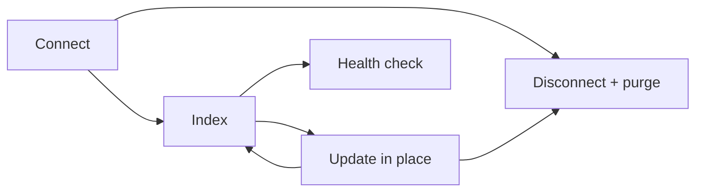

# Source Lifecycle

> Category: Sources | Version: 1.1 | Date: June 2026 | Status: Active

How external knowledge bases (Obsidian, Discord, GitHub) and ad-hoc documents are connected, indexed, kept current, and purged, with provenance preserved at every step.

**Related:**
- [`../data/schema.md`](../data/schema.md)
- [`../data/deeplake-storage.md`](../data/deeplake-storage.md)
- [`../ai/retrieval.md`](../ai/retrieval.md)
- [`../ai/knowledge-graph-ontology.md`](../ai/knowledge-graph-ontology.md)
- [`../security/scoping-and-visibility.md`](../security/scoping-and-visibility.md)

---

## The contract

A source is a read-only external knowledge base that Honeycomb mounts as evidence. The governing rule comes straight from the source-truth model: source artifacts are evidence, recall rows derived from them must preserve provenance, and everything a source produced must remain purgeable by that source. Source files themselves are never modified. The goal is a single source-artifact contract that works across vaults, repos, chat, and future providers, with the provider-specific code confined to the ingest stage upstream of the contract. The daemon runs the document worker that does the ingest; harness clients never touch the store.

Every source-derived row carries `source_id`, `source_kind`, `source_path`, and `source_root`. That is true for the `memory_artifacts` table and for the graph rows (entities, attributes, dependencies) written from a source, which is what makes a clean purge possible. Like every Honeycomb table, those rows are scoped to an org and workspace and are written to DeepLake by the daemon.

## The lifecycle



### Connect

Connecting registers the source and queues an index job. For Obsidian:

```bash
honeycomb sources add obsidian /path/to/Vault --name "Vault"
```

Discord and GitHub connect through the API or CLI with a stored secret reference for the token (never a raw token), plus bounds like which guilds or repos, resource types, and a `since` window.

### Index

Indexing turns the source into three things. Artifacts: each unit (a Markdown file, a Discord message, a GitHub issue) becomes a `memory_artifacts` row with its source provenance. Native graph: the source topology is mounted into the ontology, so an Obsidian vault root becomes an entity, folders become groups, files become documents, wiki links become dependencies, headings become aspects, and paragraphs become claims. Chunks and embeddings: content is split (by heading for Obsidian) and embedded for semantic recall, with provenance carried into each chunk. Chunk vectors are 768-dim `nomic-embed-text-v1.5` embeddings stored as DeepLake tensors.

Because the DeepLake query endpoint has no parameterized queries, every path, title, and content value the ingest stage interpolates is escaped through the `sqlStr`/`sqlLike`/`sqlIdent` helpers. Tables are created lazily on first write with lazy schema-healing, so a new source kind does not require a migration ahead of its first index.

### Update in place

The daemon watches connected sources and re-reads on change. Re-scans are single-flight, so overlapping requests coalesce, and content fingerprints skip files that have not changed. Removed files are soft-deleted from `memory_artifacts` and their chunks purged; renames are treated conservatively as a delete plus an add. Soft-delete is a status advance written through the append-only, version-bumped path rather than an in-place UPDATE, which sidesteps DeepLake's UPDATE-coalescing quirk.

### Health

`GET /api/sources/:sourceId/health` reports artifact and chunk counts, the latest artifact and checkpoint timestamps, failure counts, stale or partial checkpoints, purge residue, and source-provenance graph row counts. A source degrades when there are fetch failures, partial or stale checkpoints, deleted residue, or orphaned chunks.

### Disconnect and purge

Removing a source purges everything it owns and nothing else:

1. remove the source config,
2. purge the Honeycomb-owned `memory_artifacts` rows for that `source_id`,
3. purge the source-owned graph rows (entities, dependencies, attributes) where `source_id` matches,
4. purge the source's chunk embeddings and their vector tensor mirror,
5. leave the source files untouched.

The dashboard and API route `DELETE /api/sources/:sourceId` performs the full purge. If the daemon is unavailable, the CLI falls back to config-only removal with a warning.

## The three source providers

### Obsidian

Mounts a vault: artifacts per Markdown file, native graph from vault topology, heading-split chunks. Provenance is vault-relative path plus heading and line range. Updates are watch-driven.

The selected vault root is a read-only filesystem boundary, and the provider enforces path containment so a malicious vault config cannot turn an indexing pass into an arbitrary local-file read. Two checks back this:

- **The vault root is canonicalized once.** On the first `connect`/`health`/snapshot/index call, the configured `vaultPath` is resolved with `realpath` (collapsing symlinks and relative segments) and confirmed to be a real directory with `stat`. An external vault outside the Honeycomb workspace is legitimate and accepted; an empty directory is a valid empty vault, but a missing, unreadable, escaping, or non-directory path is a hard validation failure. `connect` and `health` must surface that failure explicitly, and `snapshot`/`index` must return a dedicated validation-error artifact or fail the operation. They must not return an empty successful snapshot for an invalid root, because that is indistinguishable from a real empty vault and can trigger delete-all sync behavior.
- **Every file read is contained within that canonical root.** Each candidate file path is resolved (again via `realpath`) and must still start with the canonical vault root plus a path separator. A path that escapes the root, whether through a `../` traversal segment in a narrowed scope set or through a symlink whose target lives outside the vault, is not read. It becomes a failure artifact with `readError: "path escapes vault root"` and the indexing loop continues past it.

This is the source-provider instance of the daemon's general fail-closed posture: validation gates every read, and an unsafe configuration degrades to a clear health error instead of silently leaking files. See [`../security/trust-boundaries.md`](../security/trust-boundaries.md) for the broader trust-boundary map.

### Discord

Three sync modes cover different access patterns. REST (bounded) pulls guilds, channels, threads, members, and per-message artifacts with latest and backfill checkpoints, refreshing forward from the latest checkpoint and backfilling within bounds. Gateway-tail (live) holds a bot gateway connection open and indexes create, update, and delete events with per-channel tail checkpoints; removing the source closes the connection. Desktop-cache (local) reads the Discord desktop cache with no bot token, treating local-only DMs under a synthetic `@me` guild; cache eviction never deletes previously indexed rows. Snapshots export and re-import artifacts with provenance for backup and move, excluding local `@me` DMs by default.

### GitHub

Indexes issues, pull requests, and discussions over GraphQL (token required), plus selected Markdown docs over REST, bounded by `maxItemsPerRepo` and path globs. Doc ingestion is limited to Markdown; arbitrary source code is not ingested.

```bash
honeycomb sources add github --repo Org/Repo --token-ref GITHUB_TOKEN \
  --resource-type issues --resource-type docs
```

Across all three, partial failures are written as source-owned failure artifacts and reported rather than silently swallowed, and a failure never deletes existing rows.

## Documents

Documents are the lighter path for ad-hoc text, URLs, and files, separate from full source mounts. `POST /api/documents` enqueues a document and returns its id and status; an identical URL is deduplicated and returns the existing record. The document worker then runs the lifecycle in the `memory_jobs` table alongside extraction:

```text
queued -> extracting -> chunking -> embedding -> indexing -> done
```

Chunking is character-based (default around 2000 characters with 200 overlap), each chunk becomes a `document_chunk` memory linked through the `document_memories` table, and identical chunks share an embedding by content hash. Embedding failures are non-fatal: the chunk is still written and stays keyword-searchable. Deleting a document soft-deletes the document and all of its linked chunk memories and writes history entries. The chunking and worker knobs live under `pipeline.*` in `agent.yaml`.

## How sources show up in recall

Recall keeps source-backed hits distinct from native memories. Source chunks act as a fallback when normal candidates are empty, and results carry source provenance so a caller can open the original vault, channel, or repo directly. This is the source half of the retrieval flow in [`../ai/retrieval.md`](../ai/retrieval.md). Because every source row is scoped and provenanced, a source can be trusted as evidence and still be fully removable, which is the entire point of the contract. The tables behind it are documented in [`../data/schema.md`](../data/schema.md) and the storage mechanics in [`../data/deeplake-storage.md`](../data/deeplake-storage.md).
