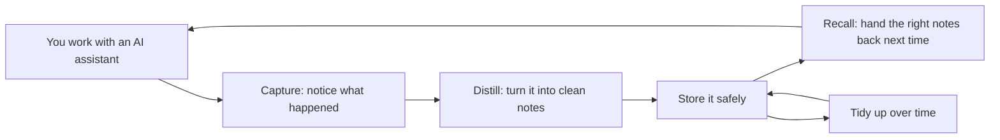

# How Honeycomb works

> Category: Overview | Version: 1.0 | Date: June 2026 | Status: Active

A plain-language tour of how Honeycomb captures, distills, and recalls memory, and why it gets sharper over time. No technical background needed.

**Related:**
- [What is Honeycomb?](what-is-honeycomb.md)
- [Glossary](glossary.md)
- [Getting started](../guides/getting-started.md)

---

## One quiet helper in the background

When you install Honeycomb, it runs a small, always-on helper on your machine (we call it the **daemon**). It is the only part that talks to your memory store, which keeps everything in one safe place. Your coding assistants do not connect to the store themselves; they just talk to this local helper.

Everything Honeycomb does follows one simple loop: **capture, distill, recall, and compound.**

## Capture: notice what happened

As you and your assistant work, Honeycomb quietly records the important moments: what you asked, what the assistant did, and what came back. This recording is cheap and instant, and it never gets in the way. If anything ever goes wrong while recording, your assistant keeps working normally. Nothing is lost.

## Distill: turn it into clean notes

Raw transcripts are long and noisy. Honeycomb distills them into short, useful notes: a one-line headline ("the index"), a longer summary, and the full original if you ever need to dig in. This is the **three-tier memory**: skim the headline, open the summary if it looks relevant, and only read the full detail when you truly need it. It is how a person remembers, a gist first, then the details on demand.

## Recall: hand the right notes back

When you start a new session, Honeycomb gives your assistant a small, tidy "here is what I already know about this project" briefing so it starts informed instead of blank. During your work, the assistant can also ask for more whenever it needs it. You do not have to manage any of this; it happens for you.

Honeycomb finds the right notes two ways at once: by matching the words you used, and (optionally) by matching the *meaning* even when the words are different. That second kind is called semantic search, and it is what lets Honeycomb surface the right memory even when you would not have known the exact term to look for.

## Compound: it gets sharper over time

Most note piles get messier as they grow. Honeycomb does the opposite. Every so often it runs a tidy-up pass that merges duplicate notes, drops the junk, and replaces stale facts with their current version, while keeping a full history so nothing is truly lost. The result is that the more you use Honeycomb, the *sharper* its memory gets, not the noisier.

## Your data stays yours

Honeycomb keeps your memories in a store you control (powered by [Deep Lake](https://deeplake.ai)), separated cleanly so different teams and projects never see each other's notes. The local helper is the only thing that connects to it, and on a single machine it only listens to your own computer. Secrets like API keys are handled separately and are never shown to the assistant.

## In one sentence

Honeycomb watches your work, writes clean notes, hands the right ones back to any assistant on any device, and keeps tidying itself so your project's memory only gets better.
