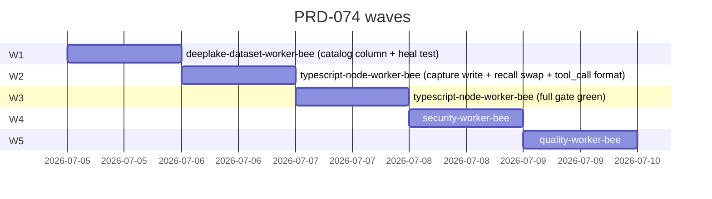

# Execution Ledger — PRD-074 Sessions Prose Column

> **Run:** the-smoker · branch `prd-074-sessions-prose-column` · worktree `C:\Users\mario\GitHub\honeycomb-prd-074\`
> **Source PRD:** [`library/requirements/backlog/prd-074-sessions-prose-column/`](../requirements/backlog/prd-074-sessions-prose-column/prd-074-sessions-prose-column-index.md)
> **Model:** GLM 5.2 for every Bee (per Mario's directive — model matrix ignored)
> **Gate:** `npm run ci` = typecheck + jscpd dup + vitest. A criterion is DONE only when its tests pass and the gate is green. Verification is a separate pass.
> **Status legend:** OPEN · IN PROGRESS · DONE (implemented+tested) · VERIFIED (independent pass) · BLOCKED

## Scope anchor

All work happens in the worktree at `C:\Users\mario\GitHub\honeycomb-prd-074\` on branch `prd-074-sessions-prose-column`. The original `honeycomb/` working tree (parallel agent's branch `fix-lease-discovery-on-paginated-scan`) must NOT be touched by any dispatched Bee.

**Out of scope (per Non-Goals):** the native hybrid reference candidate at `hybrid-recall.ts` is left completely untouched. PRD-047a declined `deeplake_hybrid_record`; RRF is production. Whoever re-opens PRD-047a adapts the reference candidate in their own PRD.

## AC Ledger

| ID | Source | Criterion (abbreviated) | Owner Bee | Wave | Status |
|---|---|---|---|---|---|
| L-A1 | m-AC-1 / a-AC-1 | `sessions` gains `prose TEXT NOT NULL DEFAULT ''` in `SESSIONS_COLUMNS` | deeplake-dataset-worker-bee | 1 | OPEN |
| L-A2 | a-AC-2 | Heal is additive + idempotent (mirrors PRD-060a a-AC-3); a second heal on a healed table is a no-op | deeplake-dataset-worker-bee | 1 | OPEN |
| L-B1 | m-AC-3 / a-AC-3 | Capture handler populates `prose` for every new `sessions` INSERT from the typed `CaptureEvent`; both single + batched paths | typescript-node-worker-bee | 2 | OPEN |
| L-B2 | a-AC-4 | `user_message` / `assistant_message` → `prose = event.text` verbatim, no cap | typescript-node-worker-bee | 2 | OPEN |
| L-B3 | a-AC-5 / m-AC-5 | `tool_call` follows 074b format: file-path-aware line 1 + bounded response; cap is the named export `TOOL_PROSE_RESPONSE_CAP` | typescript-node-worker-bee | 2 | OPEN |
| L-B4 | b-AC-2..4 | Per-tool first-line shape: `file_path`/`path` → `${tool} → shortPath:range`; `command` → `${tool}: cmd`; else `${tool}` | typescript-node-worker-bee | 2 | OPEN |
| L-B5 | b-AC-5..7 | Response line whitespace-collapsed + capped at `TOOL_PROSE_RESPONSE_CAP` (default 500, named export). 10 KB Read → ~500 char row; full content survives in `message` JSONB | typescript-node-worker-bee | 2 | OPEN |
| L-B6 | b-AC-9 | Windows path separators in `file_path` preserved as-is (no double-backslash re-escaping) | typescript-node-worker-bee | 2 | OPEN |
| L-C1 | m-AC-2 / a-AC-6 | Live lexical arm (`buildSessionsArmSql`) returns `COALESCE(NULLIF(prose, ''), message::text) AS text`; same expression in the `ILIKE` predicate so legacy rows stay matchable | typescript-node-worker-bee | 2 | OPEN |
| L-D1 | m-AC-4 / a-AC-7 | Existing `message` JSONB consumers unchanged (`summaries/worker.ts`, `skillify/miner.ts`, `dashboard/roi-session-writer.ts`, `dashboard/api.ts`); each still parses the typed envelope | typescript-node-worker-bee | 2 | OPEN |
| L-D2 | b-AC-8 | `user_message`/`assistant_message` `prose` is `event.text` verbatim (no cap/truncation) — parity test | typescript-node-worker-bee | 2 | OPEN |
| L-X1 | m-AC-7 / a-AC-8 | All existing recall, capture-handler, heal, dashboard tests remain green; `hybrid-recall.ts` untouched (out of scope) | typescript-node-worker-bee | 3 | OPEN |
| L-S1 | close-out | Security audit (SQL injection / PII / supply chain) — Critical + High remediated | security-worker-bee | 4 | OPEN |
| L-Q1 | close-out | QA verifies implementation against PRD-074; writes report | quality-worker-bee | 5 | OPEN |

## Wave plan

**Wave 1 — catalog + heal** (`deeplake-dataset-worker-bee`):
- Adds `{ name: "prose", sql: "TEXT NOT NULL DEFAULT ''" }` to `SESSIONS_COLUMNS` in `src/daemon/storage/catalog/sessions-summaries.ts`.
- Writes the heal-idempotence test (a second heal on a healed table is a no-op).
- Exit: L-A1 DONE, L-A2 DONE.

**Wave 2 — implementation** (`typescript-node-worker-bee`): depends on W1.
- Defines `proseForEvent(event)` + `proseForToolCall(event)` + `TOOL_PROSE_RESPONSE_CAP` in `src/daemon/runtime/capture/event-contract.ts`.
- Writes `prose` in `buildRow()` (`capture-handler.ts`) for both single + batched paths.
- Swaps `buildSessionsArmSql` (`recall.ts`) to `COALESCE(NULLIF(prose, ''), message::text)` in projection + predicate.
- Writes per-AC tests (L-B1..L-B6, L-C1, L-D1, L-D2).
- Exit: every L-B* + L-C1 + L-D* DONE.

**Wave 3 — full gate** (`typescript-node-worker-bee`): depends on W2.
- Runs `npm run ci` (typecheck + jscpd + vitest) in the worktree.
- Fixes any regressions; the screenshot's exact `Read` blob is the first acceptance fixture.
- Exit: L-X1 DONE (gate green, `hybrid-recall.ts` untouched).

**Wave 4 — security** (`security-worker-bee`): depends on W3.
- Audits the SQL surface (the new COALESCE expression), the capture write path, PII in tool_call prose (Bash command redaction open question), supply chain.
- Exit: L-S1 DONE (Critical/High remediated).

**Wave 5 — quality** (`quality-worker-bee`): depends on W4.
- Verifies the implementation against PRD-074's ACs (every L-A..L-X). Writes the QA report at `library/requirements/backlog/prd-074-sessions-prose-column/qa/prd-074-sessions-prose-column-qa.md`.
- Exit: L-Q1 DONE. Every criterion flips DONE → VERIFIED.

## Default rulings adopted (open questions resolved for autonomous execution)

| # | Question | Ruling adopted |
|---|---|---|
| R1 | `TOOL_PROSE_RESPONSE_CAP` default value | **500** (the PRD's proposed default). Tunable later from corpus measurement. |
| R2 | `shortPath` depth | **last-three-segments/basename**. Tunable. |
| R3 | Per-tool response extractor | Heuristic (`response.file.content` for Read, `response.stdout` for Bash, `JSON.stringify` fallback). A per-tool registry is a follow-up. |
| R4 | Redaction of secrets in `Bash` `input.command` | **OUT OF SCOPE** for this PRD. The `proseForToolCall` seam is where it would land; flagged for a future PRD with its own threat model. |
| R5 | The hybrid reference candidate | **Untouched.** PRD-047a declined; RRF is production. Out of scope per the PRD's Non-Goals. |
| R6 | Backfill of legacy rows | **None.** Mirrors PRD-060a. COALESCE fallback handles legacy rows at read time. |

## Watchdog triggers

- A Wave 2 Bee that produces prose text but no per-AC tests = stalled (re-dispatch with the test requirement explicit).
- A Wave 3 gate run with >2 flaky retries on tests that touch the new code = real, not flake. Decompose.
- Any Bee that edits `hybrid-recall.ts` = scope violation. Terminate, re-dispatch with the out-of-scope rule explicit.
