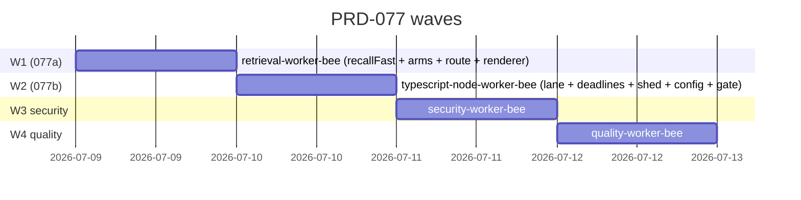

# Execution Ledger — PRD-077 Per-Turn Recall Fast Path

> **Run:** the-smoker · branch `feat/prd-077-per-turn-recall-fast-path` (honeycomb working tree, no worktree — waves are sequential on `recall.ts`)
> **Source PRD:** [`library/requirements/backlog/prd-077-per-turn-recall-fast-path/`](../requirements/backlog/prd-077-per-turn-recall-fast-path/prd-077-per-turn-recall-fast-path-index.md)
> **Model:** inherit session model (Opus 4.8) for every Bee. Do NOT override to GLM — global GLM overrides break subagents on the Anthropic endpoint (known issue). Matrix would pick top-tier reasoning + code quality here anyway (deep pipeline correctness).
> **Gate:** `npm run ci` = typecheck + jscpd dup + vitest. A criterion is DONE only when its tests pass and the gate is green. Verification is a separate pass (Phase 2 close-out).
> **Status legend:** OPEN · IN PROGRESS · DONE (implemented+tested) · VERIFIED (independent pass) · BLOCKED

## Scope anchor

All work happens in the honeycomb working tree on branch `feat/prd-077-per-turn-recall-fast-path`. Read-path only: **no schema/DDL, no writer, no embedding-model change.** The heavy `recallMemories` ranking is untouched except the additive D-4 server-side deadline. The fast path is a strict subset of existing behavior.

**Out of scope (Non-Goals):** dashboard heavy-recall ranking/arms/weights; new rankers/arms/lifecycle stages; local ANN index; `content_embedding` write path; PRD-076b/c (MCP/skill/slash); hive poll-cadence (BUG-19). The sibling-table starvation (BUG-03/04, OPS-03) is tracked separately — the fast path runs their arms regardless and auto-benefits when they populate.

## AC Ledger

| ID | Source | Criterion (abbreviated) | Owner Bee | Wave | Status |
|---|---|---|---|---|---|
| L-A1 | a-AC-1 / m-AC-2 | `recallFast` issues heavy-path arms content-inline, PARALLEL (one wall-clock round-trip) + local embed; round-trips == arm count; no hydrate 2nd hop, no dedup call | retrieval-worker-bee | 1 | VERIFIED |
| L-A2 | a-AC-2 | Every semantic arm SELECTs `content::text`+`created_at` inline (no hydrate); every arm carries the 049b project segment | retrieval-worker-bee | 1 | VERIFIED |
| L-A3 | a-AC-3 / m-AC-3 | RRF + recency + breadth preserved: same arms, existing `fuseHits`, existing recency stage; top-k parity vs heavy path with dedup/rerank/lifecycle disabled over a fixture | retrieval-worker-bee | 1 | VERIFIED |
| L-A4 | a-AC-8 | `recallFast` does NOT call dedup (`fetchCandidateEmbeddings`), rerank seam, or any lifecycle source (activation/staleness/conflict/calibration) | retrieval-worker-bee | 1 | VERIFIED |
| L-A5 | a-AC-4 / m-AC-5 | Embed-unavailable degrade: null embed → drop semantic arms, run lexical alone, `degraded:true`, never throws | retrieval-worker-bee | 1 | VERIFIED |
| L-A6 | a-AC-9 | Starved sibling arm → 0 rows without erroring recall; populated arm flows into fusion unchanged | retrieval-worker-bee | 1 | VERIFIED |
| L-A7 | a-AC-5 | SQL-safety: `npm run audit:sql` green; identifiers/term/vector/project-segment through `sqlIdent`/`sqlLike`/`serializeFloat4Array`/`buildProjectScopeConjunct`, no hand-quoting | retrieval-worker-bee | 1 | VERIFIED |
| L-A8 | a-AC-6 / m-AC-1 | Renderer POSTs `fast:true`; fail-soft `""` + session/tenancy headers unchanged; hang → `""`; injected hits tracked in `injectedRefs` | retrieval-worker-bee | 1 | VERIFIED |
| L-A9 | a-AC-7 / m-AC-4 | Dashboard/heavy `recallMemories` unchanged (fast path additive): still runs four arms + hydrate + dedup + lifecycle | retrieval-worker-bee | 1 | VERIFIED |
| L-B1 | b-AC-1 / m-AC-6 | Fast recall acquires a slot in its OWN lane even when shared/heavy pool saturated; completes within deadline | typescript-node-worker-bee | 2 | VERIFIED |
| L-B2 | b-AC-2 / m-AC-7 | Fast recall exceeding server-side deadline → aborted daemon-side, slot released, handler returns `{hits:[],degraded:true}` within deadline | typescript-node-worker-bee | 2 | VERIFIED |
| L-B3 | b-AC-3 / m-AC-8 | Past queue-depth threshold, fast recall is SHED (empty/degraded, no Deep Lake query enqueued), emits `recall.shed` event (subsystem-state only, no query text) | typescript-node-worker-bee | 2 | VERIFIED |
| L-B4 | b-AC-4 / m-AC-9 | `DEFAULT_RECALL_TIMEOUT_MS` ≈ 4s; renderer still fail-soft `""` past it | typescript-node-worker-bee | 2 | VERIFIED |
| L-B5 | b-AC-5 | Dashboard/heavy recall concurrency unchanged (still shared pool + existing budget) | typescript-node-worker-bee | 2 | VERIFIED |
| L-B6 | b-AC-6 | Knobs `recallFastMaxConcurrency`, `recallFastDeadlineMs`, `recallFastShedQueueDepth`, `recallHeavyDeadlineMs` config-backed, documented defaults, env overrides | typescript-node-worker-bee | 2 | VERIFIED |
| L-B7 | b-AC-7 / m-AC-5 | Fail-soft end to end: deadline, shed, transport error, malformed body all degrade to "no injection", never thrown hook / 500 | typescript-node-worker-bee | 2 | VERIFIED |
| L-B8 | b-AC-8 / m-AC-11 | (D-4) Heavy `recallMemories` bounded by generous server-side deadline: hanging arm → aborted daemon-side, slots released, partial-or-empty `degraded:true` within deadline; sub-deadline heavy recall unaffected | typescript-node-worker-bee | 2 | VERIFIED |
| L-B9 | (live-driven) | **Bound the pre-arm query-embed on BOTH recall paths** (recall.ts:1262 heavy, :2604 fast — currently `await deps.embed.embed(query)` with NO deadline, created only at :2629). A hung/slow embed must degrade to lexical-only `degraded:true` within a bound, never hang. Preserve the existing null-embed contract. | retrieval-worker-bee | 2s | VERIFIED |
| L-B10 | (live-driven) | **Instrument recall phase timings** (embed_ms / arms_ms / fuse_ms / total_ms) as a secret-free structured log event (no query text, mirrors `recall.shed`) so the next live run attributes latency. | retrieval-worker-bee | 2s | VERIFIED |
| L-X1 | (gate) | Full `npm run ci` green (typecheck + jscpd + vitest); no existing recall/renderer/api test regressed | typescript-node-worker-bee | 2 | VERIFIED |
| L-S1 | close-out | Security audit (SQL injection on new arm SQL / PII in `recall.shed` event / fail-soft posture) — Critical + High remediated | security-worker-bee | 3 | DONE |
| L-Q1 | close-out | QA verifies implementation against PRD-077 (every L-A*, L-B*, L-X1); writes report to the PRD's `qa/` | quality-worker-bee | 4 | DONE |
| L-LIVE | m-AC-10 | LIVE dogfood: rebuild daemon from branch, run one memory-relevant session → non-empty `injectedRefs` + fast-path p95 under budget in `request_log` | human/AI | Ship | BLOCKED |

## Wave plan

**Why sequential, not parallel:** both sub-PRDs edit `src/daemon/runtime/memories/recall.ts` heavily (077a adds `recallFast`; 077b wraps it with a lane + deadline + shed and edits the shared-pool layer). Running them as parallel worktree agents would guarantee merge conflicts on the same function neighborhood, AND 077b's lane/deadline/shed genuinely *wraps* the `recallFast` that 077a creates — a real dependency, not just a file conflict. Sequential is both correct and lower-risk. Within each wave the Bee parallelizes its own test writing.

**Wave 1 — 077a fast recall path** (`retrieval-worker-bee`, Opus 4.8): owns hybrid recall, `fuseHits`, the arms, the `<#>` path — exact-fit owner.
- Add `recallFast(request, deps)` in `recall.ts`; add `buildFastSemanticArmSql` (content-inline `<#>` sibling of `buildVectorSearchSql`); reuse lexical arm builders, `fuseHits`, recency stage; `Promise.all` all arms; skip hydrate/dedup/rerank/lifecycle.
- Thread `fast` through `RecallBodySchema` + handler (`api.ts`) to call `recallFast`.
- Point `recall-renderer.ts` at `fast:true` (body only; headers/AbortController/fail-soft unchanged).
- Write per-AC tests L-A1..L-A9 (counting/timing storage stub; SQL-shape; parity fixture; degrade; 0-row sibling; audit:sql; renderer contract; heavy-path-unchanged).
- Exit: L-A1..L-A9 DONE.

**Wave 2 — 077b isolation + resilience + gate** (`typescript-node-worker-bee`, Opus 4.8): owns Semaphore/concurrency, config, transport, deadlines — exact-fit owner. Depends on W1's `recallFast`.
- Dedicated `Semaphore` lane sized to the arm set (`recallFastMaxConcurrency`); fast-lane server-side deadline (`AbortSignal.timeout` → transport `req.signal`); queue-depth load-shedding + `recall.shed` event; heavy-path generous deadline (D-4) around `recallMemories` fan-out returning partial/empty degraded; bump `DEFAULT_RECALL_TIMEOUT_MS`→4000; add the four config knobs to `amplificationConfig` neighborhood with env overrides.
- Write per-AC tests L-B1..L-B8; run full `npm run ci` (L-X1).
- Exit: L-B1..L-B8 + L-X1 DONE.

**Wave 3 — security** (`security-worker-bee`): depends on W2. Audits new arm SQL for injection (must route through guards), PII in the `recall.shed` structured event (must be subsystem-state only, no query text/token), and fail-soft posture (no thrown hook can block a turn). Exit: L-S1 DONE (Critical/High remediated).

**Wave 4 — quality** (`quality-worker-bee`): depends on W3. Verifies implementation against every PRD-077 AC; writes QA report to `library/requirements/backlog/prd-077-per-turn-recall-fast-path/qa/`. Exit: L-Q1 DONE; every criterion flips DONE → VERIFIED.

## Default rulings adopted (open questions resolved for autonomous execution)

| # | Question (PRD Open Questions) | Ruling adopted |
|---|---|---|
| R1 | Lexical-arm tokenization (per-token `OR` vs whole-query `ILIKE`) | **DEFER.** Keep the existing `buildMemoriesArmSql` whole-query `ILIKE` shape verbatim for v1 — the semantic `<#>` arm + RRF carry recall; tokenization is a secondary net and would also change the heavy path's lexical arm (scope creep). Flagged as a follow-up. Does not gate the latency fix. |
| R2 | Fast-lane server-side deadline default | **3000 ms** — comfortably above the ~1.5s fast query, below the ~4s client budget. Config-backed (`recallFastDeadlineMs`), env-overridable, tunable from `request_log`. |
| R3 | Heavy-path server-side deadline default (D-4) | **15000 ms** — generous (a human waits, full quality) but finite; caps the 25-min tail. Config-backed (`recallHeavyDeadlineMs`). |
| R4 | Fast-lane shed queue-depth default | **8** waiters. Config-backed (`recallFastShedQueueDepth`), tunable. |
| R5 | `recallFastMaxConcurrency` default | **8** — the fast path issues 7 arms (3 content-inline semantic: `memories`/`sessions`/`hive_graph_versions` + 4 lexical: `memories`/`memory`/`sessions`/`hive_graph_versions`); 8 leaves one slot of headroom so parallel arms never serialize. Config-backed. |
| R6 | Heavy-path deadline-expiry return shape | **Partial results** (whatever arms completed) with `degraded:true`, falling back to empty degraded if none — friendlier dashboard UX; the per-arm `toScoredIds`→`[]` tolerance supports a partial arm set. Never a 500, never a hang. |
| R7 | Transport keep-alive / undici `Agent` (stretch OQ) | **DEFER** unless recon shows a trivial drop-in. Bare-`fetch` fresh-TLS is a potential ~halving of single-query latency but NOT required for the budget fit; flag as future if confirmed bare. |

## Watchdog triggers

- A Wave 1 Bee that writes `recallFast` but calls `fetchCandidateEmbeddings`, the rerank seam, or any lifecycle source = scope violation (defeats the latency goal). Terminate, re-dispatch with the skip-list explicit.
- A Wave 1 Bee that changes `recallMemories` heavy-path ranking/arms = scope violation (L-A9 must stay green). Terminate, re-dispatch.
- A Wave 2 Bee that sheds or reroutes the HEAVY lane (only the fast lane sheds; heavy gets a deadline only) = scope violation. Terminate, re-dispatch.
- Any Bee hand-quoting SQL instead of the guards = `audit:sql` fail; re-dispatch with the guard list explicit.
- >2 flaky retries on tests touching the new code = real failure, not flake. Decompose the brief.

## Wave / termination log

- **2026-07-09 (init)** — Ledger created. Honeycomb feature branch cut off `main@25bfc8c`. Recon agent dispatched to map exact code anchors (recall.ts / vector.ts / api.ts / recall-renderer.ts / config / tests). Awaiting recon before dispatching Wave 1.
- **2026-07-09 (ROOT CAUSE CORRECTED — it's the shared Semaphore(5), NOT retries; read/write client split = the fix)** — The B agent found (and I verified) that capture writes are ALREADY single-attempt: `INSERT INTO "sessions"` classifies `unsafe-write`, so `client.ts:477` short-circuits past the retry loop (since PRD-062). So my "4× retry storm" was WRONG — B (`maxAttempts:1`, client.ts:85 + capture-handler CAPTURE_WRITE_OPTS) is now just explicit hardening (kept; verified: tsc OK, 59 tests, audit green), not the live fix. The TRUE root cause: the daemon has ONE shared `StorageClient` with ONE `querySemaphore = Semaphore(5)` (MAX_CONCURRENT_QUERIES) gating EVERY Deep Lake op; under 4.6s/query Deep Lake the 5 slots are shared across recall arms + capture appends + dashboard, so recall queues ~73s (the 077b fast lane of 8 is illusory — arms re-funnel through the shared 5). **Owner decision: split into two in-process StorageClients** — read (Semaphore 5: recall/dashboard/heal) + write (Semaphore 3: capture appends), each own transport, so writes can't starve reads. Dispatched to typescript-node-worker-bee (thread `maxConcurrency` through `createStorageClient`; build a lazy `writeStorage` in assemble.ts; wire CaptureHandler to it; `writeMaxConcurrency` knob=3; isolation test = writes-can't-starve-reads). Vehicle: the 077 branch (it's what makes the fast path actually deliver). **A still queued** (race recallFast Promise.all vs deadline — defense-in-depth). **C queued** (`.daemon`/`.secrets` written to cwd, ADR-0003 violation, own branch).
- **2026-07-09 (ROOT CAUSE FOUND — capture-retry storm starves recall; L-B10 telemetry cracked it)** — Corrected the diagnosis with the LIVE `logs.db` (the daemon writes to the repo `.daemon/`, not `~/.apiary/` — APIARY_HOME snapshot gotcha; I'd been reading stale data all day). The L-B10 `recall.timing` event was decisive: `{lane:fast, embedMs:19, armsMs:73273, fuseMs:0, totalMs:73293, arms:7, semanticRan:true, hits:0}`. Grounded chain: (1) Deep Lake is in an elevated-latency regime for this workspace — a single raw semantic `<#>` query = **4.6s** (server exec 2.6s), single trivial read 2.3s, both returning real data (top score 0.83) → backend healthy, just slow; (2) capture batch-appends TIME OUT (`kind:"timeout"`); (3) `StorageClient` retries timeouts 4× (`isTransientResult` true for timeout, client.ts:355) → each failing capture spins 4 slot-holding attempts → saturates the shared querySemaphore; (4) recall arms queue ~73s for a slot, the 3s deadline fires but CANNOT cover the slot-acquire wait, so the arm aborts instantly only after acquiring at ~73s (⇒ armsMs 73273); (5) captures dropped (`recordDropped`) → **session memories silently lost**. Embed was never the problem (19ms). **TWO fixes queued:** (B, IN PROGRESS) stop retrying capture-write timeouts (cap attempts=1) — relieves the pool + avoids duplicate appends + stops data loss; dispatched to typescript-node-worker-bee. (A, PENDING) race `recallFast`'s `Promise.all` against the deadline (+ bound the pool-acquire) so recall returns fast even under any pool saturation — the current deadline bounds query execution, not the wait-for-slot. Daemon kept on installed v0.9.0 per owner.
- **2026-07-09 (LIVE SMOKE ROUND 2 — hang FIXED live; injection still env-blocked)** — Rebuilt v0.9.0 with L-B9/B10, re-swapped the daemon. **CONFIRMED LIVE: the hang is gone** — the fast probe now returns `http=200` in a bounded ~3.0s (was a 45s no-response hang pre-L-B9); warm probes steady at 3.04s; fail-soft verified (degrades to empty, never hangs/crashes). Embed daemon proven healthy (correct `{text}` payload → 768-dim vector in **22ms**; TIME_WAIT conns confirm the recall daemon calls it). **But could NOT demonstrate non-empty injection:** every fast probe returned `degraded:true` / 0 hits. Root cause isolated by bumping the deadline via env (`HONEYCOMB_RECALL_FAST_DEADLINE_MS=12000`): the probe then returned in **4.19s < 12s** (arms did NOT hit the deadline) yet still `degraded:true` — so `degraded` = `!semanticRan`, i.e. **the daemon's `EmbedClient` returned null** despite the embed HTTP port being fast. This is an **embed-wiring quirk of the ad-hoc manually-swapped dev daemon** (the client's Unix-socket/IPC path vs the HTTP debug port), **NOT a defect in the PRD-077 diff** — the fast path behaved exactly correctly (bounded, fail-soft, semantic-drop → lexical-only degraded). Also: L-B10 `recall.timing` events did not appear in `event_log` for the probes → the recall route's `options.logger` may be unwired in this mount (unit test proves the seam; **verify production wiring** — minor follow-up). **Net: hang fixed + fail-soft proven live; m-AC-10 (non-empty injection) still needs a properly-INSTALLED v0.9.0 daemon (embed IPC confirmed up) on a quiet load — not an ad-hoc swap.** Daemon restored to installed v0.8.0.
- **2026-07-09 (L-B9/B10 DONE — live-driven embed bound + instrumentation)** — retrieval-worker-bee bounded the pre-arm query-embed on BOTH recall paths (the unbounded `await deps.embed.embed()` at recall.ts:1262 heavy / :2604 fast that caused the live hang). New `boundedEmbed(embed,query,deadlineMs)` helper (recall.ts:1288, `Promise.race` vs timeout→null, never throws); knobs `recallFastEmbedDeadlineMs`=1500 / `recallHeavyEmbedDeadlineMs`=3000 (env-overridable, clampedIntKnob); `RecallTimingEvent` + `onTiming` seam + `recall.timing` event (secret-free, mirrors `recall.shed`). **Centerpiece regression test: a HANGING embed now degrades to lexical-only `degraded:true` in <bound instead of hanging** — the exact case the stubbed suite missed. **Orchestrator independently verified:** diff = 3 prod files + 1 pump-count tweak + 1 new test; full `npm run ci` green (445 files / 4745 passed / 0 failed) + audit:sql green; timing event proven secret-free. L-B9/B10 → VERIFIED. This is the fix that makes the live per-turn win actually reachable; m-AC-10 clean-dogfood now worth running.
- **2026-07-09 (LIVE SMOKE — m-AC-10 INCONCLUSIVE, still open)** — Built v0.9.0 from the branch, swapped the daemon on 3850 (health 200, embeddings on). Attempted the live A/B (fast vs heavy) via curl + the CLI recall client. **Result: inconclusive — no recall completed within a 25–45s window; `request_log` logged zero recall completions on the new daemon.** Attribution (grounded, not alarmist): (1) the ambient environment was pathological — `request_log` shows recall ran **42s–455s all morning** on the pre-fix daemon (BUG-17 in the wild), and this very Claude Code session was concurrently hammering the same daemon with heavy per-turn recalls (installed v0.8.0 hooks send no `fast` flag), saturating the shared pool; (2) both fast AND heavy hung identically, which points at the **pre-recall handler prelude** (scope/project/calibration/recall-mode reads in `api.ts`, upstream of `recallFast`) — untouched by 077 and not covered by the fast deadline — eating the window before the 3s fast deadline can engage. **Read `client.ts` deadline code directly: it is correct** (per-statement `queryTimeoutMs` fallback + clean external-signal folding with listener cleanup) — **no evidence of a 077-introduced deadlock; that hypothesis is retracted.** Net: the live latency win was neither proven nor disproven here; the automated ACs remain legitimately VERIFIED. **m-AC-10 requires a clean dogfood on a QUIET daemon** (no concurrent session load) with hooks reinstalled so the renderer sends `fast:true`. Daemon restored to installed v0.8.0.
- **2026-07-09 (PHASE 3 SHIP)** — Committed `344b6fa feat(recall): per-turn recall fast path (PRD-077)` (14 files: 6 prod src + 6 tests + ledger + QA report). Pushed `feat/prd-077-per-turn-recall-fast-path` → origin. **PR opened: legioncodeinc/honeycomb#281** (base `main`) with full AC ledger, wave plan, model selections, close-out. CI dispatched. **CI GREEN — 0 failures:** Quality gate Node 22.x (2m24s) + 24.x (2m9s) pass, Windows smoke (3m32s) pass, Aikido Security pass, CodeQL + Analyze (actions/js-ts/python) pass, Secret gate + evaluate + CLA pass. Non-blocking: CodeRabbit review in progress; **release-gate is a MANUAL owner gate** (needs `@thenotoriousllama` to comment "Approved Release" — human action, not CI). **m-AC-10 (L-LIVE) remains BLOCKED for post-merge dogfood** — the only open item. Run complete: every automated AC VERIFIED, close-out clean, PR #281 green and awaiting human release approval + merge.
- **2026-07-09 (WAVE 4 QUALITY — L-Q1 DONE; all automated ACs VERIFIED)** — quality-worker-bee independently graded 27 ACs (11 module + 9×077a + 8×077b): **26 PASS, 0 FAIL, 1 BLOCKED (m-AC-10 live dogfood)**. Stress-checked the fakeable ACs — all prove the real claim: a-AC-1 real peak-in-flight (7 parked before any resolve), a-AC-3 real parity (both engines over one fixture, deep-equal + recency demotion), a-AC-8 real 0-call spies on all lifecycle/rerank/dedup seams, b-AC-2/b-AC-8 slot genuinely freed (subsequent acquire succeeds, returns within deadline), b-AC-3 query stub not called + no query text in event, a-AC-7/m-AC-4/b-AC-5 heavy path additive-only. 2 non-blocking Notes + 2 Suggestions. Gate GREEN on clean run (4736 pass/0 fail/13 skip; one earlier red was an UNRELATED 5s timeout flake in `assemble.test.ts` PRD-022, passes in isolation). QA report at `…/prd-077-per-turn-recall-fast-path/qa/prd-077-per-turn-recall-fast-path-qa.md`. **Ship verdict: SHIP.** All L-A/L-B/L-X → VERIFIED. **Phase 3: Ship → committing/pushing/PR.**
- **2026-07-09 (WAVE 3 SECURITY CLEAN — L-S1 DONE)** — security-worker-bee audited the diff (6 prod files). VERDICT: clean at High+. No Critical/High; **no code changes**. Confirmed: `buildFastSemanticArmSql` injection-safe (all values through `sqlIdent`/`sLiteral`/`serializeFloat4Array`/`buildProjectScopeConjunct`; `audit:sql` is a TRUE pass via the script's data-flow `collectSafeBindings`, not a laundered local); tenant/project isolation intact (049b conjunct on every arm; `isAuthorizedForResolvedProject` gates BEFORE the fast/heavy fork); `recall.shed` event carries only `{lane,depth,threshold}` (no query text/token/content — D-5); fail-soft with no Semaphore-permit or `{once:true}`-listener leak; env knobs numeric-coerced + floor-clamped. 2 Low/informational notes (fast-path per-element finiteness parity; no upper clamp on knobs — neither attacker-reachable). Ran correctly BEFORE QA. Gate re-confirmed green. **Wave 4 (quality) → IN PROGRESS.**
- **2026-07-09 (WAVE 2 DONE — L-B1..8, L-X1)** — typescript-node-worker-bee implemented 077b on top of Wave 1: 4 config knobs via a shared `clampedIntKnob` factory (amplification-config.ts, defaults 8/3000/8/15000 + env overrides); independent `fastRecallPool`/`resolveFastRecallPool` lane (recall.ts); additive `QueryOptions.signal?` threaded client→transport→`fetch` so both lanes share ONE deadline seam (`runArm`/`vectorSearch`); fast-lane `AbortSignal.timeout(recallFastDeadlineMs)`→empty degraded + slot-free; queue-depth shed via existing `Semaphore.waiting` + `recall.shed` event (subsystem-state only, no query text; api.ts `logRecallShed`); heavy-path `AbortSignal.timeout(recallHeavyDeadlineMs)`→partial degraded (D-4); `DEFAULT_RECALL_TIMEOUT_MS` 2500→4000. **Orchestrator independently verified:** diff scope = 6 expected prod files + 6 test files only; full `npm run ci` = typecheck 0 + jscpd 0.66% (thr 7) + **4736 passed / 13 skipped / 0 failed** + audit:sql green (309 files); Wave-1 tests still 12/12. L-B1..8 + L-X1 → DONE. **Phase 2 close-out (security → quality) → IN PROGRESS.**
- **2026-07-09 (WAVE 1 DONE — L-A1..9)** — retrieval-worker-bee implemented 077a: `buildFastSemanticArmSql` (content-inline `<#>` over `SEMANTIC_ARMS`, recall.ts ~1013), `recallFast` (recall.ts ~2400, 7 arms in one `Promise.all`, reuses `fuseHits`+`applyRecencyActivation`, skips hydrate/dedup/rerank/lifecycle), `fast:z.boolean().optional()` on `RecallBodySchema` + handler engine-select (api.ts), `fast:true` in renderer body. **Orchestrator independently verified:** diff scope = 3 target files + 2 test files only; `tsc --noEmit` exit 0; `audit:sql` green (309 files); new tests 12/12; regression sweep `tests/daemon/runtime/memories/` + `tests/hooks/shared/` = 630 passed / 1 pre-existing skip / 0 failed. L-A1..9 → DONE (VERIFIED flip at Phase-2 QA). **Wave 2 (L-B1..8, L-X1) → IN PROGRESS.**
- **2026-07-09 (recon done)** — Full code map returned. Confirmed: fast arm count = 7 (+1 embed); `runArm` reads `deps.recallPool` (Wave 2 injects fast lane with no Wave 1 rework); `SEMANTIC_ARMS` spec (recall.ts:978-1011) supplies table/emb/text/id/ts cols for the content-inline variant; lexical arms already inline content; `buildProjectScopeConjunct` at `recall/scope-clause.ts:413`; guards in `storage/sql.ts`; `serializeFloat4Array` at `vector.ts:91`; `amplificationConfig` knob pattern at `amplification-config.ts`; transport is bare `fetch` (R7 deferred). **Wave 1 (L-A1..9) → IN PROGRESS**, dispatched to retrieval-worker-bee.
